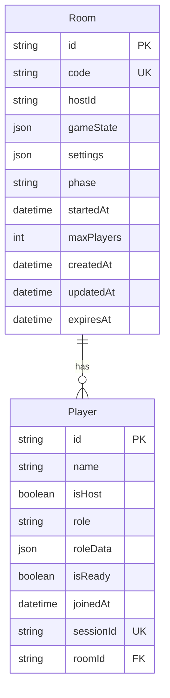

# Database Entity Relationship Diagram

## Overview
This document describes the database schema for the Avalon game application.

## Database Schema

### Tables

#### Room
Stores game room information and settings.

| Column | Type | Description | Constraints |
|--------|------|-------------|-------------|
| id | String | Primary key | CUID, Primary Key |
| code | String | Unique room code | Unique, Indexed |
| hostId | String | Host player ID | Indexed |
| gameState | Json | Current game state | JSON object |
| settings | Json | Game configuration | JSON object |
| phase | String | Current game phase | Default: 'lobby', Indexed |
| startedAt | DateTime | Game start timestamp | Nullable |
| maxPlayers | Int | Maximum players | Default: 10 |
| createdAt | DateTime | Creation timestamp | Default: now() |
| updatedAt | DateTime | Last update timestamp | Auto-updated |
| expiresAt | DateTime | Expiration timestamp | Indexed |

#### Player
Stores player information and room associations.

| Column | Type | Description | Constraints |
|--------|------|-------------|-------------|
| id | String | Primary key | CUID, Primary Key |
| name | String | Player display name | Required |
| isHost | Boolean | Whether player is room host | Default: false |
| role | String | Game role (optional) | Nullable |
| roleData | Json | Role-specific data | JSON object, Nullable |
| isReady | Boolean | Player ready status | Default: false |
| joinedAt | DateTime | Join timestamp | Default: now() |
| sessionId | String | Session identifier | Unique, Indexed, Nullable |
| roomId | String | Associated room ID | Foreign Key, Indexed |

## Relationships

### Room ↔ Player (One-to-Many)
- One Room can have multiple Players
- Each Player belongs to exactly one Room
- Foreign key: `Player.roomId` → `Room.id`
- Cascade delete: When a Room is deleted, all associated Players are deleted

## Indexes

### Room Table
- `code` (unique) - For fast room lookups
- `phase` - For game phase queries
- `expiresAt` - For cleanup operations
- `hostId` - For host-specific queries

### Player Table
- `roomId` - For room-based player queries
- `sessionId` (unique) - For session-based lookups

## JSON Schema

### Room.gameState
```json
{
  "phase": "lobby" | "roleReveal" | "voting" | "missionSelect" | "missionVote" | "missionResult" | "assassinAttempt" | "gameOver",
  "round": number,
  "leaderIndex": number,
  "startedAt": Date | null,
  "votes": [
    {
      "playerId": string,
      "vote": "approve" | "reject",
      "round": number,
      "votedAt": Date
    }
  ],
  "missions": [
    {
      "id": string,
      "round": number,
      "teamSize": number,
      "teamMembers": string[],
      "votes": [
        {
          "playerId": string,
          "vote": "success" | "failure",
          "votedAt": Date
        }
      ],
      "result": "success" | "failure" | null,
      "completedAt": Date | null
    }
  ],
  "assassinAttempt": {
    "assassinId": string,
    "targetId": string,
    "success": boolean,
    "attemptedAt": Date
  } | null
}
```

### Room.settings
```json
{
  "characters": string[],
  "playerCount": number,
  "timeLimit": number | null,
  "allowSpectators": boolean,
  "autoStart": boolean,
  "customRules": [
    {
      "id": string,
      "name": string,
      "description": string,
      "enabled": boolean
    }
  ]
}
```

### Player.roleData
```json
{
  "roleId": string,
  "assignedAt": Date,
  "visiblePlayers": [
    {
      "playerId": string,
      "roleId": string,
      "name": string
    }
  ],
  "abilities": string[],
  "seesEvil": boolean,
  "seenByMerlin": boolean,
  "isAssassin": boolean
}
```

## Mermaid ERD



## Migration History

### 20250715152537_add_room_and_player_models
- Added Room table with proper indexes
- Added Player table with foreign key relationship
- Added unique constraints and indexes for performance
- Set up cascade delete for data consistency

### 20250715154618_add_game_state_and_role_fields
- Added `phase` field to Room table with default 'lobby'
- Added `startedAt` field to Room table for game start timestamp
- Added `roleData` field to Player table for role-specific information
- Added `isReady` field to Player table for game start readiness
- Added index on Room.phase for efficient phase queries

## Notes

1. **Room Expiration**: Rooms automatically expire after 1 hour of inactivity
2. **Session Management**: Players maintain session identity via sessionId
3. **Cascade Delete**: Deleting a room removes all associated players
4. **JSON Fields**: Game state and settings are stored as JSON for flexibility
5. **Performance**: Strategic indexes on commonly queried fields

## Future Considerations

- Add audit log table for game events
- Consider partitioning for large-scale deployments
- Add indexes for specific query patterns as they emerge
- Consider adding database constraints for game rules
