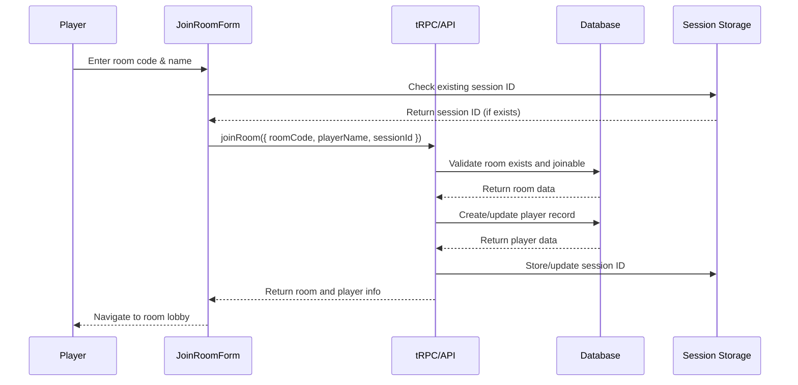

# User Story: 2 - Join Game Room

**As a** player,
**I want** to join an existing game room using a room code or link,
**so that** I can participate in an Avalon game with friends.

## Acceptance Criteria

* Player can enter a room code to join a game
* Player can click a shared URL to join directly
* Player can scan a QR code to join via mobile
* Player must provide their name to join
* Player is assigned a unique UUID for the session
* Player is added to the room's player list
* All players in the room are notified when someone joins
* Maximum player limit is enforced (typically 10 players)
* Player cannot join if game has already started

## Notes

* Real-time updates use Socket.IO `player:join` event
* Player identity persists via UUID in cookies/session
* Room must exist and be in lobby phase for joining

## Implementation Plan

### 1. Feature Overview

Create a room joining feature that allows players to join existing Avalon game rooms through various methods (room code, URL, QR code). The primary user role is the player who wants to participate in a game hosted by someone else.

### 2. Component Analysis & Reuse Strategy

**Existing Components:**
- No existing components are suitable for reuse for this feature

**New Components Required:**
- `JoinRoomForm` - New component needed for room code input and name entry
- `JoinRoomPage` - New component needed for the joining page layout
- `PlayerNameInput` - New component needed for name validation and submission
- `RoomJoinStatus` - New component needed to show join status and errors

### 3. Affected Files

```
- [CREATE] src/app/room/[roomCode]/page.tsx
- [CREATE] src/app/room/[roomCode]/JoinRoomForm.tsx
- [CREATE] src/app/room/[roomCode]/PlayerNameInput.tsx
- [CREATE] src/app/room/[roomCode]/RoomJoinStatus.tsx
- [CREATE] src/app/join/page.tsx
- [CREATE] src/app/join/JoinRoomForm.tsx
- [CREATE] src/app/join/JoinRoomForm.test.tsx
- [CREATE] src/app/join/JoinRoomForm.visual.spec.ts
- [CREATE] src/app/room/[roomCode]/JoinRoomForm.test.tsx
- [CREATE] src/app/room/[roomCode]/PlayerNameInput.test.tsx
- [CREATE] src/app/room/[roomCode]/RoomJoinStatus.test.tsx
- [CREATE] src/app/room/[roomCode]/JoinRoomForm.visual.spec.ts
- [CREATE] src/app/room/[roomCode]/PlayerNameInput.visual.spec.ts
- [CREATE] src/app/room/[roomCode]/RoomJoinStatus.visual.spec.ts
- [CREATE] src/app/api/rooms/[roomCode]/join/route.ts
- [CREATE] src/lib/session.ts
- [CREATE] src/lib/session.test.ts
- [CREATE] src/types/player.ts
- [MODIFY] src/types/room.ts
- [MODIFY] src/server/api/routers/room.ts
- [MODIFY] src/server/api/root.ts
- [MODIFY] prisma/schema.prisma
- [MODIFY] docs/erd.md
```

### 4. Component Breakdown

**JoinRoomForm** (`src/app/join/JoinRoomForm.tsx` & `src/app/room/[roomCode]/JoinRoomForm.tsx`)
- **Type**: Client Component (requires form interaction and navigation)
- **Responsibility**: Handle room code input, name entry, and join process
- **Key Props**:
  ```typescript
  interface JoinRoomFormProps {
    roomCode?: string; // Pre-filled for URL joins
    onJoinSuccess: (room: Room, player: Player) => void;
    onJoinError: (error: string) => void;
    className?: string;
  }
  ```
- **Child Components**: PlayerNameInput, RoomJoinStatus

**PlayerNameInput** (`src/app/room/[roomCode]/PlayerNameInput.tsx`)
- **Type**: Client Component (requires validation and state management)
- **Responsibility**: Handle player name input with validation
- **Key Props**:
  ```typescript
  interface PlayerNameInputProps {
    value: string;
    onChange: (value: string) => void;
    error?: string;
    disabled?: boolean;
    className?: string;
  }
  ```
- **Child Components**: None

**RoomJoinStatus** (`src/app/room/[roomCode]/RoomJoinStatus.tsx`)
- **Type**: Client Component (requires real-time status updates)
- **Responsibility**: Display join status, loading states, and error messages
- **Key Props**:
  ```typescript
  interface RoomJoinStatusProps {
    status: 'idle' | 'loading' | 'success' | 'error';
    error?: string;
    roomInfo?: Partial<Room>;
    className?: string;
  }
  ```
- **Child Components**: None

### 5. Design Specifications

**Color Analysis:**
| Design Color | Semantic Purpose | Element | Implementation Method |
|--------------|-----------------|---------|------------------------|
| #1a1a2e | Primary brand | Header background | Direct hex value (#1a1a2e) |
| #16213e | Secondary brand | Card background | Direct hex value (#16213e) |
| #0066cc | Interactive | Join button background | Direct hex value (#0066cc) |
| #4a90e2 | Interactive hover | Button hover state | Direct hex value (#4a90e2) |
| #ffffff | High contrast text | Button text, labels | Direct hex value (#ffffff) |
| #f8f9fa | Subtle background | Input background | Direct hex value (#f8f9fa) |
| #6c757d | Muted text | Helper text | Direct hex value (#6c757d) |
| #28a745 | Success | Success messages | Direct hex value (#28a745) |
| #dc3545 | Error | Error messages, validation | Direct hex value (#dc3545) |
| #ffc107 | Warning | Room full warning | Direct hex value (#ffc107) |

**Spacing Values:**
- Card padding: 24px (p-6)
- Input padding: 12px 16px (px-4 py-3)
- Button padding: 12px 24px (px-6 py-3)
- Gap between form elements: 16px (gap-4)
- Margin between sections: 24px (mb-6)

**Visual Hierarchy:**
```
JoinRoomPage
├── Header (h1, text-3xl font-bold)
├── JoinRoomForm (max-w-md mx-auto)
│   ├── Room Code Input (text-lg, font-mono)
│   ├── Player Name Input (text-lg)
│   ├── Join Button (btn-primary)
│   └── RoomJoinStatus (conditional)
└── Instructions (text-sm, muted)
```

**Typography:**
- Page title: 30px, font-bold, line-height: 1.2
- Input labels: 16px, font-medium, line-height: 1.5
- Room code: 18px, font-mono, font-semibold
- Helper text: 14px, font-normal, line-height: 1.4
- Error messages: 14px, font-medium, line-height: 1.4

**Responsive Behavior:**
- Mobile (375px): Single column, full-width inputs
- Tablet (768px): Single column, constrained width
- Desktop (1280px): Centered layout, optimal form width

### 6. Data Flow & State Management

**TypeScript Types** (`src/types/player.ts`):
```typescript
export interface Player {
  id: string;
  name: string;
  isHost: boolean;
  role?: string;
  joinedAt: Date;
  roomId: string;
  sessionId?: string;
}

export interface JoinRoomRequest {
  roomCode: string;
  playerName: string;
  sessionId?: string;
}

export interface JoinRoomResponse {
  success: boolean;
  room: Room;
  player: Player;
  error?: string;
}
```

**Data Fetching Strategy:**
- **Server Component**: `src/app/room/[roomCode]/page.tsx` - Fetches room info for validation
- **Client Component**: `JoinRoomForm` - Calls tRPC mutation to join room
- **API Route**: `src/app/api/rooms/[roomCode]/join/route.ts` - Handles join requests

**State Management:**
- Local state in `JoinRoomForm` for form data and submission status
- Local state in `PlayerNameInput` for validation
- Session storage for player UUID persistence
- No global state management required initially

**Database Schema Changes:**
Updates to existing models:
```prisma
model Player {
  id        String   @id @default(cuid())
  name      String
  isHost    Boolean  @default(false)
  role      String?
  joinedAt  DateTime @default(now())
  sessionId String?  @unique
  roomId    String
  room      Room     @relation(fields: [roomId], references: [id], onDelete: Cascade)
  
  @@index([roomId])
  @@index([sessionId])
}

model Room {
  id          String   @id @default(cuid())
  code        String   @unique
  hostId      String
  gameState   Json
  settings    Json
  maxPlayers  Int      @default(10)
  createdAt   DateTime @default(now())
  updatedAt   DateTime @updatedAt
  expiresAt   DateTime
  players     Player[]
  
  @@index([code])
  @@index([expiresAt])
}
```

### 7. API Endpoints & Contracts

**POST /api/rooms/[roomCode]/join** (`src/app/api/rooms/[roomCode]/join/route.ts`):
- **HTTP Method**: POST
- **Request Body**:
  ```typescript
  {
    playerName: string;
    sessionId?: string;
  }
  ```
- **Response**:
  ```typescript
  {
    success: boolean;
    room: {
      id: string;
      code: string;
      gameState: GameState;
      playerCount: number;
      maxPlayers: number;
    };
    player: {
      id: string;
      name: string;
      isHost: boolean;
      sessionId: string;
    };
    error?: string;
  }
  ```
- **Core Logic**:
  - Validate room exists and is joinable
  - Check player count limits
  - Validate player name uniqueness
  - Create or update player record
  - Generate/update session ID
  - Return room and player data

**tRPC Router** (`src/server/api/routers/room.ts`):
```typescript
joinRoom: publicProcedure
  .input(z.object({
    roomCode: z.string().length(8),
    playerName: z.string().min(1).max(50),
    sessionId: z.string().optional()
  }))
  .mutation(async ({ ctx, input }) => {
    // Room joining logic
  })

getRoomInfo: publicProcedure
  .input(z.object({
    roomCode: z.string().length(8)
  }))
  .query(async ({ ctx, input }) => {
    // Room info retrieval
  })
```

### 8. Integration Diagram



### 9. Styling

**Color Implementation:**
- Primary brand color (#1a1a2e) for headers
- Interactive blue (#0066cc) for join buttons with hover state (#4a90e2)
- Success green (#28a745) for successful joins
- Error red (#dc3545) for validation errors and join failures
- Warning yellow (#ffc107) for room full notifications
- Muted gray (#6c757d) for helper text

**Typography Implementation:**
- Font family: Geist Sans (--font-geist-sans)
- Input labels: text-base (16px) with font-medium
- Room code input: text-lg (18px) with font-mono for clarity
- Error messages: text-sm (14px) with font-medium
- Helper text: text-sm (14px) with font-normal

**Layout & Spacing:**
- Form container: max-w-md (448px) with mx-auto centering
- Input spacing: mb-4 (16px) between form fields
- Button spacing: mt-6 (24px) above primary button
- Card padding: p-6 (24px) for main content areas

**Visual Implementation Checklist:**
- [ ] Form uses card background (#16213e) with proper contrast
- [ ] Join button uses interactive blue (#0066cc) with hover effect
- [ ] Room code input uses monospace font for readability
- [ ] Error messages use red color (#dc3545) with proper contrast
- [ ] Success states use green color (#28a745)
- [ ] Loading states provide clear visual feedback
- [ ] Responsive layout adapts to all screen sizes

### 10. Testing Strategy

**Unit Tests:**
- `src/lib/session.test.ts` - Session management utility functions
- `src/app/join/JoinRoomForm.test.tsx` - Form validation and submission
- `src/app/room/[roomCode]/PlayerNameInput.test.tsx` - Name validation logic
- `src/app/room/[roomCode]/RoomJoinStatus.test.tsx` - Status display logic

**Component Tests:**
- Form validation with various input combinations
- Room code format validation
- Player name uniqueness checking
- Error handling for full rooms and invalid codes
- Session ID persistence and retrieval

**Playwright Visual Tests:**
- `src/app/join/JoinRoomForm.visual.spec.ts` - Join form appearance
- `src/app/room/[roomCode]/JoinRoomForm.visual.spec.ts` - Room-specific join form
- `src/app/room/[roomCode]/PlayerNameInput.visual.spec.ts` - Name input styling
- `src/app/room/[roomCode]/RoomJoinStatus.visual.spec.ts` - Status indicators

### 11. Accessibility (A11y) Considerations

- Form labels properly associated with inputs using htmlFor
- Error messages announced to screen readers with aria-describedby
- Loading states communicated through aria-busy and aria-live
- Room code input supports autocomplete for easier entry
- Success/error states have sufficient color contrast
- Keyboard navigation works for all interactive elements
- Focus management during form submission and navigation

### 12. Security Considerations

- Room code validation prevents injection attacks
- Player name sanitization prevents XSS attacks
- Session ID generation uses cryptographically secure methods
- Rate limiting on join attempts prevents spam
- Room state validation prevents invalid joins
- Player data sanitized before storage and display

### 13. Implementation Steps

**Phase 1: UI Implementation with Mock Data**

**1. Setup & Types:**
- [ ] Define Player types in `src/types/player.ts`
- [ ] Update Room types in `src/types/room.ts`
- [ ] Create mock room and player data in `src/mocks/room-mock.ts`
- [ ] Create session management utilities in `src/lib/session.ts`

**2. UI Components:**
- [ ] Create `src/app/join/page.tsx` for general join page
- [ ] Create `src/app/join/JoinRoomForm.tsx` for room code entry
- [ ] Create `src/app/room/[roomCode]/page.tsx` for direct room access
- [ ] Create `src/app/room/[roomCode]/JoinRoomForm.tsx` for room-specific joining
- [ ] Create `src/app/room/[roomCode]/PlayerNameInput.tsx` for name validation
- [ ] Create `src/app/room/[roomCode]/RoomJoinStatus.tsx` for status display
- [ ] Configure components to use mock data
- [ ] Implement form validation logic

**3. Styling:**
- [ ] Verify card background color (#16213e) matches design system EXACTLY
- [ ] Verify join button color (#0066cc) with hover state (#4a90e2) EXACTLY
- [ ] Verify error message color (#dc3545) with proper contrast EXACTLY
- [ ] Verify success message color (#28a745) EXACTLY
- [ ] Verify typography sizes (text-lg, text-base, text-sm) EXACTLY
- [ ] Verify spacing values (p-6, mb-4, mt-6) EXACTLY
- [ ] Apply direct hex values for all colors in className attributes
- [ ] Apply Tailwind classes for spacing and typography
- [ ] Implement responsive behavior for all breakpoints

**4. UI Testing:**
- [ ] Write component tests for all components with mock data
- [ ] Create Playwright visual test `src/app/join/JoinRoomForm.visual.spec.ts`
- [ ] Create Playwright visual test `src/app/room/[roomCode]/JoinRoomForm.visual.spec.ts`
- [ ] Create Playwright visual test `src/app/room/[roomCode]/PlayerNameInput.visual.spec.ts`
- [ ] Create Playwright visual test `src/app/room/[roomCode]/RoomJoinStatus.visual.spec.ts`
- [ ] Configure tests for all viewport sizes (375px, 768px, 1280px, 1920px)
- [ ] Add visual color verification tests with exact RGB values using CSS property assertions
- [ ] Add spacing/layout verification tests with pixel measurements using DOM properties
- [ ] Add typography verification tests for font sizes and weights using computed styles
- [ ] Add comprehensive data-testid attributes: `data-testid="join-room-form"`, `data-testid="player-name-input"`, `data-testid="room-join-status"`
- [ ] Manual testing and A11y checks for all UI elements

**Phase 2: API Integration with Real Data**

**5. Database Schema:**
- [ ] Update Player model in `prisma/schema.prisma` with sessionId
- [ ] Update Room model with maxPlayers field
- [ ] Create and run database migration
- [ ] Update database ERD in `docs/erd.md`

**6. Backend Implementation:**
- [ ] Extend `src/server/api/routers/room.ts` with joinRoom procedure
- [ ] Add getRoomInfo procedure for room validation
- [ ] Create `src/app/api/rooms/[roomCode]/join/route.ts` REST endpoint
- [ ] Implement session management utilities
- [ ] Add player validation and uniqueness checks
- [ ] Implement room capacity validation

**7. Integration:**
- [ ] Replace mock data with real tRPC calls in all components
- [ ] Update state management to handle real data fetching
- [ ] Implement proper error handling for API failures
- [ ] Add loading states connected to real data fetching
- [ ] Implement session persistence for player identity
- [ ] Test room joining end-to-end flow

**8. Integration Testing:**
- [ ] Write unit tests for room joining API validation logic
- [ ] Update component tests to test with real data fetching (mocked)
- [ ] End-to-end testing of room joining flow
- [ ] Test session persistence across page reloads
- [ ] Test error scenarios (full room, invalid code, game started)

**9. Final Documentation & Polishing:**
- [ ] Add JSDoc documentation to all functions and components
- [ ] Final review of integration between UI and API
- [ ] Performance checks with real data
- [ ] Security review of session management and validation
- [ ] User experience testing for edge cases

### References

- [Next.js Dynamic Routes](https://nextjs.org/docs/app/building-your-application/routing/dynamic-routes)
- [tRPC Input Validation](https://trpc.io/docs/server/validators)
- [Prisma Unique Constraints](https://www.prisma.io/docs/reference/api-reference/prisma-schema-reference#unique)
- [Web Storage API](https://developer.mozilla.org/en-US/docs/Web/API/Web_Storage_API)
- [ARIA Live Regions](https://developer.mozilla.org/en-US/docs/Web/Accessibility/ARIA/ARIA_Live_Regions)
