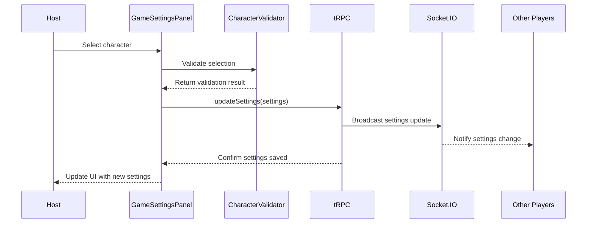

# User Story: 3 - Configure Game Settings

**As a** game host,
**I want** to configure which characters and game settings to include,
**so that** I can customize the game experience for my group.

## Acceptance Criteria

* Host can select which characters to include (Merlin, Morgana, Percival, Mordred, Oberon, etc.)
* System validates character combinations (e.g., Merlin required if Percival included)
* Host can see a summary of selected characters and their effects
* Settings are saved and synchronized to all players in real-time
* Invalid configurations are prevented with clear error messages
* Host can reset settings to default recommendations
* Settings cannot be changed once game has started

## Notes

* Configuration must ensure game balance and playability
* Character dependencies are validated on backend
* Uses tRPC `room.updateSettings()` API
* Real-time sync via Socket.IO `room:update` event

## Implementation Plan

### 1. Feature Overview

Create a game settings configuration interface that allows hosts to customize character selection and game rules for their Avalon game room. The primary user role is the game host who needs to configure the game before starting.

### 2. Component Analysis & Reuse Strategy

**Existing Components:**
- No existing components are suitable for reuse for this feature

**New Components Required:**
- `GameSettingsPanel` - New component needed for the main settings interface
- `CharacterSelector` - New component needed for character selection with validation
- `CharacterCard` - New component needed to display character info and effects
- `SettingsSummary` - New component needed to show current configuration summary
- `ValidationErrors` - New component needed for displaying configuration errors

### 3. Affected Files

```
- [CREATE] src/app/room/[roomCode]/lobby/GameSettingsPanel.tsx
- [CREATE] src/app/room/[roomCode]/lobby/CharacterSelector.tsx
- [CREATE] src/app/room/[roomCode]/lobby/CharacterCard.tsx
- [CREATE] src/app/room/[roomCode]/lobby/SettingsSummary.tsx
- [CREATE] src/app/room/[roomCode]/lobby/ValidationErrors.tsx
- [CREATE] src/app/room/[roomCode]/lobby/GameSettingsPanel.test.tsx
- [CREATE] src/app/room/[roomCode]/lobby/CharacterSelector.test.tsx
- [CREATE] src/app/room/[roomCode]/lobby/CharacterCard.test.tsx
- [CREATE] src/app/room/[roomCode]/lobby/SettingsSummary.test.tsx
- [CREATE] src/app/room/[roomCode]/lobby/ValidationErrors.test.tsx
- [CREATE] src/app/room/[roomCode]/lobby/GameSettingsPanel.visual.spec.ts
- [CREATE] src/app/room/[roomCode]/lobby/CharacterSelector.visual.spec.ts
- [CREATE] src/app/room/[roomCode]/lobby/CharacterCard.visual.spec.ts
- [CREATE] src/app/room/[roomCode]/lobby/SettingsSummary.visual.spec.ts
- [CREATE] src/app/room/[roomCode]/lobby/ValidationErrors.visual.spec.ts
- [CREATE] src/types/characters.ts
- [CREATE] src/types/game-settings.ts
- [CREATE] src/lib/character-validation.ts
- [CREATE] src/lib/character-validation.test.ts
- [CREATE] src/lib/default-settings.ts
- [MODIFY] src/types/room.ts
- [MODIFY] src/server/api/routers/room.ts
- [MODIFY] prisma/schema.prisma
- [MODIFY] docs/erd.md
```

### 4. Component Breakdown

**GameSettingsPanel** (`src/app/room/[roomCode]/lobby/GameSettingsPanel.tsx`)
- **Type**: Client Component (requires real-time updates and form interactions)
- **Responsibility**: Main container for all game settings configuration
- **Key Props**:
  ```typescript
  interface GameSettingsPanelProps {
    roomId: string;
    currentSettings: GameSettings;
    isHost: boolean;
    onSettingsChange: (settings: GameSettings) => void;
    disabled?: boolean;
    className?: string;
  }
  ```
- **Child Components**: CharacterSelector, SettingsSummary, ValidationErrors

**CharacterSelector** (`src/app/room/[roomCode]/lobby/CharacterSelector.tsx`)
- **Type**: Client Component (requires interactive selection)
- **Responsibility**: Handle character selection with validation
- **Key Props**:
  ```typescript
  interface CharacterSelectorProps {
    selectedCharacters: string[];
    onCharacterToggle: (character: string) => void;
    validationErrors: ValidationError[];
    disabled?: boolean;
    className?: string;
  }
  ```
- **Child Components**: CharacterCard

**CharacterCard** (`src/app/room/[roomCode]/lobby/CharacterCard.tsx`)
- **Type**: Client Component (requires hover states and selection)
- **Responsibility**: Display individual character information and selection state
- **Key Props**:
  ```typescript
  interface CharacterCardProps {
    character: Character;
    isSelected: boolean;
    onToggle: () => void;
    hasError: boolean;
    disabled?: boolean;
    className?: string;
  }
  ```
- **Child Components**: None

**SettingsSummary** (`src/app/room/[roomCode]/lobby/SettingsSummary.tsx`)
- **Type**: Client Component (requires real-time updates)
- **Responsibility**: Display current configuration summary and recommendations
- **Key Props**:
  ```typescript
  interface SettingsSummaryProps {
    settings: GameSettings;
    playerCount: number;
    isValid: boolean;
    className?: string;
  }
  ```
- **Child Components**: None

**ValidationErrors** (`src/app/room/[roomCode]/lobby/ValidationErrors.tsx`)
- **Type**: Client Component (requires dynamic error display)
- **Responsibility**: Display validation errors and suggestions
- **Key Props**:
  ```typescript
  interface ValidationErrorsProps {
    errors: ValidationError[];
    onResetToDefault: () => void;
    className?: string;
  }
  ```
- **Child Components**: None

### 5. Design Specifications

**Modern UI/UX Principles:**
- **Interactive Card System**: Character cards with hover states and selection feedback
- **Progressive Disclosure**: Settings revealed based on user selections
- **Visual Feedback**: Immediate response to user interactions
- **Gamification Elements**: Achievement-style indicators for valid configurations
- **Contextual Help**: Tooltips and inline guidance for complex rules

**Color System (Enhanced):**
| Design Color | Semantic Purpose | Element | Implementation Method |
|--------------|-----------------|---------|------------------------|
| #0f0f23 | Deep primary | Main background | bg-[#0f0f23] with subtle pattern |
| #1a1a2e | Primary brand | Panel headers | bg-[#1a1a2e] with gradient overlay |
| #252547 | Elevated surface | Character cards | bg-[#252547] with glass effect |
| #2d2d5f | Interactive | Card hover states | bg-[#2d2d5f] with glow transition |
| #3d3d7a | Selection | Selected card borders | border-[#3d3d7a] with pulse |
| #4a4a96 | Selection hover | Active selections | bg-[#4a4a96] with scale effect |
| #ffffff | High contrast | Character names | text-white with shadow |
| #f8fafc | Subtle | Descriptions | text-slate-100 with opacity |
| #22c55e | Success/Good | Good team indicators | text-green-500 with glow |
| #ef4444 | Error/Evil | Evil team indicators | text-red-500 with pulse |
| #f59e0b | Warning | Config warnings | text-amber-500 with bounce |
| #3b82f6 | Info | Character abilities | text-blue-500 with fade |

**Animation & Interaction Design:**
- **Character Card Animations**:
  - Hover: `transform: translateY(-8px) scale(1.05)` with `shadow-2xl`
  - Selection: `ring-4 ring-blue-500/50` with `transform: scale(1.02)`
  - Team indicator: Pulsing glow effect for team affiliation
  - Flip animation: 3D card flip on selection with backface-visibility
- **Grid Animations**:
  - Staggered entry: Cards animate in with 100ms delays
  - Masonry layout: Smooth repositioning on selection changes
  - Filtering: Smooth fade-in/fade-out transitions
- **Validation Feedback**:
  - Success: Green checkmark with bounce keyframe
  - Error: Red X with shake animation
  - Warning: Amber triangle with pulse effect

**Enhanced Visual Hierarchy:**
```
GameSettingsPanel (bg-gradient-to-br from-[#0f0f23] to-[#1a1a2e])
├── Header (text-3xl font-bold with gradient text)
├── CharacterSelector (grid with staggered animations)
│   └── CharacterCard[] (interactive with hover-lift)
│       ├── Team Badge (floating with glow effect)
│       ├── Character Portrait (with selection overlay)
│       ├── Name (text-xl font-bold)
│       └── Ability (text-sm with fade-in)
├── SettingsSummary (glass-panel with slide-up)
│   ├── Player Requirements (progress-bar style)
│   ├── Team Balance (visual indicator)
│   └── Configuration Status (status-badge)
└── ValidationErrors (slide-down with error-specific icons)
```

**Typography (Enhanced):**
- **Panel Titles**: `text-3xl font-bold bg-gradient-to-r from-white to-slate-200`
- **Character Names**: `text-xl font-bold tracking-wide`
- **Descriptions**: `text-sm leading-relaxed opacity-90`
- **Team Indicators**: `text-xs font-bold uppercase tracking-widest`
- **Error Messages**: `text-sm font-medium text-red-400`
- **Success Messages**: `text-sm font-medium text-green-400`

**Interactive Elements (Enhanced):**
- **Character Cards**:
  - Default: `bg-[#252547]/80 backdrop-blur-xl border border-slate-600/30`
  - Hover: `transform: translateY(-8px) scale(1.05) shadow-2xl`
  - Selected: `ring-4 ring-blue-500/50 bg-[#3d3d7a]/50`
  - Team Glow: `box-shadow: 0 0 20px rgba(color, 0.3)`
- **Grid Layout**:
  - Responsive: `grid-cols-1 sm:grid-cols-2 md:grid-cols-3 lg:grid-cols-4`
  - Gap: `gap-6 md:gap-8` with smooth transitions
  - Masonry: CSS Grid with `grid-template-rows: masonry`
- **Validation States**:
  - Success: `border-green-500 bg-green-500/10`
  - Error: `border-red-500 bg-red-500/10`
  - Warning: `border-amber-500 bg-amber-500/10`

**Spacing Values:**
- Panel padding: 24px (p-6)
- Character card padding: 16px (p-4)
- Card margin: 8px (m-2)
- Grid gap: 16px (gap-4)
- Section spacing: 32px (mb-8)

**Visual Hierarchy:**
```
GameSettingsPanel
├── Header (h2, text-2xl font-bold)
├── CharacterSelector (grid layout)
│   └── CharacterCard[] (interactive cards)
├── SettingsSummary (info panel)
│   ├── Player count requirements
│   └── Selected characters summary
└── ValidationErrors (error panel, conditional)
    ├── Error messages
    └── Reset button
```

**Typography:**
- Panel title: 24px, font-bold, line-height: 1.3
- Character names: 18px, font-semibold, line-height: 1.4
- Character descriptions: 14px, font-normal, line-height: 1.5
- Error messages: 14px, font-medium, line-height: 1.4
- Summary text: 16px, font-normal, line-height: 1.5

**Responsive Behavior:**
- Mobile (375px): Single column character cards, stacked layout
- Tablet (768px): 2-column character grid, side-by-side summary
- Desktop (1280px): 3-column character grid, optimal layout
- Large (1920px): 4-column character grid, spacious layout

### 6. Data Flow & State Management

**TypeScript Types** (`src/types/characters.ts`):
```typescript
export interface Character {
  id: string;
  name: string;
  team: 'good' | 'evil';
  description: string;
  ability: string;
  dependencies: string[];
  conflicts: string[];
  requiredFor: string[];
  minPlayers: number;
  maxPlayers: number;
}

export interface ValidationError {
  type: 'dependency' | 'conflict' | 'balance' | 'playerCount';
  message: string;
  characters: string[];
  severity: 'error' | 'warning';
}
```

**TypeScript Types** (`src/types/game-settings.ts`):
```typescript
export interface GameSettings {
  characters: string[];
  playerCount: number;
  timeLimit?: number;
  allowSpectators: boolean;
  autoStart: boolean;
  customRules?: CustomRule[];
}

export interface CustomRule {
  id: string;
  name: string;
  description: string;
  enabled: boolean;
}
```

**Data Fetching Strategy:**
- **Server Component**: Character definitions fetched from static data
- **Client Component**: `GameSettingsPanel` manages settings state and validation
- **tRPC**: `room.updateSettings()` for persisting changes
- **Real-time**: Socket.IO for synchronizing changes across players

**State Management:**
- Local state in `GameSettingsPanel` for current settings
- Local state in `CharacterSelector` for selection interactions
- Real-time synchronization via Socket.IO events
- Validation state managed centrally in settings panel

**Database Schema Changes:**
Updates to Room model:
```prisma
model Room {
  id          String   @id @default(cuid())
  code        String   @unique
  hostId      String
  gameState   Json
  settings    Json     // GameSettings object
  maxPlayers  Int      @default(10)
  createdAt   DateTime @default(now())
  updatedAt   DateTime @updatedAt
  expiresAt   DateTime
  players     Player[]
  
  @@index([code])
  @@index([expiresAt])
}
```

### 7. API Endpoints & Contracts

**tRPC Router** (`src/server/api/routers/room.ts`):
```typescript
updateSettings: publicProcedure
  .input(z.object({
    roomId: z.string(),
    settings: z.object({
      characters: z.array(z.string()),
      playerCount: z.number().min(5).max(10),
      timeLimit: z.number().optional(),
      allowSpectators: z.boolean(),
      autoStart: z.boolean()
    })
  }))
  .mutation(async ({ ctx, input }) => {
    // Settings validation and update logic
  })

validateSettings: publicProcedure
  .input(z.object({
    settings: z.object({
      characters: z.array(z.string()),
      playerCount: z.number()
    })
  }))
  .query(async ({ ctx, input }) => {
    // Settings validation logic
  })

getCharacters: publicProcedure
  .query(async ({ ctx }) => {
    // Return available characters
  })
```

### 8. Integration Diagram



### 9. Styling

**Color Implementation:**
- Primary brand color (#1a1a2e) for panel headers
- Interactive blue (#0066cc) for selected character borders
- Character card backgrounds (#16213e) with hover states (#4a90e2)
- Success green (#28a745) for valid configurations
- Error red (#dc3545) for validation errors
- Warning yellow (#ffc107) for configuration warnings
- Info blue (#17a2b8) for character ability descriptions

**Typography Implementation:**
- Font family: Geist Sans (--font-geist-sans)
- Panel titles: text-2xl (24px) with font-bold
- Character names: text-lg (18px) with font-semibold
- Character descriptions: text-sm (14px) with font-normal
- Error messages: text-sm (14px) with font-medium

**Layout & Spacing:**
- Panel container: max-w-4xl with mx-auto centering
- Character grid: grid-cols-1 md:grid-cols-2 lg:grid-cols-3 xl:grid-cols-4
- Card spacing: gap-4 (16px) between cards
- Section spacing: mb-8 (32px) between major sections
- Card padding: p-4 (16px) for character cards

**Visual Implementation Checklist:**
- [ ] Character cards use brand background (#16213e) with proper contrast
- [ ] Selected characters have blue border (#0066cc)
- [ ] Hover states use lighter blue (#4a90e2)
- [ ] Error states use red background/border (#dc3545)
- [ ] Success states use green indicators (#28a745)
- [ ] Grid layout adapts properly to all screen sizes
- [ ] Typography hierarchy is clear and consistent

### 10. Testing Strategy

**Unit Tests:**
- `src/lib/character-validation.test.ts` - Character validation logic
- `src/app/room/[roomCode]/lobby/GameSettingsPanel.test.tsx` - Settings management
- `src/app/room/[roomCode]/lobby/CharacterSelector.test.tsx` - Selection logic
- `src/app/room/[roomCode]/lobby/CharacterCard.test.tsx` - Card interactions
- `src/app/room/[roomCode]/lobby/SettingsSummary.test.tsx` - Summary display
- `src/app/room/[roomCode]/lobby/ValidationErrors.test.tsx` - Error display

**Component Tests:**
- Character selection and deselection
- Validation error display and handling
- Settings persistence and synchronization
- Default settings reset functionality
- Disabled state when game started

**Playwright Visual Tests:**
- Character card grid layout and responsiveness
- Selection states and hover effects
- Error message display and styling
- Settings summary panel appearance
- Validation error styling and positioning

### 11. Accessibility (A11y) Considerations

- Character cards have proper ARIA labels and roles
- Selection states announced to screen readers
- Error messages associated with relevant form controls
- Keyboard navigation support for character selection
- High contrast maintained for all character information
- Focus indicators clearly visible on interactive elements
- Screen reader announcements for validation errors

### 12. Security Considerations

- Server-side validation of all character combinations
- Host-only access to settings modification
- Settings persistence validates user permissions
- Character data sanitized before display
- Rate limiting on settings update requests
- Input validation prevents malicious character selections

### 13. Implementation Steps

**Phase 1: UI Implementation with Mock Data**

**1. Setup & Types:**
- [ ] Define Character types in `src/types/characters.ts`
- [ ] Define GameSettings types in `src/types/game-settings.ts`
- [ ] Create character validation utilities in `src/lib/character-validation.ts`
- [ ] Create default settings in `src/lib/default-settings.ts`
- [ ] Set up mock character data and settings

**2. Core Components:**
- [ ] Create `src/app/room/[roomCode]/lobby/CharacterCard.tsx`
- [ ] Create `src/app/room/[roomCode]/lobby/CharacterSelector.tsx`
- [ ] Create `src/app/room/[roomCode]/lobby/SettingsSummary.tsx`
- [ ] Create `src/app/room/[roomCode]/lobby/ValidationErrors.tsx`
- [ ] Create `src/app/room/[roomCode]/lobby/GameSettingsPanel.tsx`
- [ ] Configure components to use mock data
- [ ] Implement character selection logic with validation

**3. Styling:**
- [ ] Verify panel header color (#1a1a2e) matches design system EXACTLY
- [ ] Verify character card background (#16213e) and hover state (#4a90e2) EXACTLY
- [ ] Verify selected character border color (#0066cc) EXACTLY
- [ ] Verify error message color (#dc3545) with proper contrast EXACTLY
- [ ] Verify success indicator color (#28a745) EXACTLY
- [ ] Verify warning color (#ffc107) for configuration warnings EXACTLY
- [ ] Verify typography sizes (text-2xl, text-lg, text-sm) EXACTLY
- [ ] Verify spacing values (p-6, p-4, gap-4, mb-8) EXACTLY
- [ ] Apply direct hex values for all colors in className attributes
- [ ] Apply Tailwind classes for spacing and grid layout
- [ ] Implement responsive behavior for all breakpoints

**4. UI Testing:**
- [ ] Write component tests for all components with mock data
- [ ] Create Playwright visual test `src/app/room/[roomCode]/lobby/GameSettingsPanel.visual.spec.ts`
- [ ] Create Playwright visual test `src/app/room/[roomCode]/lobby/CharacterSelector.visual.spec.ts`
- [ ] Create Playwright visual test `src/app/room/[roomCode]/lobby/CharacterCard.visual.spec.ts`
- [ ] Create Playwright visual test `src/app/room/[roomCode]/lobby/SettingsSummary.visual.spec.ts`
- [ ] Create Playwright visual test `src/app/room/[roomCode]/lobby/ValidationErrors.visual.spec.ts`
- [ ] Configure tests for all viewport sizes (375px, 768px, 1280px, 1920px)
- [ ] Add visual color verification tests with exact RGB values using CSS property assertions
- [ ] Add spacing/layout verification tests with pixel measurements using DOM properties
- [ ] Add typography verification tests for font sizes and weights using computed styles
- [ ] Add comprehensive data-testid attributes: `data-testid="game-settings-panel"`, `data-testid="character-selector"`, `data-testid="character-card-{characterId}"`, `data-testid="settings-summary"`, `data-testid="validation-errors"`
- [ ] Manual testing and A11y checks for all UI elements

**Phase 2: API Integration with Real Data**

**5. Database Schema:**
- [ ] Update Room model in `prisma/schema.prisma` with enhanced settings field
- [ ] Create and run database migration
- [ ] Update database ERD in `docs/erd.md`

**6. Backend Implementation:**
- [ ] Extend `src/server/api/routers/room.ts` with updateSettings procedure
- [ ] Add validateSettings procedure for real-time validation
- [ ] Add getCharacters procedure for character data
- [ ] Implement server-side character validation logic
- [ ] Add proper error handling and validation

**7. Integration:**
- [ ] Replace mock data with real tRPC calls in all components
- [ ] Update state management to handle real data fetching
- [ ] Implement proper error handling for API failures
- [ ] Add loading states connected to real data fetching
- [ ] Implement real-time settings synchronization
- [ ] Test settings persistence and validation

**8. Integration Testing:**
- [ ] Write unit tests for settings validation API logic
- [ ] Update component tests to test with real data fetching (mocked)
- [ ] End-to-end testing of settings configuration flow
- [ ] Test character validation rules with various combinations
- [ ] Test error scenarios (invalid selections, conflicts)

**9. Final Documentation & Polishing:**
- [ ] Add JSDoc documentation to all functions and components
- [ ] Final review of integration between UI and API
- [ ] Performance checks with real character data
- [ ] Security review of settings validation and permissions
- [ ] User experience testing for complex character combinations

### References

- [Official Avalon Rules](https://boardgamegeek.com/boardgame/128882/the-resistance-avalon)
- [Zod Schema Validation](https://zod.dev/)
- [React Hook Form](https://react-hook-form.com/)
- [CSS Grid Layout](https://developer.mozilla.org/en-US/docs/Web/CSS/CSS_Grid_Layout)
- [ARIA Selection Patterns](https://www.w3.org/WAI/ARIA/apg/patterns/grid/)
