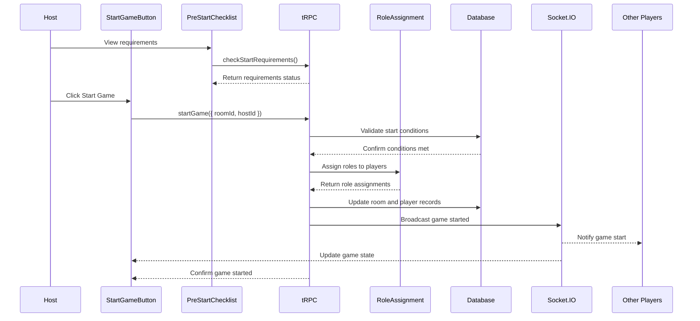

# User Story: 4 - Start Game

**As a** game host,
**I want** to start the game when all players are ready,
**so that** we can begin playing Avalon.

## Acceptance Criteria

* Host can only start game when minimum 5 players are in the room
* Start game button is disabled until minimum players are met
* Roles are randomly assigned based on selected character configuration
* Game phase transitions from lobby to roleReveal
* All players are notified that the game has started
* Player roles are stored securely on the backend
* Game state is synchronized to all players
* Once started, new players cannot join the room

## Notes

* Role assignment must be cryptographically secure and random
* Game state machine enforces valid transitions
* Uses Socket.IO `game:start` event for real-time notification
* Backend validates all conditions before allowing game start

## Implementation Plan

### 1. Feature Overview

Create a game starting feature that allows hosts to initiate the Avalon game when all prerequisites are met. This involves role assignment, game state transition, and real-time synchronization. The primary user role is the game host who controls when the game begins.

### 2. Component Analysis & Reuse Strategy

**Existing Components:**
- `GameSettingsPanel` - Can be reused for displaying current settings before start
- `ValidationErrors` - Can be reused for displaying start validation errors

**New Components Required:**
- `StartGameButton` - New component needed for the start game trigger
- `PreStartChecklist` - New component needed to show readiness requirements
- `GameStartStatus` - New component needed to show starting progress
- `PlayerReadyList` - New component needed to show player readiness

### 3. Affected Files

```
- [CREATE] src/app/room/[roomCode]/lobby/StartGameButton.tsx
- [CREATE] src/app/room/[roomCode]/lobby/PreStartChecklist.tsx
- [CREATE] src/app/room/[roomCode]/lobby/GameStartStatus.tsx
- [CREATE] src/app/room/[roomCode]/lobby/PlayerReadyList.tsx
- [CREATE] src/app/room/[roomCode]/lobby/StartGameButton.test.tsx
- [CREATE] src/app/room/[roomCode]/lobby/PreStartChecklist.test.tsx
- [CREATE] src/app/room/[roomCode]/lobby/GameStartStatus.test.tsx
- [CREATE] src/app/room/[roomCode]/lobby/PlayerReadyList.test.tsx
- [CREATE] src/app/room/[roomCode]/lobby/StartGameButton.visual.spec.ts
- [CREATE] src/app/room/[roomCode]/lobby/PreStartChecklist.visual.spec.ts
- [CREATE] src/app/room/[roomCode]/lobby/GameStartStatus.visual.spec.ts
- [CREATE] src/app/room/[roomCode]/lobby/PlayerReadyList.visual.spec.ts
- [CREATE] src/lib/role-assignment.ts
- [CREATE] src/lib/role-assignment.test.ts
- [CREATE] src/lib/game-state-machine.ts
- [CREATE] src/lib/game-state-machine.test.ts
- [CREATE] src/types/game-state.ts
- [CREATE] src/types/roles.ts
- [MODIFY] src/types/room.ts
- [MODIFY] src/server/api/routers/room.ts
- [MODIFY] prisma/schema.prisma
- [MODIFY] docs/erd.md
```

### 4. Component Breakdown

**StartGameButton** (`src/app/room/[roomCode]/lobby/StartGameButton.tsx`)
- **Type**: Client Component (requires user interaction and state management)
- **Responsibility**: Handle game start trigger with validation and loading states
- **Key Props**:
  ```typescript
  interface StartGameButtonProps {
    roomId: string;
    isHost: boolean;
    canStart: boolean;
    onStartGame: () => void;
    isStarting: boolean;
    className?: string;
  }
  ```
- **Child Components**: None

**PreStartChecklist** (`src/app/room/[roomCode]/lobby/PreStartChecklist.tsx`)
- **Type**: Client Component (requires real-time updates)
- **Responsibility**: Display requirements and readiness status for game start
- **Key Props**:
  ```typescript
  interface PreStartChecklistProps {
    playerCount: number;
    minPlayers: number;
    settingsValid: boolean;
    allPlayersReady: boolean;
    requirements: StartRequirement[];
    className?: string;
  }
  ```
- **Child Components**: None

**GameStartStatus** (`src/app/room/[roomCode]/lobby/GameStartStatus.tsx`)
- **Type**: Client Component (requires real-time status updates)
- **Responsibility**: Display game starting progress and role assignment status
- **Key Props**:
  ```typescript
  interface GameStartStatusProps {
    status: 'idle' | 'starting' | 'assigning-roles' | 'complete' | 'error';
    progress: number;
    message: string;
    error?: string;
    className?: string;
  }
  ```
- **Child Components**: None

**PlayerReadyList** (`src/app/room/[roomCode]/lobby/PlayerReadyList.tsx`)
- **Type**: Client Component (requires real-time player updates)
- **Responsibility**: Display list of players and their readiness status
- **Key Props**:
  ```typescript
  interface PlayerReadyListProps {
    players: Player[];
    hostId: string;
    className?: string;
  }
  ```
- **Child Components**: None

### 5. Design Specifications

**Color Analysis:**
| Design Color | Semantic Purpose | Element | Implementation Method |
|--------------|-----------------|---------|------------------------|
| #1a1a2e | Primary brand | Section headers | Direct hex value (#1a1a2e) |
| #16213e | Secondary brand | Player list background | Direct hex value (#16213e) |
| #0066cc | Interactive | Start button (enabled) | Direct hex value (#0066cc) |
| #4a90e2 | Interactive hover | Start button hover | Direct hex value (#4a90e2) |
| #6c757d | Disabled | Start button (disabled) | Direct hex value (#6c757d) |
| #ffffff | High contrast text | Button text, player names | Direct hex value (#ffffff) |
| #f8f9fa | Subtle background | Checklist background | Direct hex value (#f8f9fa) |
| #28a745 | Success | Ready indicators, checkmarks | Direct hex value (#28a745) |
| #dc3545 | Error | Error states, failed requirements | Direct hex value (#dc3545) |
| #ffc107 | Warning | Pending requirements | Direct hex value (#ffc107) |
| #17a2b8 | Info | Progress indicators | Direct hex value (#17a2b8) |

**Spacing Values:**
- Component padding: 24px (p-6)
- Player list item padding: 12px (p-3)
- Button padding: 12px 32px (px-8 py-3)
- Gap between sections: 24px (gap-6)
- Progress bar height: 8px (h-2)

**Visual Hierarchy:**
```
StartGameSection
├── PreStartChecklist (requirements panel)
│   ├── Player count status
│   ├── Settings validation status
│   └── Ready requirements
├── PlayerReadyList (player status)
│   └── Player items with ready indicators
├── StartGameButton (primary action)
└── GameStartStatus (progress panel, conditional)
    ├── Progress bar
    └── Status message
```

**Typography:**
- Section titles: 20px, font-bold, line-height: 1.3
- Player names: 16px, font-medium, line-height: 1.4
- Status messages: 14px, font-normal, line-height: 1.5
- Button text: 16px, font-semibold, line-height: 1.4
- Error messages: 14px, font-medium, line-height: 1.4

**Responsive Behavior:**
- Mobile (375px): Single column layout, full-width button
- Tablet (768px): Two-column layout for checklist and player list
- Desktop (1280px): Optimized spacing and layout
- Large (1920px): Wider containers with proper spacing

### 6. Data Flow & State Management

**TypeScript Types** (`src/types/game-state.ts`):
```typescript
export interface GameState {
  phase: GamePhase;
  round: number;
  leaderIndex: number;
  startedAt?: Date;
  votes: Vote[];
  missions: Mission[];
  assassinAttempt?: AssassinAttempt;
}

export type GamePhase = 
  | 'lobby' 
  | 'roleReveal' 
  | 'voting' 
  | 'missionSelect' 
  | 'missionVote' 
  | 'missionResult' 
  | 'assassinAttempt' 
  | 'gameOver';

export interface StartRequirement {
  id: string;
  name: string;
  description: string;
  status: 'pending' | 'satisfied' | 'failed';
  required: boolean;
}
```

**TypeScript Types** (`src/types/roles.ts`):
```typescript
export interface Role {
  id: string;
  name: string;
  team: 'good' | 'evil';
  description: string;
  abilities: string[];
  seesEvil: boolean;
  seenByMerlin: boolean;
  isAssassin: boolean;
}

export interface RoleAssignment {
  playerId: string;
  roleId: string;
  assignedAt: Date;
}
```

**Data Fetching Strategy:**
- **Server Component**: Game state and player data fetched from database
- **Client Component**: `StartGameButton` calls tRPC mutation to start game
- **Real-time**: Socket.IO for game state synchronization
- **Background**: Role assignment happens server-side securely

**State Management:**
- Local state in `StartGameButton` for start process status
- Local state in `GameStartStatus` for progress tracking
- Real-time game state updates via Socket.IO
- No global state management required for this feature

**Database Schema Changes:**
Updates to existing models:
```prisma
model Room {
  id          String   @id @default(cuid())
  code        String   @unique
  hostId      String
  gameState   Json     // Enhanced GameState object
  settings    Json
  phase       String   @default("lobby")
  startedAt   DateTime?
  maxPlayers  Int      @default(10)
  createdAt   DateTime @default(now())
  updatedAt   DateTime @updatedAt
  expiresAt   DateTime
  players     Player[]
  
  @@index([code])
  @@index([phase])
  @@index([expiresAt])
}

model Player {
  id        String   @id @default(cuid())
  name      String
  isHost    Boolean  @default(false)
  role      String?  // Role ID assigned during game start
  roleData  Json?    // Role-specific data
  isReady   Boolean  @default(false)
  joinedAt  DateTime @default(now())
  sessionId String?  @unique
  roomId    String
  room      Room     @relation(fields: [roomId], references: [id], onDelete: Cascade)
  
  @@index([roomId])
  @@index([sessionId])
}
```

### 7. API Endpoints & Contracts

**tRPC Router** (`src/server/api/routers/room.ts`):
```typescript
startGame: publicProcedure
  .input(z.object({
    roomId: z.string(),
    hostId: z.string()
  }))
  .mutation(async ({ ctx, input }) => {
    // Game start validation and role assignment
  })

checkStartRequirements: publicProcedure
  .input(z.object({
    roomId: z.string()
  }))
  .query(async ({ ctx, input }) => {
    // Return start requirements status
  })

getGameState: publicProcedure
  .input(z.object({
    roomId: z.string()
  }))
  .query(async ({ ctx, input }) => {
    // Return current game state
  })
```

### 8. Integration Diagram



### 9. Styling

**Color Implementation:**
- Primary brand color (#1a1a2e) for section headers
- Interactive blue (#0066cc) for enabled start button with hover (#4a90e2)
- Disabled gray (#6c757d) for disabled start button
- Success green (#28a745) for ready indicators and satisfied requirements
- Error red (#dc3545) for failed requirements and error states
- Warning yellow (#ffc107) for pending requirements
- Info blue (#17a2b8) for progress indicators

**Typography Implementation:**
- Font family: Geist Sans (--font-geist-sans)
- Section titles: text-xl (20px) with font-bold
- Player names: text-base (16px) with font-medium
- Status messages: text-sm (14px) with font-normal
- Button text: text-base (16px) with font-semibold

**Layout & Spacing:**
- Component container: max-w-2xl with mx-auto centering
- Section spacing: mb-6 (24px) between major sections
- Player list spacing: space-y-2 (8px) between player items
- Button spacing: mt-8 (32px) above start button
- Progress bar: h-2 (8px) height with rounded corners

**Visual Implementation Checklist:**
- [ ] Start button uses interactive blue (#0066cc) when enabled
- [ ] Start button uses disabled gray (#6c757d) when disabled
- [ ] Ready indicators use success green (#28a745)
- [ ] Error states use error red (#dc3545)
- [ ] Progress bar uses info blue (#17a2b8)
- [ ] Player list has proper background (#16213e)
- [ ] Typography hierarchy is clear and consistent

### 10. Testing Strategy

**Unit Tests:**
- `src/lib/role-assignment.test.ts` - Role assignment algorithms
- `src/lib/game-state-machine.test.ts` - Game state transitions
- `src/app/room/[roomCode]/lobby/StartGameButton.test.tsx` - Start button logic
- `src/app/room/[roomCode]/lobby/PreStartChecklist.test.tsx` - Requirements checking
- `src/app/room/[roomCode]/lobby/GameStartStatus.test.tsx` - Status display
- `src/app/room/[roomCode]/lobby/PlayerReadyList.test.tsx` - Player list display

**Component Tests:**
- Start button enable/disable logic
- Requirements validation and display
- Role assignment process
- Error handling for start failures
- Progress tracking and display

**Playwright Visual Tests:**
- Start button states (enabled, disabled, loading)
- Requirements checklist appearance
- Player readiness indicators
- Progress bar and status messages
- Error state displays

### 11. Accessibility (A11y) Considerations

- Start button properly labeled and has clear disabled state
- Progress indicators announced to screen readers
- Requirements checklist uses proper ARIA roles
- Status messages use live regions for announcements
- Loading states provide clear feedback to screen readers
- Error messages are associated with relevant controls
- Keyboard navigation works for all interactive elements

### 12. Security Considerations

- Host-only access to game start functionality
- Server-side validation of all start requirements
- Cryptographically secure role assignment
- Role data encrypted in database
- Game state transitions validated server-side
- Anti-cheat measures for role assignment
- Audit logging for game start events

### 13. Implementation Steps

**Phase 1: UI Implementation with Mock Data**

**1. Setup & Types:**
- [ ] Define GameState types in `src/types/game-state.ts`
- [ ] Define Role types in `src/types/roles.ts`
- [ ] Create role assignment utilities in `src/lib/role-assignment.ts`
- [ ] Create game state machine in `src/lib/game-state-machine.ts`
- [ ] Set up mock game state and role data

**2. UI Components:**
- [ ] Create `src/app/room/[roomCode]/lobby/PreStartChecklist.tsx`
- [ ] Create `src/app/room/[roomCode]/lobby/PlayerReadyList.tsx`
- [ ] Create `src/app/room/[roomCode]/lobby/StartGameButton.tsx`
- [ ] Create `src/app/room/[roomCode]/lobby/GameStartStatus.tsx`
- [ ] Configure components to use mock data
- [ ] Implement start button logic with validation

**3. Styling:**
- [ ] Verify start button colors (#0066cc enabled, #6c757d disabled) EXACTLY
- [ ] Verify hover state color (#4a90e2) EXACTLY
- [ ] Verify success indicators color (#28a745) EXACTLY
- [ ] Verify error states color (#dc3545) EXACTLY
- [ ] Verify progress bar color (#17a2b8) EXACTLY
- [ ] Verify player list background (#16213e) EXACTLY
- [ ] Verify typography sizes (text-xl, text-base, text-sm) EXACTLY
- [ ] Verify spacing values (p-6, mb-6, mt-8) EXACTLY
- [ ] Apply direct hex values for all colors in className attributes
- [ ] Apply Tailwind classes for spacing and layout
- [ ] Implement responsive behavior for all breakpoints

**4. UI Testing:**
- [ ] Write component tests for all components with mock data
- [ ] Create Playwright visual test `src/app/room/[roomCode]/lobby/StartGameButton.visual.spec.ts`
- [ ] Create Playwright visual test `src/app/room/[roomCode]/lobby/PreStartChecklist.visual.spec.ts`
- [ ] Create Playwright visual test `src/app/room/[roomCode]/lobby/GameStartStatus.visual.spec.ts`
- [ ] Create Playwright visual test `src/app/room/[roomCode]/lobby/PlayerReadyList.visual.spec.ts`
- [ ] Configure tests for all viewport sizes (375px, 768px, 1280px, 1920px)
- [ ] Add visual color verification tests with exact RGB values using CSS property assertions
- [ ] Add spacing/layout verification tests with pixel measurements using DOM properties
- [ ] Add typography verification tests for font sizes and weights using computed styles
- [ ] Add comprehensive data-testid attributes: `data-testid="start-game-button"`, `data-testid="pre-start-checklist"`, `data-testid="game-start-status"`, `data-testid="player-ready-list"`
- [ ] Manual testing and A11y checks for all UI elements

**Phase 2: API Integration with Real Data**

**5. Database Schema:**
- [ ] Update Room model in `prisma/schema.prisma` with enhanced gameState and phase fields
- [ ] Update Player model with role and roleData fields
- [ ] Create and run database migration
- [ ] Update database ERD in `docs/erd.md`

**6. Backend Implementation:**
- [ ] Extend `src/server/api/routers/room.ts` with startGame procedure
- [ ] Add checkStartRequirements procedure for validation
- [ ] Add getGameState procedure for state retrieval
- [ ] Implement secure role assignment logic
- [ ] Add game state machine validation
- [ ] Implement proper error handling and logging

**7. Integration:**
- [ ] Replace mock data with real tRPC calls in all components
- [ ] Update state management to handle real data fetching
- [ ] Implement proper error handling for API failures
- [ ] Add loading states connected to real data fetching
- [ ] Implement real-time game state synchronization
- [ ] Test game start end-to-end flow

**8. Integration Testing:**
- [ ] Write unit tests for game start API validation logic
- [ ] Update component tests to test with real data fetching (mocked)
- [ ] End-to-end testing of game start flow
- [ ] Test role assignment with various character combinations
- [ ] Test error scenarios (insufficient players, invalid settings)

**9. Final Documentation & Polishing:**
- [ ] Add JSDoc documentation to all functions and components
- [ ] Final review of integration between UI and API
- [ ] Performance checks with role assignment
- [ ] Security review of role assignment and game state management
- [ ] User experience testing for game start flow

### References

- [Cryptographically Secure Random](https://developer.mozilla.org/en-US/docs/Web/API/Crypto/getRandomValues)
- [Fisher-Yates Shuffle Algorithm](https://en.wikipedia.org/wiki/Fisher%E2%80%93Yates_shuffle)
- [State Machine Pattern](https://en.wikipedia.org/wiki/State_pattern)
- [ARIA Live Regions](https://developer.mozilla.org/en-US/docs/Web/Accessibility/ARIA/ARIA_Live_Regions)
- [Socket.IO Room Events](https://socket.io/docs/v4/rooms/)
