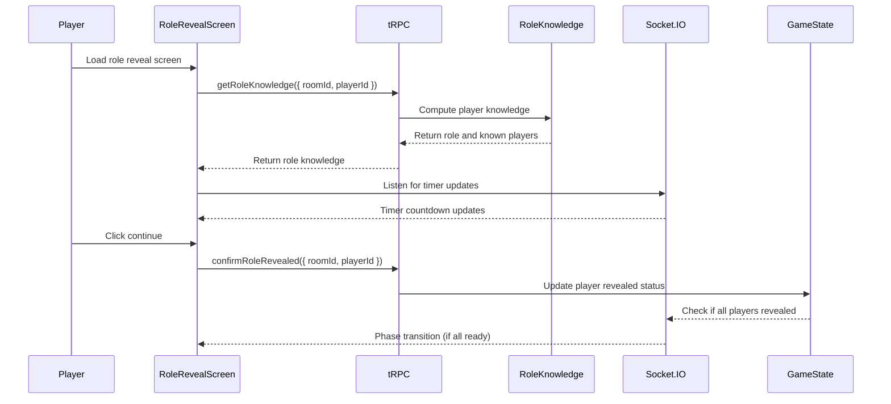

# User Story: 5 - Reveal Character Roles

**As a** player,
**I want** to privately see my character role and relevant information,
**so that** I understand my objectives and what I know about other players.

## Acceptance Criteria

* Each player receives their role information privately
* Evil players can see other evil players (except Oberon sees no one)
* Merlin can see all evil players (except Mordred)
* Percival can see both Merlin and Morgana (but cannot distinguish between them)
* Regular good players see only their own role
* Role information is sent securely and privately to each player
* Role reveal phase has a timer or manual progression
* Game advances to voting phase after role reveal is complete

## Notes

* Role information sent via private Socket.IO event `player:roleReveal`
* Information visibility follows official Avalon rules
* Backend handles all role-reveal logic for security
* UI clearly displays what each player knows and doesn't know

## Implementation Plan

### 1. Feature Overview

Create a role revelation interface that privately displays each player's character information and knowledge about other players according to Avalon rules. The primary user role is any player who needs to understand their character's abilities and what they know about others.

### 2. Component Analysis & Reuse Strategy

**Existing Components:**
- No existing components are suitable for reuse for this feature

**New Components Required:**
- `RoleRevealScreen` - New component needed for the main role display interface
- `PlayerRoleCard` - New component needed to display player's own role
- `KnownPlayersGrid` - New component needed to show what player knows about others
- `RoleRevealTimer` - New component needed for phase timing
- `ContinueButton` - New component needed for manual progression

### 3. Affected Files

```
- [CREATE] src/app/room/[roomCode]/game/RoleRevealScreen.tsx
- [CREATE] src/app/room/[roomCode]/game/PlayerRoleCard.tsx
- [CREATE] src/app/room/[roomCode]/game/KnownPlayersGrid.tsx
- [CREATE] src/app/room/[roomCode]/game/RoleRevealTimer.tsx
- [CREATE] src/app/room/[roomCode]/game/ContinueButton.tsx
- [CREATE] src/app/room/[roomCode]/game/RoleRevealScreen.test.tsx
- [CREATE] src/app/room/[roomCode]/game/PlayerRoleCard.test.tsx
- [CREATE] src/app/room/[roomCode]/game/KnownPlayersGrid.test.tsx
- [CREATE] src/app/room/[roomCode]/game/RoleRevealTimer.test.tsx
- [CREATE] src/app/room/[roomCode]/game/ContinueButton.test.tsx
- [CREATE] src/app/room/[roomCode]/game/RoleRevealScreen.visual.spec.ts
- [CREATE] src/app/room/[roomCode]/game/PlayerRoleCard.visual.spec.ts
- [CREATE] src/app/room/[roomCode]/game/KnownPlayersGrid.visual.spec.ts
- [CREATE] src/app/room/[roomCode]/game/RoleRevealTimer.visual.spec.ts
- [CREATE] src/app/room/[roomCode]/game/ContinueButton.visual.spec.ts
- [CREATE] src/lib/role-knowledge.ts
- [CREATE] src/lib/role-knowledge.test.ts
- [CREATE] src/types/role-knowledge.ts
- [MODIFY] src/types/roles.ts
- [MODIFY] src/server/api/routers/room.ts
- [MODIFY] docs/erd.md
```

### 4. Component Breakdown

**RoleRevealScreen** (`src/app/room/[roomCode]/game/RoleRevealScreen.tsx`)
- **Type**: Client Component (requires real-time updates and secure data handling)
- **Responsibility**: Main container for role revelation interface
- **Key Props**:
  ```typescript
  interface RoleRevealScreenProps {
    playerId: string;
    roomId: string;
    playerRole: Role;
    knownPlayers: KnownPlayer[];
    timeRemaining?: number;
    onContinue: () => void;
    className?: string;
  }
  ```
- **Child Components**: PlayerRoleCard, KnownPlayersGrid, RoleRevealTimer, ContinueButton

**PlayerRoleCard** (`src/app/room/[roomCode]/game/PlayerRoleCard.tsx`)
- **Type**: Client Component (displays sensitive role information)
- **Responsibility**: Display player's own role information and abilities
- **Key Props**:
  ```typescript
  interface PlayerRoleCardProps {
    role: Role;
    playerName: string;
    team: 'good' | 'evil';
    className?: string;
  }
  ```
- **Child Components**: None

**KnownPlayersGrid** (`src/app/room/[roomCode]/game/KnownPlayersGrid.tsx`)
- **Type**: Client Component (displays computed knowledge)
- **Responsibility**: Display what the player knows about other players
- **Key Props**:
  ```typescript
  interface KnownPlayersGridProps {
    knownPlayers: KnownPlayer[];
    playerRole: Role;
    className?: string;
  }
  ```
- **Child Components**: None

**RoleRevealTimer** (`src/app/room/[roomCode]/game/RoleRevealTimer.tsx`)
- **Type**: Client Component (requires real-time countdown)
- **Responsibility**: Display countdown timer for role reveal phase
- **Key Props**:
  ```typescript
  interface RoleRevealTimerProps {
    timeRemaining: number;
    onTimeUp: () => void;
    className?: string;
  }
  ```
- **Child Components**: None

### 5. Design Specifications

**Color Analysis:**
| Design Color | Semantic Purpose | Element | Implementation Method |
|--------------|-----------------|---------|------------------------|
| #1a1a2e | Primary brand | Screen header | Direct hex value (#1a1a2e) |
| #16213e | Secondary brand | Role card background | Direct hex value (#16213e) |
| #0066cc | Interactive | Continue button | Direct hex value (#0066cc) |
| #4a90e2 | Interactive hover | Button hover state | Direct hex value (#4a90e2) |
| #ffffff | High contrast text | Role names, descriptions | Direct hex value (#ffffff) |
| #f8f9fa | Subtle background | Screen background | Direct hex value (#f8f9fa) |
| #6c757d | Muted text | Player names, hints | Direct hex value (#6c757d) |
| #28a745 | Success/Good | Good team indicators | Direct hex value (#28a745) |
| #dc3545 | Error/Evil | Evil team indicators | Direct hex value (#dc3545) |
| #ffc107 | Warning | Timer warnings | Direct hex value (#ffc107) |
| #17a2b8 | Info | Knowledge indicators | Direct hex value (#17a2b8) |

**Spacing Values:**
- Screen padding: 24px (p-6)
- Role card padding: 20px (p-5)
- Grid gap: 16px (gap-4)
- Timer spacing: 16px (mt-4)
- Button spacing: 32px (mt-8)

**Visual Hierarchy:**
```
RoleRevealScreen
├── Header ("Your Role" - h1, text-3xl)
├── PlayerRoleCard (prominent, centered)
│   ├── Role name (h2, text-2xl)
│   ├── Team indicator (badge)
│   └── Role description (p, text-lg)
├── KnownPlayersGrid (conditional)
│   ├── Section title ("You Know")
│   └── Player knowledge cards
├── RoleRevealTimer (countdown)
└── ContinueButton (primary action)
```

**Typography:**
- Screen title: 30px, font-bold, line-height: 1.2
- Role name: 24px, font-bold, line-height: 1.3
- Role description: 18px, font-normal, line-height: 1.5
- Player names: 16px, font-medium, line-height: 1.4
- Timer text: 18px, font-mono, font-semibold
- Button text: 16px, font-semibold, line-height: 1.4

### 6. Data Flow & State Management

**TypeScript Types** (`src/types/role-knowledge.ts`):
```typescript
export interface KnownPlayer {
  id: string;
  name: string;
  knowledgeType: 'role' | 'team' | 'ambiguous' | 'unknown';
  revealedRole?: string;
  revealedTeam?: 'good' | 'evil';
  isAmbiguous?: boolean;
  confidence: 'certain' | 'suspected' | 'unknown';
}

export interface RoleKnowledge {
  playerId: string;
  playerRole: Role;
  knownPlayers: KnownPlayer[];
  restrictions: string[];
  hints: string[];
}
```

**Data Fetching Strategy:**
- **Server Component**: None - all data comes from secure tRPC calls
- **Client Component**: `RoleRevealScreen` receives role data via secure Socket.IO
- **Real-time**: Role information delivered privately per player
- **Security**: Role knowledge computed server-side, never exposed to other players

**State Management:**
- Local state for timer countdown
- Local state for continue button status
- Real-time role data via Socket.IO private events
- No persistent state - data is session-only

### 7. API Endpoints & Contracts

**tRPC Router** (`src/server/api/routers/room.ts`):
```typescript
getRoleKnowledge: publicProcedure
  .input(z.object({
    roomId: z.string(),
    playerId: z.string()
  }))
  .query(async ({ ctx, input }) => {
    // Compute and return role knowledge for player
  })

confirmRoleRevealed: publicProcedure
  .input(z.object({
    roomId: z.string(),
    playerId: z.string()
  }))
  .mutation(async ({ ctx, input }) => {
    // Mark player as having seen their role
  })
```

### 8. Integration Diagram



### 9. Styling

**Color Implementation:**
- Primary brand color (#1a1a2e) for screen headers
- Role card background (#16213e) with high contrast text
- Good team indicators use success green (#28a745)
- Evil team indicators use error red (#dc3545)
- Interactive blue (#0066cc) for continue button
- Timer warnings use warning yellow (#ffc107)
- Info blue (#17a2b8) for knowledge indicators

**Layout & Spacing:**
- Screen container: max-w-4xl with mx-auto centering
- Role card: prominent centering with generous padding
- Grid layout: responsive columns for known players
- Timer: fixed positioning or prominent placement
- Button: centered with proper spacing

### 10. Testing Strategy

**Component Tests:**
- Role information display accuracy
- Knowledge computation for different roles
- Timer countdown functionality
- Continue button enabling/disabling
- Private data security

**Playwright Visual Tests:**
- Role card appearance and styling
- Known players grid layout
- Timer display and countdown
- Team indicator colors
- Button states and interactions

### 11. Accessibility (A11y) Considerations

- Screen reader support for role information
- High contrast for team indicators
- Timer announcements for countdown
- Keyboard navigation for continue button
- Clear labeling of all role information
- Proper heading hierarchy

### 12. Security Considerations

- Role information never exposed to other players
- Server-side computation of all knowledge
- Secure Socket.IO events for private data
- No client-side role logic
- Audit logging of role revelations
- Anti-tampering measures

### 13. Implementation Steps

**Phase 1: UI Implementation with Mock Data**

**1. Setup & Types:**
- [ ] Define RoleKnowledge types in `src/types/role-knowledge.ts`
- [ ] Create role knowledge utilities in `src/lib/role-knowledge.ts`
- [ ] Set up mock role and knowledge data
- [ ] Create knowledge computation algorithms

**2. UI Components:**
- [ ] Create `src/app/room/[roomCode]/game/PlayerRoleCard.tsx`
- [ ] Create `src/app/room/[roomCode]/game/KnownPlayersGrid.tsx`
- [ ] Create `src/app/room/[roomCode]/game/RoleRevealTimer.tsx`
- [ ] Create `src/app/room/[roomCode]/game/ContinueButton.tsx`
- [ ] Create `src/app/room/[roomCode]/game/RoleRevealScreen.tsx`
- [ ] Configure components with mock data

**3. Styling:**
- [ ] Verify role card background (#16213e) EXACTLY
- [ ] Verify good team color (#28a745) EXACTLY
- [ ] Verify evil team color (#dc3545) EXACTLY
- [ ] Verify continue button color (#0066cc) EXACTLY
- [ ] Verify timer warning color (#ffc107) EXACTLY
- [ ] Apply direct hex values for all colors
- [ ] Implement responsive layout

**4. Testing:**
- [ ] Create comprehensive visual tests
- [ ] Test all role knowledge scenarios
- [ ] Test timer functionality
- [ ] Add accessibility tests

**Phase 2: API Integration**

**5. Backend:**
- [ ] Implement secure role knowledge computation
- [ ] Add tRPC procedures for role data
- [ ] Implement Socket.IO private events
- [ ] Add security measures

**6. Integration:**
- [ ] Replace mock data with real API calls
- [ ] Implement real-time timer synchronization
- [ ] Add error handling
- [ ] Test end-to-end flow

### References

- [Official Avalon Rules](https://boardgamegeek.com/boardgame/128882/the-resistance-avalon)
- [Socket.IO Private Messages](https://socket.io/docs/v4/private-messages/)
- [Cryptographic Security](https://developer.mozilla.org/en-US/docs/Web/API/SubtleCrypto)
