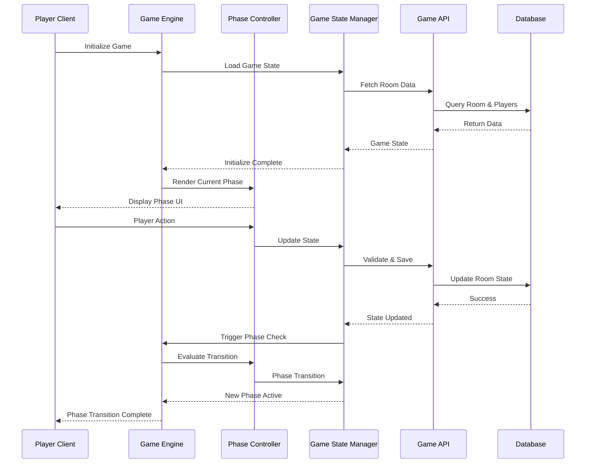

# User Story: 19 - Game Engine Controller

**As a** player,
**I want** the game to automatically orchestrate all phases from start to finish,
**so that** I can experience a seamless gameplay flow without manual navigation between phases.

## Acceptance Criteria

* The game controller manages the entire game flow from role reveal to final results
* Phase transitions happen automatically based on game logic and player actions
* All 18 implemented features work together seamlessly
* Game state is managed centrally across all phases
* Error handling and recovery mechanisms are in place
* Performance monitoring tracks game engine health

## Notes

* This is the core orchestration system that will replace the "Game Interface Coming Soon" placeholder
* Must integrate with existing game state machine and all 18 individual feature components
* Central controller at `/src/app/room/[roomCode]/game/page.tsx`

## Implementation Plan

### 1. Feature Overview

The Game Engine Controller serves as the central orchestration system that manages the entire Avalon game flow from start to finish. It coordinates all 18 implemented features, handles automatic phase transitions, and ensures seamless gameplay without manual navigation between phases.

### 2. Component Analysis & Reuse Strategy

**Existing Components to Reuse:**
- `useSSERealtimeRoom` hook (`src/hooks/useSSERealtimeRoom.ts`) - Real-time room state management
- `GameStateMachine` class (`src/lib/game-state-machine.ts`) - Phase transition logic
- `GameStateRecovery` components (`src/components/features/game-state-recovery/`) - Error recovery mechanisms
- `CurrentStatusBar` (`src/app/room/[roomCode]/game/CurrentStatusBar.tsx`) - Game progress display
- All existing feature components from Features 1-18

**New Components Needed:**
- `GameEngine` - Central game orchestration component
- `PhaseController` - Phase transition management
- `GameStateManager` - Centralized state coordination
- `ErrorBoundary` - Game-specific error handling
- `PerformanceMonitor` - Health monitoring component

### 3. Affected Files

- `[MODIFY] src/app/room/[roomCode]/game/page.tsx`
- `[CREATE] src/components/game-engine/GameEngine.tsx`
- `[CREATE] src/components/game-engine/PhaseController.tsx`
- `[CREATE] src/components/game-engine/GameStateManager.tsx`
- `[CREATE] src/components/game-engine/ErrorBoundary.tsx`
- `[CREATE] src/components/game-engine/PerformanceMonitor.tsx`
- `[CREATE] src/components/game-engine/index.ts`
- `[CREATE] src/types/game-engine.ts`
- `[CREATE] src/lib/game-engine-utils.ts`
- `[MODIFY] src/lib/game-state-machine.ts`
- `[CREATE] src/components/game-engine/GameEngine.test.tsx`
- `[CREATE] src/components/game-engine/PhaseController.test.tsx`
- `[CREATE] src/components/game-engine/GameEngine.visual.spec.ts`

### 4. Component Breakdown

**GameEngine** (`src/components/game-engine/GameEngine.tsx`)
- **Type**: Client Component (requires state management and real-time updates)
- **Responsibility**: Central orchestration of all game features and phase transitions
- **Key Props**:
  ```typescript
  interface GameEngineProps {
    roomCode: string;
    playerId: string;
    playerName: string;
    initialGameState?: GameState;
    onError?: (error: GameEngineError) => void;
    onPhaseTransition?: (from: GamePhase, to: GamePhase) => void;
  }
  ```
- **Child Components**: PhaseController, GameStateManager, ErrorBoundary, PerformanceMonitor

**PhaseController** (`src/components/game-engine/PhaseController.tsx`)
- **Type**: Client Component (manages phase transitions)
- **Responsibility**: Handle automatic phase transitions and render appropriate phase components
- **Key Props**:
  ```typescript
  interface PhaseControllerProps {
    currentPhase: GamePhase;
    gameState: GameState;
    players: Player[];
    onPhaseTransition: (newPhase: GamePhase) => void;
    roomCode: string;
    playerId: string;
  }
  ```
- **Child Components**: Dynamic phase-specific components (RoleReveal, TeamSelection, etc.)

**GameStateManager** (`src/components/game-engine/GameStateManager.tsx`)
- **Type**: Client Component (manages centralized state)
- **Responsibility**: Coordinate state updates across all features and handle synchronization
- **Key Props**:
  ```typescript
  interface GameStateManagerProps {
    roomCode: string;
    gameState: GameState;
    onStateUpdate: (newState: GameState) => void;
    onError: (error: GameEngineError) => void;
  }
  ```
- **Child Components**: None (utility component)

**ErrorBoundary** (`src/components/game-engine/ErrorBoundary.tsx`)
- **Type**: Client Component (error boundary)
- **Responsibility**: Catch and handle game-specific errors with recovery options
- **Key Props**:
  ```typescript
  interface ErrorBoundaryProps {
    children: React.ReactNode;
    onError: (error: Error, errorInfo: ErrorInfo) => void;
    fallback?: React.ComponentType<{error: Error; retry: () => void}>;
  }
  ```
- **Child Components**: Fallback error component

**PerformanceMonitor** (`src/components/game-engine/PerformanceMonitor.tsx`)
- **Type**: Client Component (performance tracking)
- **Responsibility**: Monitor game engine health and performance metrics
- **Key Props**:
  ```typescript
  interface PerformanceMonitorProps {
    enabled: boolean;
    onMetricsUpdate: (metrics: PerformanceMetrics) => void;
    thresholds: PerformanceThresholds;
  }
  ```
- **Child Components**: None (monitoring component)

### 5. Design Specifications

**Color System:**
| Design Color | Semantic Purpose | Element | Implementation Method |
|--------------|-----------------|---------|------------------------|
| #0a0a0f | Deep background | Game container | Direct hex value (#0a0a0f) |
| #1a1a2e | Primary brand | Engine panels | Direct hex value (#1a1a2e) |
| #252547 | Elevated surface | Phase containers | Direct hex value (#252547) |
| #3d3d7a | Interactive | Action buttons | Direct hex value (#3d3d7a) |
| #22c55e | Success | Successful transitions | Direct hex value (#22c55e) |
| #ef4444 | Error | Engine errors | Direct hex value (#ef4444) |
| #f59e0b | Warning | Performance warnings | Direct hex value (#f59e0b) |
| #3b82f6 | Information | Status indicators | Direct hex value (#3b82f6) |

**Typography:**
- Engine title: 32px, font-bold, line-height: 1.2
- Phase headers: 24px, font-semibold, line-height: 1.3
- Status text: 16px, font-medium, line-height: 1.4
- Error messages: 14px, font-medium, line-height: 1.5

**Spacing:**
- Container padding: 32px (p-8)
- Phase container padding: 24px (p-6)
- Component spacing: 16px (space-y-4)
- Status bar height: 64px (h-16)

**Visual Hierarchy:**
```
GameEngine Container
├── PerformanceMonitor (fixed position)
├── GameStateManager (invisible coordinator)
├── ErrorBoundary (wraps main content)
└── PhaseController (main content area)
    ├── Phase Header
    ├── Dynamic Phase Component
    └── Phase Actions
```

### 6. Data Flow & State Management

**TypeScript Types:**
```typescript
// src/types/game-engine.ts
export interface GameEngineState {
  isInitialized: boolean;
  currentPhase: GamePhase;
  gameState: GameState;
  players: Player[];
  error: GameEngineError | null;
  performance: PerformanceMetrics;
  transitionInProgress: boolean;
}

export interface GameEngineError {
  code: string;
  message: string;
  phase: GamePhase;
  recoverable: boolean;
  timestamp: Date;
}

export interface PerformanceMetrics {
  frameRate: number;
  memoryUsage: number;
  transitionTime: number;
  errorCount: number;
  lastHealthCheck: Date;
}
```

**State Management:**
- Uses React state for local game engine state
- Integrates with existing `useSSERealtimeRoom` for real-time updates
- Utilizes `GameStateMachine` for phase transition validation
- Implements optimistic updates with rollback capability

**Data Fetching:**
- Server Components: Game engine initialization data
- Client Components: Real-time state updates via SSE
- Local state: Performance metrics and engine status

### 7. API Endpoints & Contracts

**New Route Handler:**
```typescript
// src/app/api/game-engine/transition/route.ts
POST /api/game-engine/transition
{
  "roomCode": "string",
  "fromPhase": "GamePhase",
  "toPhase": "GamePhase",
  "playerId": "string",
  "gameState": "GameState"
}
Response: { success: boolean, newGameState: GameState }
```

**Core Logic:**
- Validates phase transitions using GameStateMachine
- Updates room state in database
- Broadcasts state changes to all players
- Handles error scenarios with rollback

### 8. Integration Diagram



### 9. Styling

**Color Implementation:**
- Engine background: #0a0a0f for deep immersion
- Phase containers: #1a1a2e for primary branding
- Interactive elements: #3d3d7a for user actions
- Status indicators: #3b82f6 for information display
- Success states: #22c55e for positive feedback
- Error states: #ef4444 for critical issues
- Warning states: #f59e0b for attention

**Layout:**
- Full-screen container with gradient background
- Fixed performance monitor in top-right corner
- Centered phase content with responsive design
- Smooth transitions between phases (300ms duration)

### 10. Testing Strategy

**Unit Tests:**
- `src/components/game-engine/GameEngine.test.tsx` - Core engine functionality
- `src/components/game-engine/PhaseController.test.tsx` - Phase transition logic
- `src/lib/game-engine-utils.test.ts` - Engine utility functions

**Component Tests:**
- GameEngine component integration tests
- PhaseController component tests
- ErrorBoundary component tests
- PerformanceMonitor component tests

**E2E Tests:**
- Complete game flow from start to finish
- Phase transition scenarios
- Error recovery testing
- Performance monitoring validation

### 11. Accessibility (A11y) Considerations

- ARIA labels for all interactive elements
- Keyboard navigation support throughout all phases
- Screen reader announcements for phase transitions
- High contrast mode support
- Reduced motion preferences respected
- Focus management during phase changes

### 12. Security Considerations

- Input validation for all phase transitions
- Player action authorization
- State tampering prevention
- Secure error handling without exposing sensitive data
- Rate limiting for rapid state changes

### 13. Implementation Steps

**Phase 1: UI Implementation with Mock Data**

**1. Setup & Types:**
- [ ] Define `GameEngineState`, `GameEngineError`, `PerformanceMetrics` in `src/types/game-engine.ts`
- [ ] Create game engine utility functions in `src/lib/game-engine-utils.ts`
- [ ] Set up mock game state data for testing

**2. Core Engine Components:**
- [ ] Create `src/components/game-engine/GameEngine.tsx`
- [ ] Implement GameEngine component structure with mock data
- [ ] Create `src/components/game-engine/PhaseController.tsx`
- [ ] Implement phase routing logic with mock phase transitions
- [ ] Create `src/components/game-engine/GameStateManager.tsx`
- [ ] Implement state coordination with mock state updates

**3. Supporting Components:**
- [ ] Create `src/components/game-engine/ErrorBoundary.tsx`
- [ ] Implement error boundary with recovery options
- [ ] Create `src/components/game-engine/PerformanceMonitor.tsx`
- [ ] Implement performance tracking with mock metrics
- [ ] Create `src/components/game-engine/index.ts` for exports

**4. Styling:**
- [ ] Verify engine background color (#0a0a0f) matches design system EXACTLY
- [ ] Verify phase container colors (#1a1a2e) match design system EXACTLY
- [ ] Verify interactive element colors (#3d3d7a) match design system EXACTLY
- [ ] Verify status indicator colors (#3b82f6) match design system EXACTLY
- [ ] Verify success state colors (#22c55e) match design system EXACTLY
- [ ] Verify error state colors (#ef4444) match design system EXACTLY
- [ ] Apply direct hex values for all colors in className attributes
- [ ] Implement responsive design using established breakpoints
- [ ] Add smooth phase transitions with 300ms duration

**5. UI Testing:**
- [ ] Create Playwright visual test in `src/components/game-engine/GameEngine.visual.spec.ts`
- [ ] Configure tests for all viewport sizes (mobile, tablet, desktop)
- [ ] Add visual color verification tests with exact RGB values using CSS property assertions
- [ ] Add layout verification tests for responsive design
- [ ] Add phase transition animation tests
- [ ] Add comprehensive data-testid attributes to all engine elements
- [ ] Component tests for GameEngine with mock data
- [ ] Component tests for PhaseController with mock data
- [ ] Component tests for ErrorBoundary with mock errors

**Phase 2: API Integration with Real Data**

**6. Backend Integration:**
- [ ] Create `src/app/api/game-engine/transition/route.ts`
- [ ] Implement phase transition validation and state updates
- [ ] Add API contract documentation for game engine endpoints
- [ ] Update `src/lib/game-state-machine.ts` with engine integration

**7. Real-time Integration:**
- [ ] Replace mock data with real SSE-based state updates
- [ ] Integrate with existing `useSSERealtimeRoom` hook
- [ ] Implement optimistic updates with rollback capability
- [ ] Add error handling for API failures and network issues

**8. Game Page Integration:**
- [ ] Update `src/app/room/[roomCode]/game/page.tsx` to use GameEngine
- [ ] Replace "Game Interface Coming Soon" placeholder
- [ ] Integrate with existing session management
- [ ] Add performance monitoring and health checks

**9. Integration Testing:**
- [ ] Write unit tests for API validation logic
- [ ] Update component tests to test with real data fetching (mocked)
- [ ] End-to-end testing of complete game flow
- [ ] Performance testing with real-time updates

**10. Final Documentation & Polishing:**
- [ ] Add JSDoc documentation for all engine components
- [ ] Update docs/erd.md if database schema changes are needed
- [ ] Final review of phase transition logic
- [ ] Performance optimization and monitoring setup
