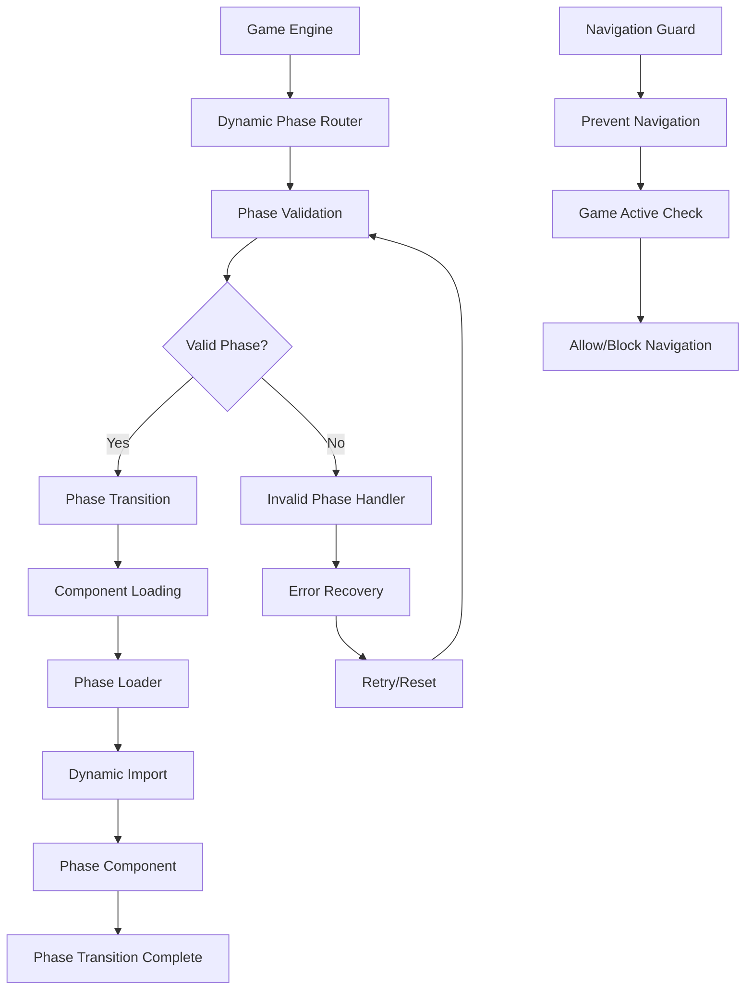

# User Story: 20 - Dynamic Phase Router

**As a** player,
**I want** the game to automatically show the correct interface for the current game phase,
**so that** I always see the appropriate actions and information for what I need to do next.

## Acceptance Criteria

* Game interface dynamically loads components based on current game phase
* Phase transitions include smooth animations (300-500ms duration)
* Invalid game states are handled gracefully with error messages
* Back/forward browser navigation is prevented during active gameplay
* Loading states are shown during phase transitions
* Error boundaries catch and handle component failures

## Notes

* Implements intelligent routing based on game state rather than URL routing
* Must handle all phase transitions: Role Reveal → Team Selection → Voting → Mission → Results → Assassin → Game End
* Component mapping for all 18 features

## Implementation Plan

### 1. Feature Overview

The Dynamic Phase Router provides intelligent component routing based on game state rather than URL routing. It dynamically loads the appropriate interface components for each game phase, ensuring players always see the correct actions and information for the current game state.

### 2. Component Analysis & Reuse Strategy

**Existing Components to Reuse:**
- `GameStateMachine` class (`src/lib/game-state-machine.ts`) - Phase validation and transitions
- All existing phase-specific components from Features 1-18
- `useSSERealtimeRoom` hook (`src/hooks/useSSERealtimeRoom.ts`) - Real-time state updates
- `ErrorBoundary` components from existing features

**New Components Needed:**
- `DynamicPhaseRouter` - Main routing component
- `PhaseTransition` - Animation wrapper for phase changes
- `PhaseLoader` - Loading states during transitions
- `InvalidPhaseHandler` - Error handling for invalid states
- `NavigationGuard` - Browser navigation prevention

### 3. Affected Files

- `[CREATE] src/components/dynamic-phase-router/DynamicPhaseRouter.tsx`
- `[CREATE] src/components/dynamic-phase-router/PhaseTransition.tsx`
- `[CREATE] src/components/dynamic-phase-router/PhaseLoader.tsx`
- `[CREATE] src/components/dynamic-phase-router/InvalidPhaseHandler.tsx`
- `[CREATE] src/components/dynamic-phase-router/NavigationGuard.tsx`
- `[CREATE] src/components/dynamic-phase-router/index.ts`
- `[CREATE] src/types/dynamic-phase-router.ts`
- `[CREATE] src/lib/phase-router-utils.ts`
- `[CREATE] src/hooks/usePhaseRouter.ts`
- `[CREATE] src/components/dynamic-phase-router/DynamicPhaseRouter.test.tsx`
- `[CREATE] src/components/dynamic-phase-router/PhaseTransition.test.tsx`
- `[CREATE] src/components/dynamic-phase-router/DynamicPhaseRouter.visual.spec.ts`

### 4. Component Breakdown

**DynamicPhaseRouter** (`src/components/dynamic-phase-router/DynamicPhaseRouter.tsx`)
- **Type**: Client Component (requires state management and dynamic imports)
- **Responsibility**: Route to appropriate phase component based on game state
- **Key Props**:
  ```typescript
  interface DynamicPhaseRouterProps {
    currentPhase: GamePhase;
    gameState: GameState;
    players: Player[];
    roomCode: string;
    playerId: string;
    onPhaseTransition?: (newPhase: GamePhase) => void;
    onError?: (error: PhaseRouterError) => void;
  }
  ```
- **Child Components**: PhaseTransition, PhaseLoader, InvalidPhaseHandler, NavigationGuard

**PhaseTransition** (`src/components/dynamic-phase-router/PhaseTransition.tsx`)
- **Type**: Client Component (handles animations)
- **Responsibility**: Provide smooth transitions between phase components
- **Key Props**:
  ```typescript
  interface PhaseTransitionProps {
    children: React.ReactNode;
    phase: GamePhase;
    isTransitioning: boolean;
    transitionDuration?: number;
    transitionType?: 'fade' | 'slide' | 'scale';
    onTransitionComplete?: () => void;
  }
  ```
- **Child Components**: Dynamic phase components

**PhaseLoader** (`src/components/dynamic-phase-router/PhaseLoader.tsx`)
- **Type**: Client Component (loading states)
- **Responsibility**: Display loading states during phase transitions and component loading
- **Key Props**:
  ```typescript
  interface PhaseLoaderProps {
    phase: GamePhase;
    message?: string;
    progress?: number;
    isVisible: boolean;
    onTimeout?: () => void;
  }
  ```
- **Child Components**: None

**InvalidPhaseHandler** (`src/components/dynamic-phase-router/InvalidPhaseHandler.tsx`)
- **Type**: Client Component (error handling)
- **Responsibility**: Handle invalid game states and provide recovery options
- **Key Props**:
  ```typescript
  interface InvalidPhaseHandlerProps {
    error: PhaseRouterError;
    currentPhase: GamePhase;
    validPhases: GamePhase[];
    onRetry: () => void;
    onReset: () => void;
  }
  ```
- **Child Components**: None

**NavigationGuard** (`src/components/dynamic-phase-router/NavigationGuard.tsx`)
- **Type**: Client Component (navigation prevention)
- **Responsibility**: Prevent browser navigation during active gameplay
- **Key Props**:
  ```typescript
  interface NavigationGuardProps {
    isGameActive: boolean;
    allowNavigation?: boolean;
    onNavigationAttempt?: (event: BeforeUnloadEvent) => void;
  }
  ```
- **Child Components**: None

### 5. Design Specifications

**Color System:**
| Design Color | Semantic Purpose | Element | Implementation Method |
|--------------|-----------------|---------|------------------------|
| #0a0a0f | Deep background | Router container | Direct hex value (#0a0a0f) |
| #1a1a2e | Primary brand | Phase containers | Direct hex value (#1a1a2e) |
| #252547 | Elevated surface | Transition overlays | Direct hex value (#252547) |
| #3d3d7a | Interactive | Navigation elements | Direct hex value (#3d3d7a) |
| #22c55e | Success | Valid phase transitions | Direct hex value (#22c55e) |
| #ef4444 | Error | Invalid phase states | Direct hex value (#ef4444) |
| #f59e0b | Warning | Loading states | Direct hex value (#f59e0b) |
| #3b82f6 | Information | Phase indicators | Direct hex value (#3b82f6) |

**Animation Specifications:**
- Phase transition duration: 300-500ms
- Transition easing: cubic-bezier(0.4, 0, 0.2, 1)
- Loading spinner: 1.5s rotation cycle
- Error state animation: shake effect (0.3s)

**Typography:**
- Phase headers: 28px, font-bold, line-height: 1.2
- Loading messages: 18px, font-medium, line-height: 1.4
- Error messages: 16px, font-medium, line-height: 1.5
- Navigation warnings: 14px, font-medium, line-height: 1.6

**Spacing:**
- Container padding: 24px (p-6)
- Phase spacing: 16px (space-y-4)
- Loading indicator padding: 32px (p-8)
- Error message padding: 20px (p-5)

### 6. Data Flow & State Management

**TypeScript Types:**
```typescript
// src/types/dynamic-phase-router.ts
export interface PhaseRouterState {
  currentPhase: GamePhase;
  previousPhase: GamePhase | null;
  isTransitioning: boolean;
  isLoading: boolean;
  error: PhaseRouterError | null;
  transitionStartTime: number | null;
}

export interface PhaseRouterError {
  code: 'INVALID_PHASE' | 'TRANSITION_FAILED' | 'COMPONENT_LOAD_ERROR';
  message: string;
  phase: GamePhase;
  recoverable: boolean;
}

export interface PhaseComponentMap {
  [key: string]: React.ComponentType<any>;
}
```

**State Management:**
- Uses React state for local router state
- Integrates with game state from parent Game Engine
- Implements phase validation before routing
- Handles component loading states and errors

**Data Fetching:**
- Dynamic imports for phase components
- Lazy loading of phase-specific resources
- Real-time game state updates via parent

### 7. API Endpoints & Contracts

**No new API endpoints required** - the Dynamic Phase Router operates entirely on the client side using game state provided by the parent Game Engine component.

### 8. Integration Diagram



### 9. Styling

**Color Implementation:**
- Router background: #0a0a0f for seamless integration
- Phase containers: #1a1a2e for consistent branding
- Transition overlays: #252547 with opacity for smooth transitions
- Loading states: #f59e0b for attention-grabbing feedback
- Error states: #ef4444 for critical issue visibility
- Success states: #22c55e for positive feedback

**Transitions:**
- Fade transitions for phase changes
- Slide transitions for sequential phases
- Scale transitions for dramatic moments
- Smooth easing curves for natural feel

### 10. Testing Strategy

**Unit Tests:**
- `src/components/dynamic-phase-router/DynamicPhaseRouter.test.tsx` - Core routing logic
- `src/components/dynamic-phase-router/PhaseTransition.test.tsx` - Animation behavior
- `src/lib/phase-router-utils.test.ts` - Utility functions
- `src/hooks/usePhaseRouter.test.ts` - Router hook functionality

**Component Tests:**
- DynamicPhaseRouter integration tests
- PhaseTransition animation tests
- PhaseLoader component tests
- InvalidPhaseHandler error scenarios

**E2E Tests:**
- Phase routing through complete game flow
- Browser navigation prevention testing
- Error recovery scenarios
- Performance testing with transitions

### 11. Accessibility (A11y) Considerations

- Screen reader announcements for phase transitions
- Keyboard navigation maintained during transitions
- Focus management during phase changes
- High contrast mode support for all states
- Reduced motion preferences for animations
- ARIA live regions for dynamic content updates

### 12. Security Considerations

- Phase validation to prevent invalid state manipulation
- Component loading security with trusted imports
- Error handling without exposing sensitive information
- Navigation guard to prevent data loss
- Input sanitization for phase parameters

### 13. Implementation Steps

**Phase 1: UI Implementation with Mock Data**

**1. Setup & Types:**
- [ ] Define `PhaseRouterState`, `PhaseRouterError`, `PhaseComponentMap` in `src/types/dynamic-phase-router.ts`
- [ ] Create phase router utility functions in `src/lib/phase-router-utils.ts`
- [ ] Set up mock phase transition data and component map

**2. Core Router Components:**
- [ ] Create `src/components/dynamic-phase-router/DynamicPhaseRouter.tsx`
- [ ] Implement phase routing logic with mock phase components
- [ ] Create `src/components/dynamic-phase-router/PhaseTransition.tsx`
- [ ] Implement transition animations (fade, slide, scale)
- [ ] Create `src/components/dynamic-phase-router/PhaseLoader.tsx`
- [ ] Implement loading states with progress indicators

**3. Supporting Components:**
- [ ] Create `src/components/dynamic-phase-router/InvalidPhaseHandler.tsx`
- [ ] Implement error handling with recovery options
- [ ] Create `src/components/dynamic-phase-router/NavigationGuard.tsx`
- [ ] Implement browser navigation prevention
- [ ] Create `src/components/dynamic-phase-router/index.ts` for exports

**4. Custom Hook:**
- [ ] Create `src/hooks/usePhaseRouter.ts`
- [ ] Implement phase routing logic and state management
- [ ] Add phase validation and transition handling
- [ ] Include error recovery and loading states

**5. Styling:**
- [ ] Verify router background color (#0a0a0f) matches design system EXACTLY
- [ ] Verify phase container colors (#1a1a2e) match design system EXACTLY
- [ ] Verify transition overlay colors (#252547) match design system EXACTLY
- [ ] Verify loading state colors (#f59e0b) match design system EXACTLY
- [ ] Verify error state colors (#ef4444) match design system EXACTLY
- [ ] Verify success state colors (#22c55e) match design system EXACTLY
- [ ] Apply direct hex values for all colors in className attributes
- [ ] Implement smooth transitions with 300-500ms duration
- [ ] Add responsive design for all viewport sizes

**6. UI Testing:**
- [ ] Create Playwright visual test in `src/components/dynamic-phase-router/DynamicPhaseRouter.visual.spec.ts`
- [ ] Configure tests for all viewport sizes (mobile, tablet, desktop)
- [ ] Add visual color verification tests with exact RGB values using CSS property assertions
- [ ] Add transition animation verification tests
- [ ] Add loading state verification tests
- [ ] Add error state verification tests
- [ ] Add comprehensive data-testid attributes to all router elements
- [ ] Component tests for DynamicPhaseRouter with mock data
- [ ] Component tests for PhaseTransition with mock animations
- [ ] Component tests for PhaseLoader with mock loading states

**Phase 2: API Integration with Real Data**

**7. Game Integration:**
- [ ] Replace mock phase components with real feature components
- [ ] Integrate with existing game state from Game Engine
- [ ] Implement dynamic component loading for all 18 features
- [ ] Add real-time phase updates via SSE

**8. Component Mapping:**
- [ ] Create comprehensive phase-to-component mapping
- [ ] Implement lazy loading for phase components
- [ ] Add error boundaries for each phase component
- [ ] Handle component loading failures gracefully

**9. Navigation Integration:**
- [ ] Integrate NavigationGuard with browser APIs
- [ ] Implement beforeunload event handling
- [ ] Add game state persistence during navigation attempts
- [ ] Test navigation prevention across different browsers

**10. Integration Testing:**
- [ ] Write unit tests for phase routing logic
- [ ] Update component tests to test with real game state
- [ ] End-to-end testing of phase transitions
- [ ] Performance testing with real component loading

**11. Final Documentation & Polishing:**
- [ ] Add JSDoc documentation for all router components
- [ ] Final review of phase routing logic
- [ ] Performance optimization for component loading
- [ ] Browser compatibility testing for navigation prevention
