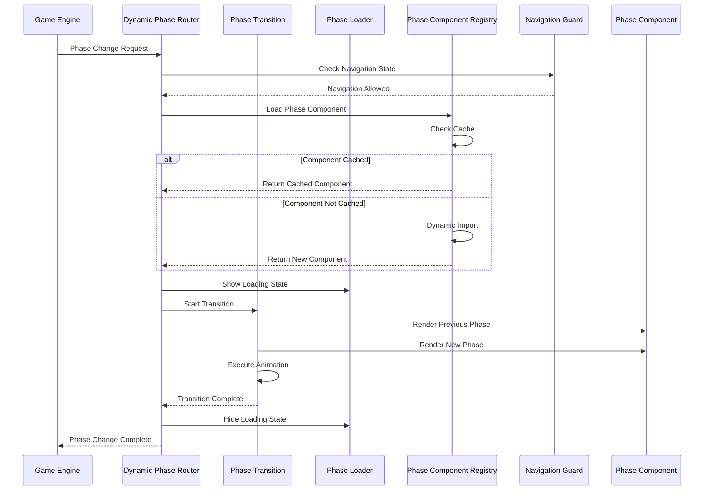

# User Story: 20 - Dynamic Phase Router

**As a** player,
**I want** the game to automatically show the correct interface for the current game phase,
**so that** I always see the appropriate actions and information for what I need to do next.

## Acceptance Criteria

* Game interface dynamically loads components based on current game phase
* Phase transitions include smooth animations (300-500ms duration)
* Invalid game states are handled gracefully with error messages
* Back/forward browser navigation is prevented during active gameplay
* Loading states are shown during phase transitions
* Error boundaries catch and handle component failures

## Notes

* Implements intelligent routing based on game state rather than URL routing
* Must handle all phase transitions: Role Reveal → Team Selection → Voting → Mission → Results → Assassin → Game End
* Component mapping for all 18 features

## Implementation Plan

### 1. Feature Overview

The Dynamic Phase Router provides intelligent component routing based on game state rather than URL routing. It enhances the existing Game Engine's PhaseController by adding dynamic component loading, smooth transitions, and enhanced error handling. This router complements the existing phase management by providing a more sophisticated routing layer that can dynamically load feature components while maintaining the current phase-based UI structure.

**Primary User Role**: Players who need seamless navigation between game phases without manual URL management.

### 2. Component Analysis & Reuse Strategy

**Existing Components to Reuse:**
- `GameEngine` (`src/components/game-engine/GameEngine.tsx`) - **Reuse as-is** - Main orchestration component that will integrate with the router
- `PhaseController` (`src/components/game-engine/PhaseController.tsx`) - **Modify** - Enhance with dynamic component loading capabilities
- `GameStateManager` (`src/components/game-engine/GameStateManager.tsx`) - **Reuse as-is** - State management integration
- `ErrorBoundary` (`src/components/game-engine/ErrorBoundary.tsx`) - **Reuse as-is** - Error handling for router components
- `PerformanceMonitor` (`src/components/game-engine/PerformanceMonitor.tsx`) - **Reuse as-is** - Performance tracking for router operations
- `useSSERealtimeRoom` hook (`src/hooks/useSSERealtimeRoom.ts`) - **Reuse as-is** - Real-time state updates
- Game state machine utilities (`src/lib/game-engine-utils.ts`) - **Reuse as-is** - Phase validation and transitions

**New Components Needed:**
- `DynamicPhaseRouter` - Enhanced router with dynamic component loading
- `PhaseTransition` - Animation wrapper for smooth phase transitions
- `PhaseLoader` - Loading states during component loading and transitions
- `InvalidPhaseHandler` - Enhanced error handling for invalid states
- `NavigationGuard` - Browser navigation prevention during gameplay
- `PhaseComponentRegistry` - Registry for dynamic component mapping

### 3. Affected Files

- `[CREATE] src/components/dynamic-phase-router/DynamicPhaseRouter.tsx`
- `[CREATE] src/components/dynamic-phase-router/PhaseTransition.tsx`
- `[CREATE] src/components/dynamic-phase-router/PhaseLoader.tsx`
- `[CREATE] src/components/dynamic-phase-router/InvalidPhaseHandler.tsx`
- `[CREATE] src/components/dynamic-phase-router/NavigationGuard.tsx`
- `[CREATE] src/components/dynamic-phase-router/PhaseComponentRegistry.tsx`
- `[CREATE] src/components/dynamic-phase-router/index.ts`
- `[CREATE] src/types/dynamic-phase-router.ts`
- `[CREATE] src/lib/phase-router-utils.ts`
- `[CREATE] src/hooks/usePhaseRouter.ts`
- `[CREATE] src/hooks/useNavigationGuard.ts`
- `[CREATE] src/components/dynamic-phase-router/DynamicPhaseRouter.test.tsx`
- `[CREATE] src/components/dynamic-phase-router/PhaseTransition.test.tsx`
- `[CREATE] src/components/dynamic-phase-router/PhaseLoader.test.tsx`
- `[CREATE] src/components/dynamic-phase-router/DynamicPhaseRouter.visual.spec.ts`
- `[CREATE] src/components/dynamic-phase-router/PhaseTransition.e2e.spec.ts`
- `[MODIFY] src/components/game-engine/GameEngine.tsx`
- `[MODIFY] src/components/game-engine/PhaseController.tsx`

### 4. Component Breakdown

**DynamicPhaseRouter** (`src/components/dynamic-phase-router/DynamicPhaseRouter.tsx`)
- **Type**: Client Component (requires state management and dynamic imports)
- **Responsibility**: Route to appropriate phase component based on game state with enhanced loading and error handling
- **Key Props**:
  ```typescript
  interface DynamicPhaseRouterProps {
    currentPhase: GamePhase;
    gameState: GameState;
    players: Player[];
    roomCode: string;
    playerId: string;
    onPhaseTransition?: (newPhase: GamePhase) => void;
    onError?: (error: PhaseRouterError) => void;
    enableTransitions?: boolean;
    transitionDuration?: number;
    enableNavigationGuard?: boolean;
  }
  ```
- **Child Components**: PhaseTransition, PhaseLoader, InvalidPhaseHandler, NavigationGuard, PhaseComponentRegistry

**PhaseTransition** (`src/components/dynamic-phase-router/PhaseTransition.tsx`)
- **Type**: Client Component (handles animations and transitions)
- **Responsibility**: Provide smooth transitions between phase components with multiple animation types
- **Key Props**:
  ```typescript
  interface PhaseTransitionProps {
    children: React.ReactNode;
    phase: GamePhase;
    previousPhase: GamePhase | null;
    isTransitioning: boolean;
    transitionDuration?: number;
    transitionType?: 'fade' | 'slide' | 'scale' | 'flip';
    direction?: 'forward' | 'backward';
    onTransitionStart?: () => void;
    onTransitionComplete?: () => void;
  }
  ```
- **Child Components**: Dynamic phase components wrapped in transition containers

**PhaseLoader** (`src/components/dynamic-phase-router/PhaseLoader.tsx`)
- **Type**: Client Component (loading states and progress tracking)
- **Responsibility**: Display loading states during phase transitions and dynamic component loading
- **Key Props**:
  ```typescript
  interface PhaseLoaderProps {
    phase: GamePhase;
    loadingType: 'transition' | 'component' | 'validation';
    message?: string;
    progress?: number;
    isVisible: boolean;
    timeout?: number;
    onTimeout?: () => void;
    onCancel?: () => void;
  }
  ```
- **Child Components**: None (display component)

**InvalidPhaseHandler** (`src/components/dynamic-phase-router/InvalidPhaseHandler.tsx`)
- **Type**: Client Component (error handling and recovery)
- **Responsibility**: Handle invalid game states with comprehensive recovery options
- **Key Props**:
  ```typescript
  interface InvalidPhaseHandlerProps {
    error: PhaseRouterError;
    currentPhase: GamePhase;
    validPhases: GamePhase[];
    gameState: GameState;
    onRetry: () => void;
    onReset: () => void;
    onForcePhase: (phase: GamePhase) => void;
    allowManualRecovery?: boolean;
  }
  ```
- **Child Components**: None (error display and recovery component)

**NavigationGuard** (`src/components/dynamic-phase-router/NavigationGuard.tsx`)
- **Type**: Client Component (navigation prevention and state persistence)
- **Responsibility**: Prevent browser navigation during active gameplay and handle state preservation
- **Key Props**:
  ```typescript
  interface NavigationGuardProps {
    isGameActive: boolean;
    currentPhase: GamePhase;
    gameState: GameState;
    allowNavigation?: boolean;
    warningMessage?: string;
    onNavigationAttempt?: (event: BeforeUnloadEvent) => void;
    onStateBackup?: (gameState: GameState) => void;
  }
  ```
- **Child Components**: None (utility component)

**PhaseComponentRegistry** (`src/components/dynamic-phase-router/PhaseComponentRegistry.tsx`)
- **Type**: Client Component (component mapping and loading)
- **Responsibility**: Manage dynamic component loading and caching for all game phases
- **Key Props**:
  ```typescript
  interface PhaseComponentRegistryProps {
    onComponentLoad: (phase: GamePhase, component: React.ComponentType) => void;
    onComponentError: (phase: GamePhase, error: Error) => void;
    preloadPhases?: GamePhase[];
    enableCaching?: boolean;
  }
  ```
- **Child Components**: None (registry component)

### 5. Design Specifications

**Color Analysis Table:**
| Design Color | Semantic Purpose | Element | Implementation Method |
|--------------|-----------------|---------|------------------------|
| #0a0a0f | Deep background | Router container | Direct hex value (#0a0a0f) |
| #1a1a2e | Primary brand | Phase containers | Direct hex value (#1a1a2e) |
| #252547 | Elevated surface | Transition overlays | Direct hex value (#252547) |
| #3d3d7a | Interactive | Navigation elements | Direct hex value (#3d3d7a) |
| #22c55e | Success state | Valid phase transitions | Direct hex value (#22c55e) |
| #ef4444 | Error state | Invalid phase states | Direct hex value (#ef4444) |
| #f59e0b | Warning state | Loading states | Direct hex value (#f59e0b) |
| #3b82f6 | Information | Phase indicators | Direct hex value (#3b82f6) |
| #f8f9fa | Primary text | Headers and labels | Direct hex value (#f8f9fa) |
| #9ca3af | Secondary text | Descriptions and meta | Direct hex value (#9ca3af) |

**Visual Hierarchy Diagram:**
```
Dynamic Phase Router Container (#0a0a0f)
├── Navigation Guard (invisible, utility)
├── Phase Loader Overlay (#252547 with opacity)
├── Phase Transition Container
│   ├── Previous Phase (transitioning out)
│   └── Current Phase (transitioning in)
├── Invalid Phase Handler (#ef4444 background)
├── Phase Component Registry (invisible, utility)
└── Phase Content Area (#1a1a2e)
    ├── Phase Header (#f8f9fa text)
    ├── Phase Progress (#9ca3af text)
    └── Dynamic Phase Component
```

**Animation Specifications:**
- Phase transition duration: 300-500ms
- Transition easing: cubic-bezier(0.4, 0, 0.2, 1)
- Loading spinner: 1.5s rotation cycle
- Error state animation: shake effect (0.3s)
- Slide transition: translateX(-100% to 0%)
- Fade transition: opacity (0 to 1)
- Scale transition: scale(0.95 to 1.0)

**Typography Hierarchy:**
- Router headers: 28px, font-bold, line-height: 1.2
- Phase titles: 24px, font-semibold, line-height: 1.3
- Loading messages: 18px, font-medium, line-height: 1.4
- Error messages: 16px, font-medium, line-height: 1.5
- Navigation warnings: 14px, font-medium, line-height: 1.6
- Meta information: 12px, font-normal, line-height: 1.7

**Spacing System:**
- Router container padding: 24px (p-6)
- Phase container padding: 20px (p-5)
- Transition spacing: 16px (space-y-4)
- Loading indicator padding: 32px (p-8)
- Error message padding: 20px (p-5)
- Component gaps: 12px (gap-3)

**Responsive Breakpoints:**
- Mobile: 375px - Stack components vertically
- Tablet: 768px - Optimize for touch interactions
- Desktop: 1280px - Full horizontal layout
- Large: 1920px - Maximum content width

### 6. Data Flow & State Management

**TypeScript Types:**
```typescript
// src/types/dynamic-phase-router.ts
export interface PhaseRouterState {
  currentPhase: GamePhase;
  previousPhase: GamePhase | null;
  isTransitioning: boolean;
  isLoading: boolean;
  error: PhaseRouterError | null;
  transitionStartTime: number | null;
  loadedComponents: Map<GamePhase, React.ComponentType>;
  navigationBlocked: boolean;
}

export interface PhaseRouterError {
  code: 'INVALID_PHASE' | 'TRANSITION_FAILED' | 'COMPONENT_LOAD_ERROR' | 'NAVIGATION_BLOCKED';
  message: string;
  phase: GamePhase;
  recoverable: boolean;
  metadata?: Record<string, any>;
}

export interface PhaseComponentMap {
  [key: string]: () => Promise<React.ComponentType<any>>;
}

export interface PhaseTransitionOptions {
  type: 'fade' | 'slide' | 'scale' | 'flip';
  duration: number;
  easing: string;
  direction: 'forward' | 'backward';
}
```

**State Management Strategy:**
- **Local State**: Router state, transition states, loading states
- **Parent Integration**: Game state from GameEngine component
- **Real-time Updates**: Via existing SSE hooks from parent
- **Component Caching**: Loaded components cached for performance
- **Error Recovery**: Comprehensive error handling with fallback states

**Data Fetching Strategy:**
- **Dynamic Imports**: Lazy loading of phase components
- **Preloading**: Optional preloading of next expected phases
- **Caching**: Component caching to prevent re-loading
- **Fallback**: Graceful degradation for failed component loads

### 7. API Endpoints & Contracts

**No new API endpoints required** - the Dynamic Phase Router operates entirely on the client side using game state provided by the parent Game Engine component. All real-time updates are handled through the existing SSE integration.

**Integration with Existing APIs:**
- Uses existing game state from parent GameEngine
- Leverages existing phase transition validation from game-engine-utils
- Integrates with existing real-time sync mechanisms

### 8. Integration Diagram



### 9. Styling

**Color Implementation:**
- Router background: #0a0a0f for seamless integration with existing GameEngine
- Phase containers: #1a1a2e for consistent branding with existing components
- Transition overlays: #252547 with opacity for smooth visual transitions
- Loading states: #f59e0b for attention-grabbing feedback
- Error states: #ef4444 for critical issue visibility
- Success states: #22c55e for positive feedback
- Interactive elements: #3d3d7a for consistent button styling

**Visual Implementation Checklist:**
- [ ] Router container uses #0a0a0f background exactly
- [ ] Phase containers use #1a1a2e background exactly
- [ ] Transition overlays use #252547 with 0.8 opacity
- [ ] Loading spinners use #f59e0b color exactly
- [ ] Error states use #ef4444 background exactly
- [ ] Success indicators use #22c55e color exactly
- [ ] All text uses #f8f9fa or #9ca3af exactly
- [ ] Interactive elements use #3d3d7a background exactly

**Transition Effects:**
- Fade: opacity 0 → 1 over 400ms
- Slide: translateX(-100% → 0%) over 500ms
- Scale: scale(0.95 → 1.0) over 300ms
- Flip: rotateY(90deg → 0deg) over 600ms

### 10. Testing Strategy

**Unit Tests:**
- `src/components/dynamic-phase-router/DynamicPhaseRouter.test.tsx` - Core routing logic, phase validation, error handling
- `src/components/dynamic-phase-router/PhaseTransition.test.tsx` - Animation behavior, transition timing, event handling
- `src/components/dynamic-phase-router/PhaseLoader.test.tsx` - Loading state management, timeout handling
- `src/lib/phase-router-utils.test.ts` - Utility functions, phase validation, component mapping
- `src/hooks/usePhaseRouter.test.ts` - Router hook functionality, state management
- `src/hooks/useNavigationGuard.test.ts` - Navigation prevention, state persistence

**Component Tests:**
- DynamicPhaseRouter integration with GameEngine
- PhaseTransition animation sequences
- PhaseLoader timeout and progress tracking
- InvalidPhaseHandler error scenarios and recovery
- NavigationGuard browser event handling
- PhaseComponentRegistry caching and loading

**E2E Tests:**
- Complete phase routing through full game flow
- Browser navigation prevention during gameplay
- Error recovery and fallback scenarios
- Performance testing with component loading
- Animation smoothness and timing verification

### 11. Accessibility (A11y) Considerations

- **Screen Reader Support**: Announcements for phase transitions with descriptive labels
- **Keyboard Navigation**: Maintained focus management during transitions
- **Focus Management**: Proper focus transfer between phase components
- **High Contrast**: Support for high contrast mode with sufficient color contrast
- **Reduced Motion**: Respect for prefers-reduced-motion settings
- **ARIA Live Regions**: Dynamic content updates announced to screen readers
- **Semantic HTML**: Proper use of landmarks and headings for navigation
- **Touch Accessibility**: Adequate touch targets for mobile devices

### 12. Security Considerations

- **Phase Validation**: Strict validation to prevent invalid state manipulation
- **Component Loading**: Secure dynamic imports with trusted component sources
- **Error Handling**: No sensitive information exposed in error messages
- **Navigation Guard**: Prevent accidental data loss during navigation
- **Input Sanitization**: Sanitize all phase parameters and state data
- **XSS Prevention**: Proper content escaping in dynamic components
- **State Integrity**: Validation of game state before phase transitions

### 13. Implementation Steps

**Phase 1: UI Implementation with Mock Data**

**1. Setup & Types:**
- [ ] Define `PhaseRouterState`, `PhaseRouterError`, `PhaseComponentMap`, `PhaseTransitionOptions` in `src/types/dynamic-phase-router.ts`
- [ ] Create phase router utility functions in `src/lib/phase-router-utils.ts`
- [ ] Set up mock phase transition data and component mapping
- [ ] Create mock component registry for testing

**2. Core Router Components:**
- [ ] Create `src/components/dynamic-phase-router/DynamicPhaseRouter.tsx`
- [ ] Implement phase routing logic with dynamic component loading
- [ ] Add integration with existing GameEngine component
- [ ] Create `src/components/dynamic-phase-router/PhaseTransition.tsx`
- [ ] Implement transition animations (fade, slide, scale, flip)
- [ ] Add transition timing and easing controls
- [ ] Create `src/components/dynamic-phase-router/PhaseLoader.tsx`
- [ ] Implement loading states with progress indicators and timeout handling

**3. Supporting Components:**
- [ ] Create `src/components/dynamic-phase-router/InvalidPhaseHandler.tsx`
- [ ] Implement comprehensive error handling with recovery options
- [ ] Create `src/components/dynamic-phase-router/NavigationGuard.tsx`
- [ ] Implement browser navigation prevention and state persistence
- [ ] Create `src/components/dynamic-phase-router/PhaseComponentRegistry.tsx`
- [ ] Implement component caching and dynamic loading
- [ ] Create `src/components/dynamic-phase-router/index.ts` for exports

**4. Custom Hooks:**
- [ ] Create `src/hooks/usePhaseRouter.ts`
- [ ] Implement phase routing logic and state management
- [ ] Add phase validation and transition handling
- [ ] Include error recovery and loading states
- [ ] Create `src/hooks/useNavigationGuard.ts`
- [ ] Implement browser navigation prevention logic
- [ ] Add state backup and recovery mechanisms

**5. Styling:**
- [ ] Verify router background color (#0a0a0f) matches design system EXACTLY
- [ ] Verify phase container colors (#1a1a2e) match design system EXACTLY
- [ ] Verify transition overlay colors (#252547) match design system EXACTLY
- [ ] Verify loading state colors (#f59e0b) match design system EXACTLY
- [ ] Verify error state colors (#ef4444) match design system EXACTLY
- [ ] Verify success state colors (#22c55e) match design system EXACTLY
- [ ] Verify interactive element colors (#3d3d7a) match design system EXACTLY
- [ ] Verify text colors (#f8f9fa, #9ca3af) match design system EXACTLY
- [ ] Apply direct hex values for all colors in className attributes
- [ ] Implement smooth transitions with 300-500ms duration
- [ ] Add responsive design for all viewport sizes (mobile, tablet, desktop)
- [ ] Implement accessibility features (reduced motion, focus management)

**6. UI Testing:**
- [ ] Create Playwright visual test in `src/components/dynamic-phase-router/DynamicPhaseRouter.visual.spec.ts`
- [ ] Configure tests for all viewport sizes (Mobile: 375x667px, Tablet: 768x1024px, Desktop: 1280x800px, Large: 1920x1080px)
- [ ] Add visual color verification tests with exact RGB values using CSS property assertions
- [ ] Add transition animation verification tests with timing validation
- [ ] Add loading state verification tests with progress tracking
- [ ] Add error state verification tests with recovery options
- [ ] Add comprehensive data-testid attributes to all router elements
- [ ] Component tests for DynamicPhaseRouter with mock data and phase transitions
- [ ] Component tests for PhaseTransition with mock animations and timing
- [ ] Component tests for PhaseLoader with mock loading states and timeouts
- [ ] Manual testing and A11y checks for all UI elements

**Phase 2: API Integration with Real Data**

**7. Game Engine Integration:**
- [ ] Modify existing GameEngine component to integrate with DynamicPhaseRouter
- [ ] Replace existing PhaseController with enhanced router functionality
- [ ] Implement dynamic component loading for all existing game phases
- [ ] Add real-time phase updates via existing SSE hooks
- [ ] Integrate with existing game state management

**8. Component Mapping:**
- [ ] Create comprehensive phase-to-component mapping for all game phases
- [ ] Implement lazy loading for existing phase components
- [ ] Add error boundaries for each dynamically loaded component
- [ ] Handle component loading failures gracefully with fallbacks
- [ ] Implement component preloading for performance optimization

**9. Navigation Integration:**
- [ ] Integrate NavigationGuard with browser APIs (beforeunload, popstate)
- [ ] Implement game state persistence during navigation attempts
- [ ] Add recovery mechanisms for interrupted sessions
- [ ] Test navigation prevention across different browsers
- [ ] Implement state backup and restoration functionality

**10. Performance Optimization:**
- [ ] Implement component caching for frequently accessed phases
- [ ] Add preloading strategies for anticipated phase transitions
- [ ] Optimize animation performance with GPU acceleration
- [ ] Implement lazy loading for non-critical phase components
- [ ] Add performance monitoring integration with existing PerformanceMonitor

**11. Integration Testing:**
- [ ] Write unit tests for phase routing logic with real game states
- [ ] Update component tests to test with real game data
- [ ] Create E2E tests for complete phase transitions
- [ ] Add performance testing for component loading and transitions
- [ ] Test error recovery scenarios with real failure conditions

**12. Final Documentation & Polishing:**
- [ ] Add comprehensive JSDoc documentation for all router components
- [ ] Final review of phase routing logic and edge cases
- [ ] Performance optimization with real component loading
- [ ] Browser compatibility testing for navigation prevention
- [ ] Security review of dynamic component loading
- [ ] Accessibility audit of all router components

### Visual Testing Strategy

**Playwright Visual Testing Requirements:**
- **Viewport Coverage**: Test all components across Mobile (375x667px), Tablet (768x1024px), Desktop (1280x800px), and Large (1920x1080px) viewports
- **Color Validation**: Direct CSS property assertions for all colors using exact RGB values from the established color palette
- **Animation Testing**: Verify transition timing, easing, and visual effects
- **Loading State Testing**: Validate loading indicators, progress bars, and timeout behavior
- **Error State Testing**: Verify error message display, recovery options, and visual feedback
- **Data Test IDs**: Comprehensive data-testid attributes for all interactive elements

**Required Test IDs:**
- `data-testid="dynamic-phase-router"` - Router container
- `data-testid="phase-transition-container"` - Transition wrapper
- `data-testid="phase-loader"` - Loading component
- `data-testid="invalid-phase-handler"` - Error handler
- `data-testid="navigation-guard"` - Navigation prevention
- `data-testid="phase-component-registry"` - Component registry
- `data-testid="phase-transition-{type}"` - Transition type indicators
- `data-testid="phase-loader-{type}"` - Loading type indicators

### References

- **Game Engine Integration**: `/src/components/game-engine/GameEngine.tsx` - Main orchestration component
- **Phase Controller**: `/src/components/game-engine/PhaseController.tsx` - Current phase management
- **Game State Types**: `/src/types/game-state.ts` - Game phase and state definitions
- **Engine Types**: `/src/types/game-engine.ts` - Existing engine type definitions
- **Real-time Hooks**: `/src/hooks/useSSERealtimeRoom.ts` - SSE integration
- **Game Utilities**: `/src/lib/game-engine-utils.ts` - Phase validation and utilities
