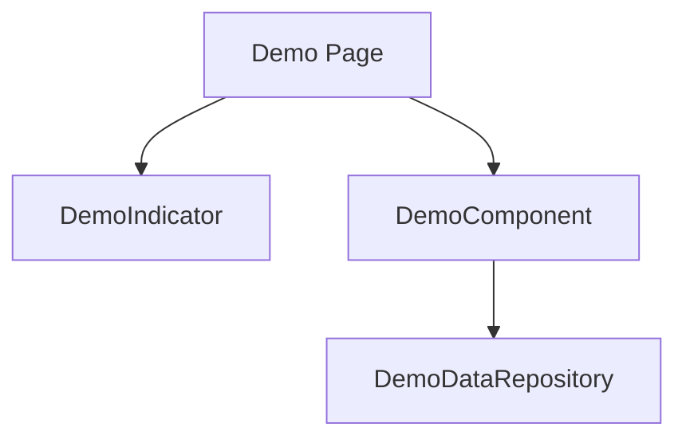
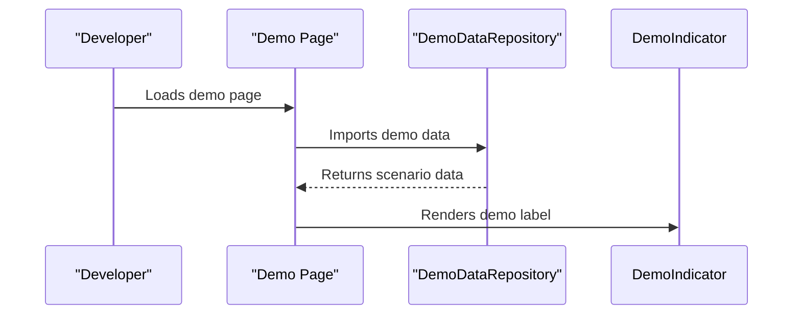

# User Story: 1 - Consolidate Demo Data Management

**As a** developer,
**I want** a centralized demo data architecture,
**so that** all demo pages use consistent, maintainable data sources and demo code is clearly separated from production.

## Acceptance Criteria

* Demo data is stored in a dedicated `/src/data/demo/` directory.
* All demo pages use only centralized demo data sources.
* Demo data is strongly typed with TypeScript interfaces.
* No backend calls are made from demo pages.
* Clear "DEMO" indicators are present on all demo pages.
* Runtime checks prevent demo data from leaking into production.
* Documentation exists for adding new demo scenarios and maintaining demo data.

## Notes

* This supports future demo features and reduces maintenance overhead.
* Migration guide and ESLint rules should be provided for demo/production separation.

## Implementation Plan

### 1. Feature Overview

- **Goal:** Centralize all demo data into a maintainable, type-safe architecture, ensuring demo code is clearly separated from production.
- **Primary User Role:** Developer

---

### 2. Component Analysis & Reuse Strategy

**Relevant Existing Components:**
- `GameRulesDemo` (`src/components/features/game-rules/GameRulesDemo.tsx`) – Used in demo pages, can be reused with updated data props.
- `GameResultsDemo` (`src/components/features/game-results/GameResultsDemo.tsx`) – Reusable, may need props refactor for centralized demo data.
- `RealTimeSyncDemo` (`src/components/features/real-time/RealTimeSyncDemo.tsx`) – Reusable, update to use centralized demo data.
- Demo pages in `src/app/demo/` – All need to be modified to use centralized demo data.

**Gaps Identified:**
- No centralized demo data repository exists (`src/data/demo/` needs to be created).
- No runtime protection against demo data in production.
- No ESLint rule for demo/production separation.

**Reuse Decisions:**
- Existing demo components can be reused with minor prop/interface updates.
- Demo pages will be modified to import from the new centralized demo data.
- New utility functions for demo data validation and runtime checks are required.

---

### 3. Affected Files

```
- [CREATE] src/data/demo/index.ts
- [CREATE] src/data/demo/game.ts
- [CREATE] src/data/demo/mobile.ts
- [CREATE] src/data/demo/accessibility.ts
- [CREATE] src/data/demo/types.ts
- [CREATE] src/data/demo/validation.ts
- [CREATE] src/data/demo/__tests__/demo-data.test.ts
- [CREATE] src/data/demo/__tests__/validation.test.ts
- [CREATE] src/data/demo/__tests__/runtime-check.test.ts
- [CREATE] src/data/demo/GameDemoData.visual.spec.ts
- [CREATE] src/data/demo/GameDemoData.e2e.spec.ts
- [MODIFY] src/app/demo/game-rules/page.tsx
- [MODIFY] src/app/demo/game-results/page.tsx
- [MODIFY] src/app/demo/real-time-sync/page.tsx
- [MODIFY] src/app/demo/accessibility-compliance/page.tsx
- [MODIFY] src/app/demo/host-management/page.tsx
- [MODIFY] src/app/demo/mobile-responsive/page.tsx
- [MODIFY] src/app/room/[roomCode]/game/demo/page.tsx
- [MODIFY] src/app/room/[roomCode]/game/voting-demo/page.tsx
- [MODIFY] src/app/room/[roomCode]/game/assassin-demo/page.tsx
- [MODIFY] src/components/features/game-rules/GameRulesDemo.tsx
- [MODIFY] src/components/features/game-results/GameResultsDemo.tsx
- [MODIFY] src/components/features/real-time/RealTimeSyncDemo.tsx
- [CREATE] src/styles/demo-indicator.module.css
- [CREATE] .eslintrc-demo-separation.js
- [MODIFY] docs/erd.md
```

---

### 4. Component Breakdown

**New Components/Utilities:**

- **DemoDataRepository** (`src/data/demo/index.ts`)
  - Type: Utility module
  - Responsibility: Export all demo data objects and scenario generators.
  - Key Types: `DemoGameState`, `DemoPlayer`, `DemoMission` (defined in `src/data/demo/types.ts`)
  - Child: Scenario generator functions

- **DemoDataValidation** (`src/data/demo/validation.ts`)
  - Type: Utility module
  - Responsibility: Validate demo data against TypeScript interfaces using Zod.

- **DemoIndicator** (`src/styles/demo-indicator.module.css`)
  - Type: CSS module
  - Responsibility: Provide styling for "DEMO" indicators.

**Existing Components to Modify:**

- **GameRulesDemo** (`src/components/features/game-rules/GameRulesDemo.tsx`)
  - Change: Update props to accept centralized demo data, add `data-testid` attributes, ensure demo indicator is present.

- **GameResultsDemo** (`src/components/features/game-results/GameResultsDemo.tsx`)
  - Change: Same as above.

- **RealTimeSyncDemo** (`src/components/features/real-time/RealTimeSyncDemo.tsx`)
  - Change: Same as above.

- **Demo Pages** (`src/app/demo/*`)
  - Change: Import and use centralized demo data, add demo indicator, remove any direct mock data usage.

---

### 5. Design Specifications

**Color Analysis Table:**

| Design Color | Semantic Purpose      | Element             | Implementation Method                |
|--------------|----------------------|---------------------|--------------------------------------|
| #1a1a2e      | Primary brand        | Demo indicator text | Direct hex value (#1a1a2e)           |
| #0066cc      | Interactive          | Demo buttons        | Direct hex value (#0066cc)           |
| #f8f9fa      | Subtle background    | Demo cards          | Direct hex value (#f8f9fa)           |
| #ffcc00      | Warning/Highlight    | Demo label          | Direct hex value (#ffcc00)           |
| #e94560      | Error/Separation     | Demo/Prod boundary  | Direct hex value (#e94560)           |

**Spacing Values:**
- Padding: 16px, 24px
- Margin: 16px, 32px
- Gap: 8px, 16px
- Grid: 8px base unit

**Visual Hierarchy Diagram:**


**Typography:**
- Header: `font-size: 2rem; font-weight: 700; line-height: 2.5rem;`
- Body: `font-size: 1rem; font-weight: 400; line-height: 1.5rem;`
- Demo label: `font-size: 0.875rem; font-weight: 600; line-height: 1.25rem;`

**Visual Verification Checklist:**
- [ ] Demo indicator uses #ffcc00 and is visible on all demo pages
- [ ] All demo cards use #f8f9fa background
- [ ] Buttons use #0066cc background and #f8f9fa text
- [ ] Spacing and grid system match design specs
- [ ] Typography matches font hierarchy

**Responsive Behavior:**
- Mobile: 375x667px
- Tablet: 768x1024px
- Desktop: 1280x800px
- Large: 1920x1080px

**Design Mapping:**
- Use CSS modules for demo indicator styling
- Use Tailwind classes for layout, spacing, and typography
- Apply direct hex values for all colors

---

### 6. Data Flow & State Management

**Types/Interfaces:**
- `DemoGameState`, `DemoPlayer`, `DemoMission` in `src/data/demo/types.ts`
- Zod schemas for validation in `src/data/demo/validation.ts`

**Data Fetching:**
- All demo data is imported statically from `src/data/demo/`
- No server-side or client-side fetching required for demo pages

**State Management:**
- Local state for demo scenario selection (if needed)
- No global state management required for demo data

**Database Schema Changes:**
- None required for demo data
- Update `docs/erd.md` to document demo data structure for reference

---

### 7. API Endpoints & Contracts

- No new API endpoints required for demo data
- If runtime checks require an API, add:
  - `[CREATE] src/app/api/demo-runtime-check/route.ts`
  - Method: GET
  - Contract:
    ```
    GET /api/demo-runtime-check
    Response: { isDemo: boolean }
    ```

---

### 8. Integration Diagram (Optional)



---

### 9. Styling

- Use direct hex values for all colors
- Font sizes, weights, and line heights per design system
- Grid spacing: multiples of 8px
- Visual implementation checklist (see above)
- Buttons, cards, forms, navigation follow established patterns
- Responsive breakpoints as specified
- No changes to Tailwind config; use direct hex values in className

---

### 10. Testing Strategy

**Test File Locations:**
- `[CREATE] src/data/demo/__tests__/demo-data.test.ts`
- `[CREATE] src/data/demo/__tests__/validation.test.ts`
- `[CREATE] src/data/demo/GameDemoData.visual.spec.ts`
- `[CREATE] src/data/demo/GameDemoData.e2e.spec.ts`

**Unit Tests:**
- Demo data interface validation
- Demo data repository functions
- Runtime check functions

**Component Tests:**
- Demo indicator rendering
- Demo page data loading

**Playwright Visual Tests:**
- All demo pages/components across all viewport sizes
- Verify colors, spacing, typography, layout, and indicators
- Use `data-testid="demo-indicator-label"` and similar for all key elements

**E2E Tests:**
- Demo page navigation and scenario selection

---

### 11. Accessibility (A11y) Considerations

- All demo indicators must have `aria-label="Demo Mode"`
- Ensure keyboard accessibility for demo scenario selection
- High contrast for demo label (#ffcc00 on #1a1a2e)
- Alt text for any demo images/icons

---

### 12. Security Considerations

- Ensure demo data cannot be loaded in production
- Runtime checks to prevent demo imports in production builds
- ESLint rule to block demo imports in production code

---

### 13. Implementation Steps

**Implementation Checklist:**

**Phase 1: UI Implementation with Mock Data**

1. Setup & Types:
   - [ ] Define `DemoGameState`, `DemoPlayer`, `DemoMission` in `src/data/demo/types.ts`
   - [ ] Set up demo data structure in `src/data/demo/index.ts`, `game.ts`, `mobile.ts`, `accessibility.ts`
   - [ ] Implement Zod schemas for validation in `validation.ts`

2. UI Components:
   - [ ] Update all demo pages in `src/app/demo/` to use centralized demo data
   - [ ] Add demo indicator to all demo pages/components
   - [ ] Add `data-testid` attributes to all key elements

3. Styling:
   - [ ] Create `demo-indicator.module.css` for demo label styling
   - [ ] Verify all colors match the design system EXACTLY
   - [ ] Verify all spacing values follow the grid system
   - [ ] Verify typography matches font hierarchy
   - [ ] Implement responsive behavior

4. UI Testing:
   - [ ] Write component tests for demo indicator and demo data loading
   - [ ] Create Playwright visual test in `src/data/demo/GameDemoData.visual.spec.ts`
   - [ ] Configure tests for all viewport sizes
   - [ ] Add visual color, spacing, and typography verification tests
   - [ ] Add comprehensive `data-testid` attributes
   - [ ] Manual A11y checks

**Phase 2: API Integration with Real Data**

5. Backend (if runtime check API needed):
   - [ ] Create `src/app/api/demo-runtime-check/route.ts`
   - [ ] Implement handler logic for runtime environment detection
   - [ ] Add API contract documentation

6. Integration:
   - [ ] Implement runtime checks in demo pages/components
   - [ ] Add ESLint rule for demo/production separation
   - [ ] Update documentation for demo data management

7. Integration Testing:
   - [ ] Write unit tests for runtime check logic
   - [ ] Update component tests for runtime protection
   - [ ] End-to-end testing of demo/production separation

8. Final Documentation & Polishing:
   - [ ] Add JSDoc documentation to all new modules
   - [ ] Final review of demo data architecture
   - [ ] Update `docs/erd.md` with demo data structure

---

### References

- `src/app/demo/*` – Demo pages to update
- `src/components/features/game-rules/GameRulesDemo.tsx` – Demo component
- `src/data/demo/` – New centralized demo data directory
- `docs/erd.md` – ERD documentation for demo data
- `.github/instructions/code-quality.instructions.md` – Code quality standards
- `.github/instructions/design.instructions.md` – Design system guidelines

---
