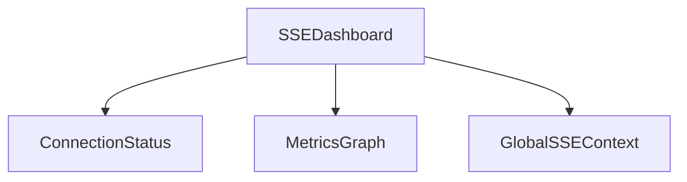
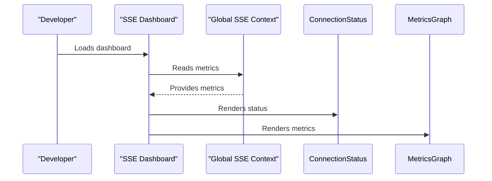

# User Story: 2 - Audit and Optimize SSE Usage

**As a** developer,
**I want** to audit and optimize all SSE subscription usage in the application,
**so that** real-time communication is efficient, reliable, and easy to monitor.

## Acceptance Criteria

* Complete inventory and documentation of all SSE usage.
* All components use the global SSE context (`useOptimizedRealtimeRoom` or `useRoomSSE`).
* No direct `api.subscriptions.*` calls outside the global context.
* Real-time SSE connection metrics and health dashboard are available.
* Performance alerts are configured for connection issues.
* Historical data tracking for SSE performance.

## Notes

* Reduces duplicate connections and improves server performance.
* Enables proactive monitoring and troubleshooting of SSE issues.

## Implementation Plan

### 1. Feature Overview

- **Goal:** Audit and optimize all SSE subscription usage, ensuring all components use the global SSE context and enabling real-time monitoring.
- **Primary User Role:** Developer

---

### 2. Component Analysis & Reuse Strategy

**Relevant Existing Components:**
- `GlobalSSEContext` (`src/context/GlobalSSEContext.tsx`) – Central context for SSE, reusable.
- `useOptimizedRealtimeRoom` (`src/hooks/useOptimizedRealtimeRoom.ts`) – Main hook for SSE, reusable.
- `useRoomSSE` (`src/hooks/useRoomSSE.ts`) – Alternative hook, reusable.
- Game phase components in `src/app/room/[roomCode]/game/` – Need modification to ensure global context usage.
- SSE dashboard (if exists) in `src/components/performance-optimization/SSEDashboard.tsx` – May need creation or enhancement.

**Gaps Identified:**
- Some components may use direct `api.subscriptions.*` calls.
- No comprehensive SSE health dashboard.
- No performance alerting integration.

**Reuse Decisions:**
- Central context and hooks reused.
- Game phase components modified to use global context.
- New SSE health dashboard component required.

---

### 3. Affected Files

```
- [MODIFY] src/app/room/[roomCode]/game/*.tsx
- [MODIFY] src/hooks/useOptimizedRealtimeRoom.ts
- [MODIFY] src/hooks/useRoomSSE.ts
- [MODIFY] src/context/GlobalSSEContext.tsx
- [CREATE] src/components/performance-optimization/SSEDashboard.tsx
- [CREATE] src/components/performance-optimization/SSEDashboard.visual.spec.ts
- [CREATE] src/components/performance-optimization/SSEDashboard.e2e.spec.ts
- [CREATE] src/components/performance-optimization/__tests__/SSEDashboard.test.tsx
- [MODIFY] src/styles/sse-dashboard.module.css
- [MODIFY] docs/erd.md
```

---

### 4. Component Breakdown

**New Component:**
- **SSEDashboard** (`src/components/performance-optimization/SSEDashboard.tsx`)
  - Type: Client Component (needs real-time updates)
  - Responsibility: Visualize SSE connection health, metrics, and alerts.
  - Props: None (reads from context/global state)
  - Child Components: ConnectionStatus, MetricsGraph
  - Key `data-testid` attributes: `sse-dashboard-container`, `sse-connection-status`, `sse-metrics-graph`

**Existing Components to Modify:**
- **Game phase components** (`src/app/room/[roomCode]/game/*.tsx`)
  - Change: Refactor to use `useOptimizedRealtimeRoom` or `useRoomSSE` from global context.
- **GlobalSSEContext** (`src/context/GlobalSSEContext.tsx`)
  - Change: Expose metrics and connection status for dashboard.
- **Hooks** (`src/hooks/useOptimizedRealtimeRoom.ts`, `src/hooks/useRoomSSE.ts`)
  - Change: Ensure all SSE logic is routed through global context.

---

### 5. Design Specifications

**Color Analysis Table:**

| Design Color | Semantic Purpose      | Element             | Implementation Method                |
|--------------|----------------------|---------------------|--------------------------------------|
| #1a1a2e      | Primary brand        | Dashboard header    | Direct hex value (#1a1a2e)           |
| #0066cc      | Interactive          | Status indicators   | Direct hex value (#0066cc)           |
| #f8f9fa      | Subtle background    | Dashboard cards     | Direct hex value (#f8f9fa)           |
| #e94560      | Error/Alert          | Connection errors   | Direct hex value (#e94560)           |
| #ffcc00      | Warning              | Performance alerts  | Direct hex value (#ffcc00)           |

**Spacing Values:**
- Padding: 16px, 24px
- Margin: 16px, 32px
- Gap: 8px, 16px
- Grid: 8px base unit

**Visual Hierarchy Diagram:**


**Typography:**
- Header: `font-size: 2rem; font-weight: 700; line-height: 2.5rem;`
- Body: `font-size: 1rem; font-weight: 400; line-height: 1.5rem;`
- Status label: `font-size: 0.875rem; font-weight: 600; line-height: 1.25rem;`

**Visual Verification Checklist:**
- [ ] Dashboard header uses #1a1a2e
- [ ] Status indicators use #0066cc, #e94560, #ffcc00 as appropriate
- [ ] Cards use #f8f9fa background
- [ ] Spacing and grid system match design specs
- [ ] Typography matches font hierarchy

**Responsive Behavior:**
- Mobile: 375x667px
- Tablet: 768x1024px
- Desktop: 1280x800px
- Large: 1920x1080px

**Design Mapping:**
- Use CSS modules for dashboard styling
- Use Tailwind classes for layout, spacing, and typography
- Apply direct hex values for all colors

---

### 6. Data Flow & State Management

**Types/Interfaces:**
- `SSEMetrics`, `SSEHealth` in `src/types/sse.ts`
- Metrics exposed via `GlobalSSEContext`

**Data Fetching:**
- SSE metrics and health are provided by context, updated in real-time.

**State Management:**
- Local state for dashboard filters/views
- Global state for SSE metrics via context

**Database Schema Changes:**
- None required
- Update `docs/erd.md` to document SSE metrics structure

---

### 7. API Endpoints & Contracts

- No new API endpoints required for SSE metrics (handled via context)
- If metrics need to be persisted, add:
  - `[CREATE] src/app/api/sse-metrics/route.ts`
  - Method: GET
  - Contract:
    ```
    GET /api/sse-metrics
    Response: { metrics: SSEMetrics }
    ```

---

### 8. Integration Diagram (Optional)



---

### 9. Styling

- Use direct hex values for all colors
- Font sizes, weights, and line heights per design system
- Grid spacing: multiples of 8px
- Visual implementation checklist (see above)
- Buttons, cards, forms, navigation follow established patterns
- Responsive breakpoints as specified
- No changes to Tailwind config; use direct hex values in className

---

### 10. Testing Strategy

**Test File Locations:**
- `[CREATE] src/components/performance-optimization/SSEDashboard.visual.spec.ts`
- `[CREATE] src/components/performance-optimization/SSEDashboard.e2e.spec.ts`
- `[CREATE] src/components/performance-optimization/__tests__/SSEDashboard.test.tsx`

**Unit Tests:**
- SSE metrics calculation
- Dashboard rendering logic

**Component Tests:**
- Status indicator rendering
- Metrics graph updates

**Playwright Visual Tests:**
- Dashboard across all viewport sizes
- Verify colors, spacing, typography, layout, and indicators
- Use `data-testid="sse-dashboard-container"` and similar for all key elements

**E2E Tests:**
- Dashboard navigation and real-time updates

---

### 11. Accessibility (A11y) Considerations

- Status indicators must have `aria-label` describing connection state
- Keyboard navigation for dashboard filters
- High contrast for error/warning states
- Alt text for any icons/graphs

---

### 12. Security Considerations

- Ensure SSE metrics are not exposed to unauthorized users
- Validate all data before rendering in dashboard

---

### 13. Implementation Steps

**Implementation Checklist:**

**Phase 1: UI Implementation with Mock Data**

1. Setup & Types:
   - [ ] Define `SSEMetrics`, `SSEHealth` in `src/types/sse.ts`
   - [ ] Set up mock metrics in dashboard component

2. UI Components:
   - [ ] Create `SSEDashboard` in `src/components/performance-optimization/SSEDashboard.tsx`
   - [ ] Add status indicator and metrics graph subcomponents
   - [ ] Add `data-testid` attributes to all key elements

3. Styling:
   - [ ] Create `sse-dashboard.module.css` for dashboard styling
   - [ ] Verify all colors match the design system EXACTLY
   - [ ] Verify all spacing values follow the grid system
   - [ ] Verify typography matches font hierarchy
   - [ ] Implement responsive behavior

4. UI Testing:
   - [ ] Write component tests for dashboard rendering
   - [ ] Create Playwright visual test in `SSEDashboard.visual.spec.ts`
   - [ ] Configure tests for all viewport sizes
   - [ ] Add visual color, spacing, and typography verification tests
   - [ ] Add comprehensive `data-testid` attributes
   - [ ] Manual A11y checks

**Phase 2: API Integration with Real Data**

5. Integration:
   - [ ] Refactor all game phase components to use global SSE context
   - [ ] Expose metrics in `GlobalSSEContext`
   - [ ] Integrate dashboard with real SSE metrics
   - [ ] Implement performance alerting

6. Integration Testing:
   - [ ] Write unit tests for metrics logic
   - [ ] Update component tests for real metrics
   - [ ] End-to-end testing of dashboard with live data

7. Final Documentation & Polishing:
   - [ ] Add JSDoc documentation to all new modules
   - [ ] Final review of SSE optimization
   - [ ] Update `docs/erd.md` with SSE metrics structure

---

### References

- `src/context/GlobalSSEContext.tsx` – SSE context
- `src/hooks/useOptimizedRealtimeRoom.ts` – SSE hook
- `src/app/room/[roomCode]/game/*.tsx` – Game phase components
- `src/components/performance-optimization/SSEDashboard.tsx` – New dashboard
- `docs/erd.md` – ERD documentation for SSE metrics

---
