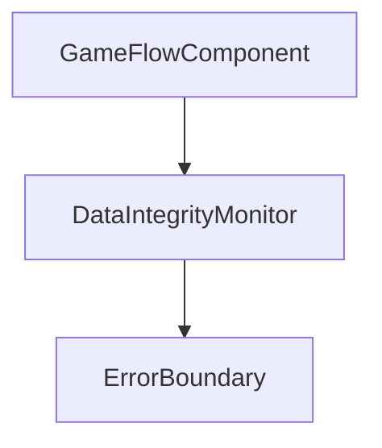
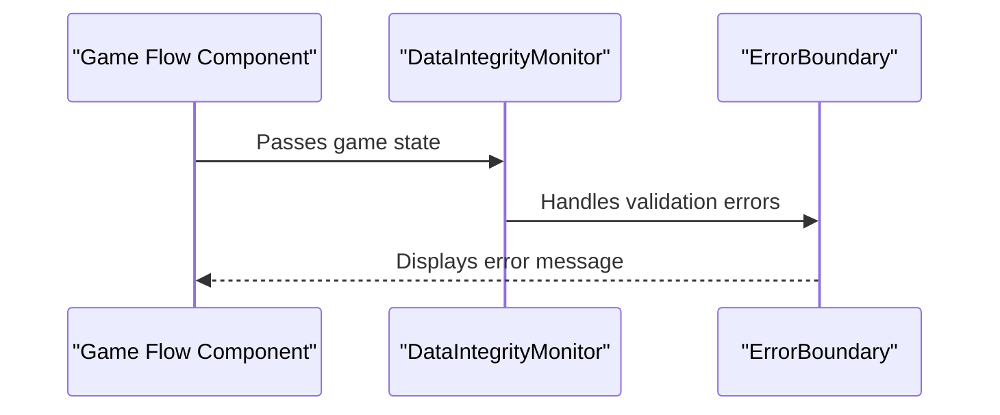

# User Story: 3 - Ensure Production Data Integrity

**As a** developer,
**I want** to eliminate all mock data from production game flows,
**so that** users always experience reliable, real backend-driven gameplay.

## Acceptance Criteria

* All production game flows use only real backend data.
* No mock data functions (e.g., `createMockGameState()`, `createMockPlayers()`) are present in production code.
* Robust error handling for missing or invalid data.
* Data validation and monitoring are implemented.
* Automated tests verify data integrity in production.

## Notes

* Supports business goals of reliability and consistency.
* Enables accurate performance and error monitoring.

## Implementation Plan

### 1. Feature Overview

- **Goal:** Remove all mock data from production game flows, ensuring only validated backend data is used and robust error handling is in place.
- **Primary User Role:** Developer

---

### 2. Component Analysis & Reuse Strategy

**Relevant Existing Components:**
- Game engine and state management in `src/app/room/[roomCode]/game/` – Needs modification to remove mock data usage.
- Data validation utilities in `src/lib/validation.ts` – Can be reused and extended.
- Error boundary components in `src/components/ErrorBoundary.tsx` – Reusable for error handling.
- Monitoring integration in `src/components/performance-optimization/` – Reusable for data integrity monitoring.

**Gaps Identified:**
- Mock data functions may exist in game flow files.
- Data validation may not cover all production scenarios.
- Monitoring for data integrity violations may be missing.

**Reuse Decisions:**
- Extend validation utilities and error boundaries.
- Refactor game flow components to remove mock data.
- Integrate with existing monitoring components.

---

### 3. Affected Files

```
- [MODIFY] src/app/room/[roomCode]/game/*.tsx
- [MODIFY] src/lib/validation.ts
- [MODIFY] src/components/ErrorBoundary.tsx
- [MODIFY] src/components/performance-optimization/DataIntegrityMonitor.tsx
- [CREATE] src/app/room/[roomCode]/game/__tests__/data-integrity.test.ts
- [CREATE] src/app/room/[roomCode]/game/DataIntegrity.visual.spec.ts
- [CREATE] src/app/room/[roomCode]/game/DataIntegrity.e2e.spec.ts
- [MODIFY] docs/erd.md
```

---

### 4. Component Breakdown

**New/Modified Components:**
- **DataIntegrityMonitor** (`src/components/performance-optimization/DataIntegrityMonitor.tsx`)
  - Type: Client Component
  - Responsibility: Track and report data integrity violations in real time.
  - Props: `roomState: GameState`
  - Child: ErrorBoundary
  - Key `data-testid` attributes: `data-integrity-monitor-container`, `data-integrity-error`

- **ErrorBoundary** (`src/components/ErrorBoundary.tsx`)
  - Change: Ensure it handles data validation errors and displays user-friendly messages.

- **Game Flow Components** (`src/app/room/[roomCode]/game/*.tsx`)
  - Change: Remove all mock data usage, ensure only backend data is used, add validation and error handling.

---

### 5. Design Specifications

**Color Analysis Table:**

| Design Color | Semantic Purpose      | Element             | Implementation Method                |
|--------------|----------------------|---------------------|--------------------------------------|
| #1a1a2e      | Primary brand        | Error boundary text | Direct hex value (#1a1a2e)           |
| #e94560      | Error/Alert          | Data integrity error| Direct hex value (#e94560)           |
| #f8f9fa      | Subtle background    | Monitor card        | Direct hex value (#f8f9fa)           |
| #0066cc      | Interactive          | Retry button        | Direct hex value (#0066cc)           |

**Spacing Values:**
- Padding: 16px, 24px
- Margin: 16px, 32px
- Gap: 8px, 16px
- Grid: 8px base unit

**Visual Hierarchy Diagram:**


**Typography:**
- Header: `font-size: 2rem; font-weight: 700; line-height: 2.5rem;`
- Body: `font-size: 1rem; font-weight: 400; line-height: 1.5rem;`
- Error label: `font-size: 0.875rem; font-weight: 600; line-height: 1.25rem;`

**Visual Verification Checklist:**
- [ ] Error boundary uses #e94560 for error messages
- [ ] Monitor card uses #f8f9fa background
- [ ] Retry button uses #0066cc background
- [ ] Spacing and grid system match design specs
- [ ] Typography matches font hierarchy

**Responsive Behavior:**
- Mobile: 375x667px
- Tablet: 768x1024px
- Desktop: 1280x800px
- Large: 1920x1080px

**Design Mapping:**
- Use CSS modules for error boundary and monitor styling
- Use Tailwind classes for layout, spacing, and typography
- Apply direct hex values for all colors

---

### 6. Data Flow & State Management

**Types/Interfaces:**
- `GameState`, `Player`, etc. in `src/types/game.ts`
- Validation schemas in `src/lib/validation.ts`

**Data Fetching:**
- All game state data fetched from backend via tRPC.

**State Management:**
- Local state for error handling and retry logic.
- Global state for game state via context/hooks.

**Database Schema Changes:**
- None required
- Update `docs/erd.md` to document data validation logic

---

### 7. API Endpoints & Contracts

- No new API endpoints required (existing tRPC endpoints used)
- If monitoring needs to report violations, add:
  - `[CREATE] src/app/api/data-integrity-report/route.ts`
  - Method: POST
  - Contract:
    ```
    POST /api/data-integrity-report
    Body: { roomId: string, error: string }
    Response: { success: boolean }
    ```

---

### 8. Integration Diagram (Optional)



---

### 9. Styling

- Use direct hex values for all colors
- Font sizes, weights, and line heights per design system
- Grid spacing: multiples of 8px
- Visual implementation checklist (see above)
- Buttons, cards, forms, navigation follow established patterns
- Responsive breakpoints as specified
- No changes to Tailwind config; use direct hex values in className

---

### 10. Testing Strategy

**Test File Locations:**
- `[CREATE] src/app/room/[roomCode]/game/__tests__/data-integrity.test.ts`
- `[CREATE] src/app/room/[roomCode]/game/DataIntegrity.visual.spec.ts`
- `[CREATE] src/app/room/[roomCode]/game/DataIntegrity.e2e.spec.ts`

**Unit Tests:**
- Data validation logic
- Error boundary handling

**Component Tests:**
- DataIntegrityMonitor rendering
- Error display and retry logic

**Playwright Visual Tests:**
- Error boundary and monitor across all viewport sizes
- Verify colors, spacing, typography, layout, and indicators
- Use `data-testid="data-integrity-monitor-container"` and similar for all key elements

**E2E Tests:**
- Game flow with backend data only, error handling

---

### 11. Accessibility (A11y) Considerations

- Error messages must have `aria-live="assertive"`
- Retry button must be keyboard accessible
- High contrast for error states
- Alt text for any icons

---

### 12. Security Considerations

- Ensure no mock data is present in production builds
- Validate all backend data before use
- Do not expose sensitive error details to users

---

### 13. Implementation Steps

**Implementation Checklist:**

**Phase 1: UI Implementation with Mock Data**

1. Setup & Types:
   - [ ] Remove all mock data functions from game flow components
   - [ ] Extend validation schemas in `src/lib/validation.ts`

2. UI Components:
   - [ ] Update game flow components to use only backend data
   - [ ] Integrate DataIntegrityMonitor and ErrorBoundary
   - [ ] Add `data-testid` attributes to all key elements

3. Styling:
   - [ ] Create CSS module for error boundary and monitor
   - [ ] Verify all colors match the design system EXACTLY
   - [ ] Verify all spacing values follow the grid system
   - [ ] Verify typography matches font hierarchy
   - [ ] Implement responsive behavior

4. UI Testing:
   - [ ] Write component tests for validation and error handling
   - [ ] Create Playwright visual test in `DataIntegrity.visual.spec.ts`
   - [ ] Configure tests for all viewport sizes
   - [ ] Add visual color, spacing, and typography verification tests
   - [ ] Add comprehensive `data-testid` attributes
   - [ ] Manual A11y checks

**Phase 2: API Integration with Real Data**

5. Integration:
   - [ ] Ensure all game flows fetch only backend data
   - [ ] Integrate monitoring and reporting for data integrity violations
   - [ ] Implement error reporting endpoint if needed

6. Integration Testing:
   - [ ] Write unit tests for validation logic
   - [ ] Update component tests for backend data
   - [ ] End-to-end testing of game flow with real data

7. Final Documentation & Polishing:
   - [ ] Add JSDoc documentation to all new modules
   - [ ] Final review of data integrity implementation
   - [ ] Update `docs/erd.md` with validation logic

---

### References

- `src/app/room/[roomCode]/game/*.tsx` – Game flow components
- `src/lib/validation.ts` – Validation logic
- `src/components/ErrorBoundary.tsx` – Error handling
- `src/components/performance-optimization/DataIntegrityMonitor.tsx` – Data integrity monitoring
- `docs/erd.md` – ERD documentation for validation logic

---
