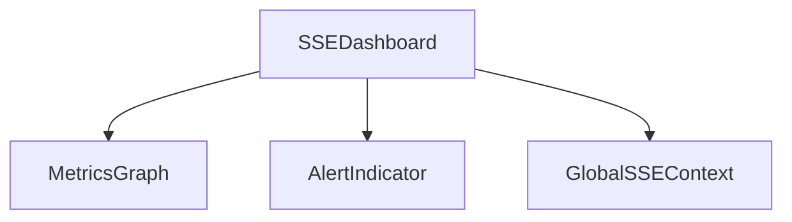
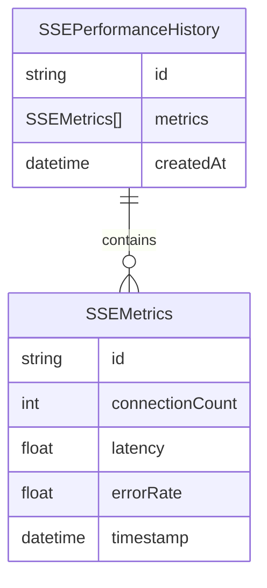
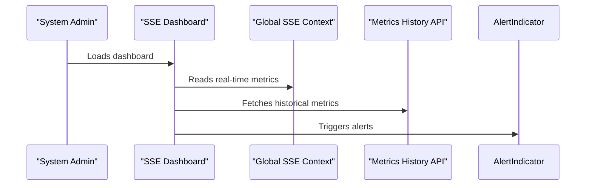

# User Story: 4 - Performance Monitoring for Real-Time Features

**As a** system administrator,
**I want** real-time monitoring and alerting for SSE connections and game state updates,
**so that** I can proactively identify and resolve performance issues.

## Acceptance Criteria

* Real-time metrics for SSE connections, latency, and error rates.
* Performance dashboard accessible to developers and admins.
* Automated alerts for anomalies or degraded performance.
* Historical data retention for at least 7 days.
* Integration with existing monitoring tools.

## Notes

* Ensures optimal user experience and system health.
* Enables data-driven improvements and troubleshooting.

## Implementation Plan

### 1. Feature Overview

- **Goal:** Enable real-time monitoring and alerting for SSE connections and game state updates, with accessible dashboards and historical data.
- **Primary User Role:** System Administrator

---

### 2. Component Analysis & Reuse Strategy

**Relevant Existing Components:**
- `SSEDashboard` (`src/components/performance-optimization/SSEDashboard.tsx`) – Can be extended for performance metrics.
- `GlobalSSEContext` (`src/context/GlobalSSEContext.tsx`) – Source of SSE metrics, reusable.
- Monitoring integration in `src/components/performance-optimization/` – Reusable for dashboard and alerting.
- Existing logging/metrics utilities in `src/lib/metrics.ts` – Can be reused or extended.

**Gaps Identified:**
- No historical data retention for metrics.
- No automated alerting for anomalies.
- Dashboard may need new views for latency/error rates.

**Reuse Decisions:**
- Extend SSEDashboard for new metrics and historical data.
- Integrate with existing monitoring tools.
- Add new alerting logic and historical data storage.

---

### 3. Affected Files

```
- [MODIFY] src/components/performance-optimization/SSEDashboard.tsx
- [MODIFY] src/context/GlobalSSEContext.tsx
- [MODIFY] src/lib/metrics.ts
- [CREATE] src/components/performance-optimization/SSEPerformance.visual.spec.ts
- [CREATE] src/components/performance-optimization/SSEPerformance.e2e.spec.ts
- [CREATE] src/components/performance-optimization/__tests__/SSEPerformance.test.tsx
- [CREATE] src/app/api/sse-metrics-history/route.ts
- [MODIFY] docs/erd.md
```

---

### 4. Component Breakdown

**New/Modified Components:**
- **SSEDashboard** (`src/components/performance-optimization/SSEDashboard.tsx`)
  - Type: Client Component
  - Responsibility: Display real-time and historical metrics, trigger alerts.
  - Props: None (reads from context/global state)
  - Child: MetricsGraph, AlertIndicator
  - Key `data-testid` attributes: `sse-performance-dashboard`, `sse-metrics-graph`, `sse-alert-indicator`

- **MetricsGraph** (subcomponent)
  - Type: Client Component
  - Responsibility: Visualize metrics over time.

- **AlertIndicator** (subcomponent)
  - Type: Client Component
  - Responsibility: Show active alerts for anomalies.

---

### 5. Design Specifications

**Color Analysis Table:**

| Design Color | Semantic Purpose      | Element             | Implementation Method                |
|--------------|----------------------|---------------------|--------------------------------------|
| #1a1a2e      | Primary brand        | Dashboard header    | Direct hex value (#1a1a2e)           |
| #0066cc      | Interactive          | Graph lines         | Direct hex value (#0066cc)           |
| #f8f9fa      | Subtle background    | Dashboard cards     | Direct hex value (#f8f9fa)           |
| #e94560      | Error/Alert          | Alert indicator     | Direct hex value (#e94560)           |
| #ffcc00      | Warning              | Latency spikes      | Direct hex value (#ffcc00)           |

**Spacing Values:**
- Padding: 16px, 24px
- Margin: 16px, 32px
- Gap: 8px, 16px
- Grid: 8px base unit

**Visual Hierarchy Diagram:**


**Typography:**
- Header: `font-size: 2rem; font-weight: 700; line-height: 2.5rem;`
- Body: `font-size: 1rem; font-weight: 400; line-height: 1.5rem;`
- Alert label: `font-size: 0.875rem; font-weight: 600; line-height: 1.25rem;`

**Visual Verification Checklist:**
- [ ] Dashboard header uses #1a1a2e
- [ ] Graph lines use #0066cc
- [ ] Alert indicator uses #e94560
- [ ] Cards use #f8f9fa background
- [ ] Spacing and grid system match design specs
- [ ] Typography matches font hierarchy

**Responsive Behavior:**
- Mobile: 375x667px
- Tablet: 768x1024px
- Desktop: 1280x800px
- Large: 1920x1080px

**Design Mapping:**
- Use CSS modules for dashboard styling
- Use Tailwind classes for layout, spacing, and typography
- Apply direct hex values for all colors

---

### 6. Data Flow & State Management

**Types/Interfaces:**
- `SSEMetrics`, `SSEPerformanceHistory` in `src/types/sse.ts`
- Metrics exposed via `GlobalSSEContext`

**Data Fetching:**
- Real-time metrics from context.
- Historical metrics via API (`/api/sse-metrics-history`).

**State Management:**
- Local state for dashboard filters/views.
- Global state for SSE metrics via context.

**Database Schema Changes:**
- Add `SSEPerformanceHistory` model if persisting metrics.
- Update `docs/erd.md` to document metrics history.

**MermaidJS ER Diagram:**


---

### 7. API Endpoints & Contracts

- `[CREATE] src/app/api/sse-metrics-history/route.ts`
  - Method: GET
  - Contract:
    ```
    GET /api/sse-metrics-history
    Response: { history: SSEPerformanceHistory }
    ```

---

### 8. Integration Diagram (Optional)



---

### 9. Styling

- Use direct hex values for all colors
- Font sizes, weights, and line heights per design system
- Grid spacing: multiples of 8px
- Visual implementation checklist (see above)
- Buttons, cards, forms, navigation follow established patterns
- Responsive breakpoints as specified
- No changes to Tailwind config; use direct hex values in className

---

### 10. Testing Strategy

**Test File Locations:**
- `[CREATE] src/components/performance-optimization/SSEPerformance.visual.spec.ts`
- `[CREATE] src/components/performance-optimization/SSEPerformance.e2e.spec.ts`
- `[CREATE] src/components/performance-optimization/__tests__/SSEPerformance.test.tsx`

**Unit Tests:**
- Metrics calculation and alert logic

**Component Tests:**
- Dashboard rendering
- Graph and alert indicator updates

**Playwright Visual Tests:**
- Dashboard across all viewport sizes
- Verify colors, spacing, typography, layout, and indicators
- Use `data-testid="sse-performance-dashboard"` and similar for all key elements

**E2E Tests:**
- Dashboard navigation and alert triggering

---

### 11. Accessibility (A11y) Considerations

- Alert indicators must have `aria-label` describing alert state
- Keyboard navigation for dashboard filters
- High contrast for alert states
- Alt text for any icons/graphs

---

### 12. Security Considerations

- Ensure metrics history is only accessible to authorized users
- Validate all data before rendering in dashboard

---

### 13. Implementation Steps

**Implementation Checklist:**

**Phase 1: UI Implementation with Mock Data**

1. Setup & Types:
   - [ ] Define `SSEMetrics`, `SSEPerformanceHistory` in `src/types/sse.ts`
   - [ ] Set up mock metrics and history in dashboard component

2. UI Components:
   - [ ] Extend SSEDashboard for new metrics and historical data
   - [ ] Add MetricsGraph and AlertIndicator subcomponents
   - [ ] Add `data-testid` attributes to all key elements

3. Styling:
   - [ ] Create/extend CSS module for dashboard styling
   - [ ] Verify all colors match the design system EXACTLY
   - [ ] Verify all spacing values follow the grid system
   - [ ] Verify typography matches font hierarchy
   - [ ] Implement responsive behavior

4. UI Testing:
   - [ ] Write component tests for dashboard and alert logic
   - [ ] Create Playwright visual test in `SSEPerformance.visual.spec.ts`
   - [ ] Configure tests for all viewport sizes
   - [ ] Add visual color, spacing, and typography verification tests
   - [ ] Add comprehensive `data-testid` attributes
   - [ ] Manual A11y checks

**Phase 2: API Integration with Real Data**

5. Backend:
   - [ ] Create API endpoint for metrics history
   - [ ] Persist metrics in database if needed
   - [ ] Update ERD in `docs/erd.md`

6. Integration:
   - [ ] Integrate dashboard with real metrics and history
   - [ ] Implement alerting logic for anomalies
   - [ ] Integrate with existing monitoring tools

7. Integration Testing:
   - [ ] Write unit tests for metrics and alert logic
   - [ ] Update component tests for real data
   - [ ] End-to-end testing of dashboard with live data

8. Final Documentation & Polishing:
   - [ ] Add JSDoc documentation to all new modules
   - [ ] Final review of performance monitoring
   - [ ] Update `docs/erd.md` with metrics history

---

### References

- `src/components/performance-optimization/SSEDashboard.tsx` – Dashboard component
- `src/context/GlobalSSEContext.tsx` – SSE context
- `src/lib/metrics.ts` – Metrics utilities
- `docs/erd.md` – ERD documentation for metrics history

---
