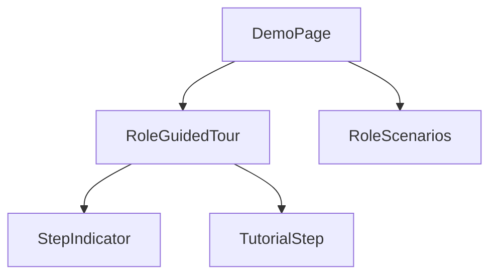
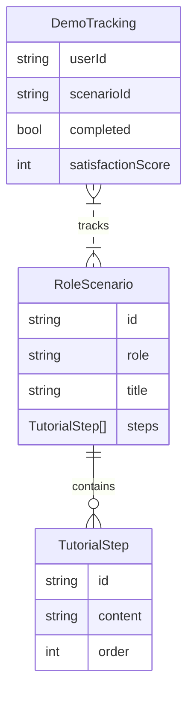
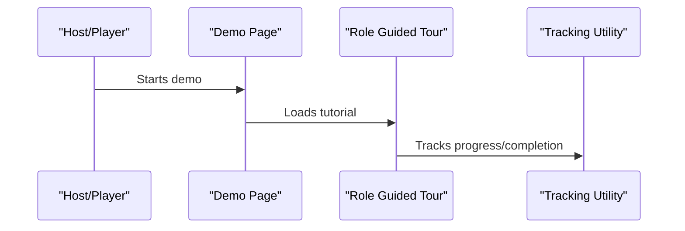

# User Story: 5 - Role-Specific Demo Experiences

**As a** host or player,
**I want** to experience role-specific demo scenarios and interactive tutorials,
**so that** I can quickly learn how to use the system and understand my role in the game.

## Acceptance Criteria

* Demo system provides guided tours for hosts and players.
* Interactive tutorials are available for onboarding.
* Demo scenarios are tailored to each user role.
* Demo completion rate and user satisfaction are tracked.
* No backend dependencies for demo experiences.

## Notes

* Improves onboarding and increases demo-to-play conversion.
* Demo system should be intuitive and easy to maintain.

## Implementation Plan

### 1. Feature Overview

- **Goal:** Provide role-specific demo scenarios and interactive tutorials for hosts and players to improve onboarding and understanding.
- **Primary User Role:** Host or Player

---

### 2. Component Analysis & Reuse Strategy

**Relevant Existing Components:**
- Demo pages in `src/app/demo/` – Can be extended for role-specific scenarios.
- Tutorial components in `src/components/features/tutorial/` (if present) – Reusable or modifiable.
- Demo data repository in `src/data/demo/` – Extend for role-specific scenarios.
- Tracking utilities in `src/lib/analytics.ts` – Reusable for completion/satisfaction tracking.

**Gaps Identified:**
- No guided tour or interactive tutorial components for roles.
- No tracking for demo completion or satisfaction.

**Reuse Decisions:**
- Extend demo pages and data for role-specific scenarios.
- Create new guided tour and tutorial components.
- Integrate tracking utilities.

---

### 3. Affected Files

```
- [MODIFY] src/app/demo/host-management/page.tsx
- [MODIFY] src/app/demo/game-rules/page.tsx
- [MODIFY] src/app/demo/game-results/page.tsx
- [CREATE] src/components/features/tutorial/RoleGuidedTour.tsx
- [CREATE] src/components/features/tutorial/RoleGuidedTour.visual.spec.ts
- [CREATE] src/components/features/tutorial/RoleGuidedTour.e2e.spec.ts
- [CREATE] src/components/features/tutorial/__tests__/RoleGuidedTour.test.tsx
- [CREATE] src/data/demo/role-scenarios.ts
- [MODIFY] src/lib/analytics.ts
- [MODIFY] docs/erd.md
```

---

### 4. Component Breakdown

**New Components:**
- **RoleGuidedTour** (`src/components/features/tutorial/RoleGuidedTour.tsx`)
  - Type: Client Component
  - Responsibility: Provide step-by-step interactive tutorial for each role.
  - Props: `role: 'host' | 'player'`, `onComplete: () => void`
  - Child: StepIndicator, TutorialStep
  - Key `data-testid` attributes: `role-guided-tour-container`, `tutorial-step`, `step-indicator`

- **RoleScenarios** (`src/data/demo/role-scenarios.ts`)
  - Type: Data module
  - Responsibility: Export demo scenarios for each role.

**Existing Components to Modify:**
- **Demo Pages** (`src/app/demo/*`)
  - Change: Integrate role-specific scenarios and guided tour.
- **Analytics Utility** (`src/lib/analytics.ts`)
  - Change: Add tracking for demo completion and satisfaction.

---

### 5. Design Specifications

**Color Analysis Table:**

| Design Color | Semantic Purpose      | Element             | Implementation Method                |
|--------------|----------------------|---------------------|--------------------------------------|
| #1a1a2e      | Primary brand        | Tour header         | Direct hex value (#1a1a2e)           |
| #0066cc      | Interactive          | Step indicator      | Direct hex value (#0066cc)           |
| #f8f9fa      | Subtle background    | Tutorial card       | Direct hex value (#f8f9fa)           |
| #ffcc00      | Highlight            | Current step        | Direct hex value (#ffcc00)           |

**Spacing Values:**
- Padding: 16px, 24px
- Margin: 16px, 32px
- Gap: 8px, 16px
- Grid: 8px base unit

**Visual Hierarchy Diagram:**


**Typography:**
- Header: `font-size: 2rem; font-weight: 700; line-height: 2.5rem;`
- Body: `font-size: 1rem; font-weight: 400; line-height: 1.5rem;`
- Step label: `font-size: 0.875rem; font-weight: 600; line-height: 1.25rem;`

**Visual Verification Checklist:**
- [ ] Tour header uses #1a1a2e
- [ ] Step indicator uses #0066cc and #ffcc00 for current step
- [ ] Tutorial card uses #f8f9fa background
- [ ] Spacing and grid system match design specs
- [ ] Typography matches font hierarchy

**Responsive Behavior:**
- Mobile: 375x667px
- Tablet: 768x1024px
- Desktop: 1280x800px
- Large: 1920x1080px

**Design Mapping:**
- Use CSS modules for tour and tutorial styling
- Use Tailwind classes for layout, spacing, and typography
- Apply direct hex values for all colors

---

### 6. Data Flow & State Management

**Types/Interfaces:**
- `RoleScenario`, `TutorialStep` in `src/data/demo/role-scenarios.ts`
- Tracking types in `src/lib/analytics.ts`

**Data Fetching:**
- Demo scenarios imported statically from data module.

**State Management:**
- Local state for tutorial progress.
- Global state for tracking completion (if needed).

**Database Schema Changes:**
- Add tracking for demo completion/satisfaction if persisted.
- Update `docs/erd.md` to document tracking.

**MermaidJS ER Diagram:**


---

### 7. API Endpoints & Contracts

- If tracking is persisted, add:
  - `[CREATE] src/app/api/demo-tracking/route.ts`
  - Method: POST
  - Contract:
    ```
    POST /api/demo-tracking
    Body: { userId: string, scenarioId: string, completed: boolean, satisfactionScore: number }
    Response: { success: boolean }
    ```

---

### 8. Integration Diagram (Optional)



---

### 9. Styling

- Use direct hex values for all colors
- Font sizes, weights, and line heights per design system
- Grid spacing: multiples of 8px
- Visual implementation checklist (see above)
- Buttons, cards, forms, navigation follow established patterns
- Responsive breakpoints as specified
- No changes to Tailwind config; use direct hex values in className

---

### 10. Testing Strategy

**Test File Locations:**
- `[CREATE] src/components/features/tutorial/RoleGuidedTour.visual.spec.ts`
- `[CREATE] src/components/features/tutorial/RoleGuidedTour.e2e.spec.ts`
- `[CREATE] src/components/features/tutorial/__tests__/RoleGuidedTour.test.tsx`

**Unit Tests:**
- Tutorial step logic
- Completion tracking

**Component Tests:**
- Guided tour rendering
- Step indicator and tutorial card updates

**Playwright Visual Tests:**
- Guided tour across all viewport sizes
- Verify colors, spacing, typography, layout, and indicators
- Use `data-testid="role-guided-tour-container"` and similar for all key elements

**E2E Tests:**
- Demo completion and satisfaction tracking

---

### 11. Accessibility (A11y) Considerations

- Tutorial steps must have `aria-label` describing content
- Keyboard navigation for step progression
- High contrast for current step indicator
- Alt text for any icons/images

---

### 12. Security Considerations

- Ensure tracking data is only accessible to authorized users
- Validate all data before storing or rendering

---

### 13. Implementation Steps

**Implementation Checklist:**

**Phase 1: UI Implementation with Mock Data**

1. Setup & Types:
   - [ ] Define `RoleScenario`, `TutorialStep` in `src/data/demo/role-scenarios.ts`
   - [ ] Set up mock scenarios for host and player

2. UI Components:
   - [ ] Create `RoleGuidedTour` in `src/components/features/tutorial/RoleGuidedTour.tsx`
   - [ ] Add StepIndicator and TutorialStep subcomponents
   - [ ] Integrate with demo pages
   - [ ] Add `data-testid` attributes to all key elements

3. Styling:
   - [ ] Create CSS module for tour and tutorial styling
   - [ ] Verify all colors match the design system EXACTLY
   - [ ] Verify all spacing values follow the grid system
   - [ ] Verify typography matches font hierarchy
   - [ ] Implement responsive behavior

4. UI Testing:
   - [ ] Write component tests for guided tour and tutorial logic
   - [ ] Create Playwright visual test in `RoleGuidedTour.visual.spec.ts`
   - [ ] Configure tests for all viewport sizes
   - [ ] Add visual color, spacing, and typography verification tests
   - [ ] Add comprehensive `data-testid` attributes
   - [ ] Manual A11y checks

**Phase 2: API Integration with Real Data**

5. Backend:
   - [ ] Create API endpoint for demo tracking if needed
   - [ ] Persist tracking data in database
   - [ ] Update ERD in `docs/erd.md`

6. Integration:
   - [ ] Integrate guided tour with tracking utility
   - [ ] Track completion and satisfaction

7. Integration Testing:
   - [ ] Write unit tests for tracking logic
   - [ ] Update component tests for real data
   - [ ] End-to-end testing of demo completion

8. Final Documentation & Polishing:
   - [ ] Add JSDoc documentation to all new modules
   - [ ] Final review of role-specific demo experiences
   - [ ] Update `docs/erd.md` with tracking logic

---

### References

- `src/app/demo/*` – Demo pages
- `src/components/features/tutorial/RoleGuidedTour.tsx` – Guided tour component
- `src/data/demo/role-scenarios.ts` – Role-specific scenarios
- `src/lib/analytics.ts` – Tracking utility
- `docs/erd.md` – ERD documentation for tracking

---
