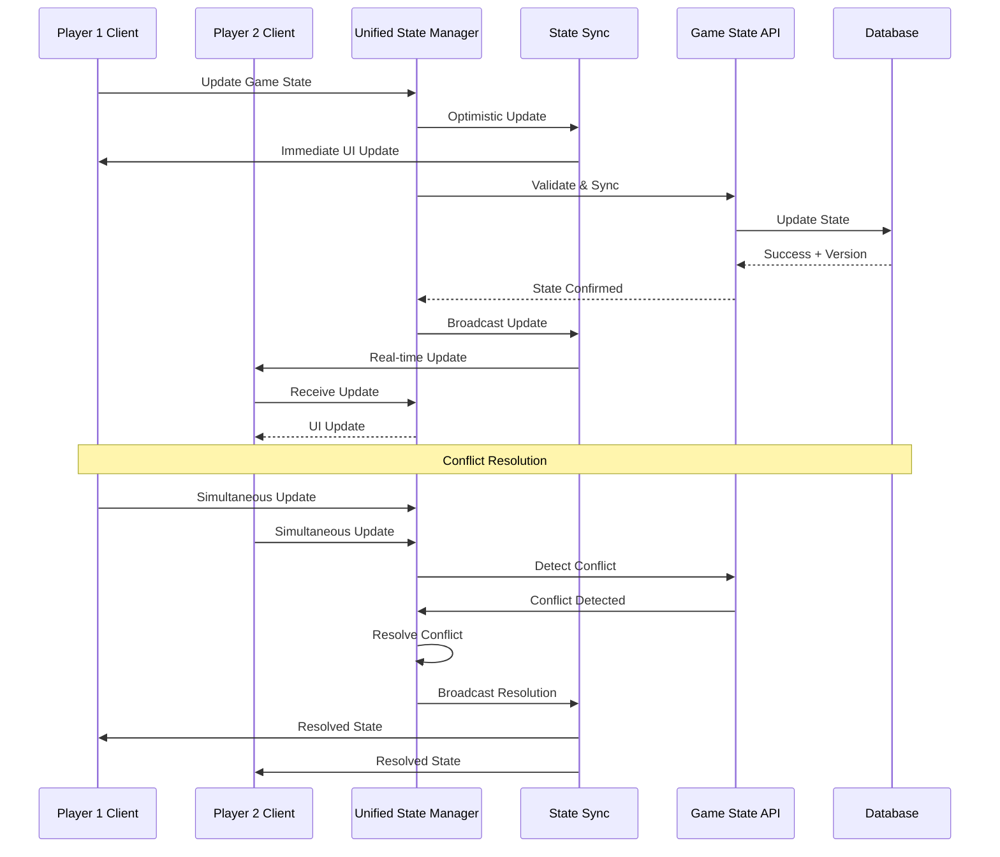

# User Story: 21 - Unified Game State Management

**As a** player,
**I want** my game state to be synchronized across all phases and with other players,
**so that** everyone sees the same game information and my actions are reflected in real-time.

## Acceptance Criteria

* Central game state manager coordinates all 18 individual components
* State changes are synchronized across all players in real-time (<200ms)
* Game state persists through connection issues and page refreshes
* Optimistic updates with rollback for failed actions
* State validation ensures data integrity across phases
* Conflict resolution handles simultaneous player actions

## Notes

* Integrates with existing `useRealTimeSync` hook and SSE infrastructure
* Must handle state for all game phases: roles, teams, votes, missions, results
* Implements automatic state persistence and recovery mechanisms

## Implementation Plan

### 1. Feature Overview

The Unified Game State Management system provides centralized state coordination for all 18 game features, ensuring real-time synchronization across all players while maintaining data integrity and handling conflicts. It serves as the single source of truth for the entire game state.

### 2. Component Analysis & Reuse Strategy

**Existing Components to Reuse:**
- `useSSERealtimeRoom` hook (`src/hooks/useSSERealtimeRoom.ts`) - Real-time synchronization
- `GameStateMachine` class (`src/lib/game-state-machine.ts`) - State validation
- `GameStateRecovery` components (`src/components/features/game-state-recovery/`) - Persistence and recovery
- All existing game state types (`src/types/game-state.ts`)

**New Components Needed:**
- `UnifiedGameStateManager` - Central state management component
- `StateSync` - Real-time synchronization handler
- `ConflictResolver` - Handles simultaneous actions
- `OptimisticUpdateManager` - Manages optimistic updates with rollback
- `StatePersistence` - Handles state persistence and recovery

### 3. Affected Files

- `[CREATE] src/components/unified-game-state/UnifiedGameStateManager.tsx`
- `[CREATE] src/components/unified-game-state/StateSync.tsx`
- `[CREATE] src/components/unified-game-state/ConflictResolver.tsx`
- `[CREATE] src/components/unified-game-state/OptimisticUpdateManager.tsx`
- `[CREATE] src/components/unified-game-state/StatePersistence.tsx`
- `[CREATE] src/components/unified-game-state/index.ts`
- `[CREATE] src/types/unified-game-state.ts`
- `[CREATE] src/lib/unified-game-state-utils.ts`
- `[CREATE] src/hooks/useUnifiedGameState.ts`
- `[CREATE] src/context/UnifiedGameStateContext.tsx`
- `[MODIFY] src/lib/game-state-machine.ts`
- `[MODIFY] src/hooks/useSSERealtimeRoom.ts`
- `[CREATE] src/components/unified-game-state/UnifiedGameStateManager.test.tsx`
- `[CREATE] src/components/unified-game-state/StateSync.test.tsx`
- `[CREATE] src/components/unified-game-state/UnifiedGameStateManager.visual.spec.ts`

### 4. Component Breakdown

**UnifiedGameStateManager** (`src/components/unified-game-state/UnifiedGameStateManager.tsx`)
- **Type**: Client Component (requires state management and real-time updates)
- **Responsibility**: Central coordination of all game state across all 18 features
- **Key Props**:
  ```typescript
  interface UnifiedGameStateManagerProps {
    roomCode: string;
    playerId: string;
    initialState?: UnifiedGameState;
    onStateChange?: (state: UnifiedGameState) => void;
    onError?: (error: GameStateError) => void;
    onConflict?: (conflict: StateConflict) => void;
  }
  ```
- **Child Components**: StateSync, ConflictResolver, OptimisticUpdateManager, StatePersistence

**StateSync** (`src/components/unified-game-state/StateSync.tsx`)
- **Type**: Client Component (handles real-time synchronization)
- **Responsibility**: Manage real-time state synchronization across all players
- **Key Props**:
  ```typescript
  interface StateSyncProps {
    gameState: UnifiedGameState;
    roomCode: string;
    playerId: string;
    onSync: (syncedState: UnifiedGameState) => void;
    onSyncError: (error: SyncError) => void;
    syncInterval?: number;
  }
  ```
- **Child Components**: None

**ConflictResolver** (`src/components/unified-game-state/ConflictResolver.tsx`)
- **Type**: Client Component (conflict resolution)
- **Responsibility**: Handle simultaneous player actions and resolve state conflicts
- **Key Props**:
  ```typescript
  interface ConflictResolverProps {
    conflicts: StateConflict[];
    resolutionStrategy: ConflictResolutionStrategy;
    onResolve: (resolvedState: UnifiedGameState) => void;
    onResolutionError: (error: ConflictResolutionError) => void;
  }
  ```
- **Child Components**: None

**OptimisticUpdateManager** (`src/components/unified-game-state/OptimisticUpdateManager.tsx`)
- **Type**: Client Component (optimistic updates)
- **Responsibility**: Manage optimistic updates with rollback capability
- **Key Props**:
  ```typescript
  interface OptimisticUpdateManagerProps {
    gameState: UnifiedGameState;
    pendingUpdates: OptimisticUpdate[];
    onUpdate: (update: OptimisticUpdate) => void;
    onRollback: (updateId: string) => void;
    onConfirm: (updateId: string) => void;
  }
  ```
- **Child Components**: None

**StatePersistence** (`src/components/unified-game-state/StatePersistence.tsx`)
- **Type**: Client Component (state persistence)
- **Responsibility**: Handle state persistence and recovery mechanisms
- **Key Props**:
  ```typescript
  interface StatePersistenceProps {
    gameState: UnifiedGameState;
    persistenceConfig: PersistenceConfig;
    onSave: (snapshot: GameStateSnapshot) => void;
    onRestore: (snapshot: GameStateSnapshot) => void;
    onPersistenceError: (error: PersistenceError) => void;
  }
  ```
- **Child Components**: None

### 5. Design Specifications

**Color System:**
| Design Color | Semantic Purpose | Element | Implementation Method |
|--------------|-----------------|---------|------------------------|
| #0a0a0f | Deep background | State manager container | Direct hex value (#0a0a0f) |
| #1a1a2e | Primary brand | State panels | Direct hex value (#1a1a2e) |
| #252547 | Elevated surface | Sync indicators | Direct hex value (#252547) |
| #3d3d7a | Interactive | State controls | Direct hex value (#3d3d7a) |
| #22c55e | Success | Sync success | Direct hex value (#22c55e) |
| #ef4444 | Error | Sync errors | Direct hex value (#ef4444) |
| #f59e0b | Warning | Conflicts | Direct hex value (#f59e0b) |
| #3b82f6 | Information | State info | Direct hex value (#3b82f6) |

**State Indicators:**
- Sync status: 12px indicator with pulse animation
- Conflict warnings: 16px warning icon with bounce
- Persistence status: 14px status text
- Connection state: 10px dot with color coding

**Typography:**
- State headers: 24px, font-bold, line-height: 1.2
- Sync messages: 16px, font-medium, line-height: 1.4
- Error messages: 14px, font-medium, line-height: 1.5
- Debug info: 12px, font-mono, line-height: 1.6

**Spacing:**
- Manager container: 16px (p-4)
- State sections: 12px (space-y-3)
- Indicator spacing: 8px (space-x-2)
- Debug panel: 20px (p-5)

### 6. Data Flow & State Management

**TypeScript Types:**
```typescript
// src/types/unified-game-state.ts
export interface UnifiedGameState {
  roomCode: string;
  gameState: GameState;
  players: Player[];
  realTimeData: RealTimeData;
  metadata: GameStateMetadata;
  version: number;
  timestamp: number;
  checksum: string;
}

export interface StateConflict {
  id: string;
  type: ConflictType;
  conflictingStates: UnifiedGameState[];
  priority: ConflictPriority;
  resolutionStrategy: ConflictResolutionStrategy;
  timestamp: number;
}

export interface OptimisticUpdate {
  id: string;
  type: UpdateType;
  payload: any;
  timestamp: number;
  playerId: string;
  status: 'pending' | 'confirmed' | 'rolled_back';
}

export interface GameStateError {
  code: string;
  message: string;
  context: any;
  recoverable: boolean;
  timestamp: number;
}
```

**State Management Strategy:**
- React Context for global state access
- Custom hook for state management operations
- Zustand store for complex state coordination
- Local storage for offline persistence
- IndexedDB for large state snapshots

**Real-time Synchronization:**
- SSE-based updates with <200ms latency
- Optimistic updates for immediate feedback
- Conflict detection and resolution
- Automatic retry with exponential backoff

### 7. API Endpoints & Contracts

**New Route Handlers:**
```typescript
// src/app/api/game-state/sync/route.ts
POST /api/game-state/sync
{
  "roomCode": "string",
  "playerId": "string",
  "gameState": "UnifiedGameState",
  "version": "number"
}
Response: { success: boolean, syncedState: UnifiedGameState, conflicts?: StateConflict[] }

// src/app/api/game-state/resolve-conflict/route.ts
POST /api/game-state/resolve-conflict
{
  "roomCode": "string",
  "conflictId": "string",
  "resolution": "ConflictResolution"
}
Response: { success: boolean, resolvedState: UnifiedGameState }
```

**Core Logic:**
- State validation using GameStateMachine
- Conflict detection and resolution algorithms
- Optimistic update management
- Real-time broadcast to all players

### 8. Integration Diagram



### 9. Styling

**Color Implementation:**
- Manager background: #0a0a0f for seamless integration
- State panels: #1a1a2e for consistent branding
- Sync indicators: #22c55e for success, #ef4444 for errors
- Conflict warnings: #f59e0b for attention
- Information displays: #3b82f6 for neutral info

**Visual Feedback:**
- Pulse animation for active synchronization
- Bounce animation for conflict warnings
- Fade transitions for state changes
- Loading spinners for sync operations

### 10. Testing Strategy

**Unit Tests:**
- `src/components/unified-game-state/UnifiedGameStateManager.test.tsx` - Core state management
- `src/components/unified-game-state/StateSync.test.tsx` - Synchronization logic
- `src/lib/unified-game-state-utils.test.ts` - Utility functions
- `src/hooks/useUnifiedGameState.test.ts` - Hook functionality

**Component Tests:**
- UnifiedGameStateManager integration tests
- StateSync component tests
- ConflictResolver component tests
- OptimisticUpdateManager component tests

**E2E Tests:**
- Multi-player state synchronization
- Conflict resolution scenarios
- Connection loss and recovery
- Performance under load

### 11. Accessibility (A11y) Considerations

- Screen reader announcements for state changes
- Keyboard navigation for debug interfaces
- High contrast mode for state indicators
- Reduced motion for animations
- Clear error messages for state issues

### 12. Security Considerations

- State validation to prevent manipulation
- Player authorization for state changes
- Secure conflict resolution without exposing sensitive data
- Rate limiting for state updates
- Input sanitization for all state data

### 13. Implementation Steps

**Phase 1: UI Implementation with Mock Data**

**1. Setup & Types:**
- [ ] Define `UnifiedGameState`, `StateConflict`, `OptimisticUpdate`, `GameStateError` in `src/types/unified-game-state.ts`
- [ ] Create unified game state utility functions in `src/lib/unified-game-state-utils.ts`
- [ ] Set up mock game state data and conflict scenarios

**2. Context and Hook:**
- [ ] Create `src/context/UnifiedGameStateContext.tsx`
- [ ] Implement React Context for global state access
- [ ] Create `src/hooks/useUnifiedGameState.ts`
- [ ] Implement custom hook for state management operations

**3. Core State Components:**
- [ ] Create `src/components/unified-game-state/UnifiedGameStateManager.tsx`
- [ ] Implement central state coordination with mock data
- [ ] Create `src/components/unified-game-state/StateSync.tsx`
- [ ] Implement synchronization logic with mock sync operations
- [ ] Create `src/components/unified-game-state/ConflictResolver.tsx`
- [ ] Implement conflict resolution with mock conflicts

**4. Supporting Components:**
- [ ] Create `src/components/unified-game-state/OptimisticUpdateManager.tsx`
- [ ] Implement optimistic updates with mock rollback scenarios
- [ ] Create `src/components/unified-game-state/StatePersistence.tsx`
- [ ] Implement persistence logic with mock storage
- [ ] Create `src/components/unified-game-state/index.ts` for exports

**5. Styling:**
- [ ] Verify manager background color (#0a0a0f) matches design system EXACTLY
- [ ] Verify state panel colors (#1a1a2e) match design system EXACTLY
- [ ] Verify sync indicator colors (#22c55e, #ef4444) match design system EXACTLY
- [ ] Verify conflict warning colors (#f59e0b) match design system EXACTLY
- [ ] Verify information display colors (#3b82f6) match design system EXACTLY
- [ ] Apply direct hex values for all colors in className attributes
- [ ] Implement pulse animations for sync indicators
- [ ] Add responsive design for debug interfaces

**6. UI Testing:**
- [ ] Create Playwright visual test in `src/components/unified-game-state/UnifiedGameStateManager.visual.spec.ts`
- [ ] Configure tests for state synchronization visualization
- [ ] Add visual color verification tests with exact RGB values using CSS property assertions
- [ ] Add animation verification tests for sync indicators
- [ ] Add conflict resolution UI tests
- [ ] Add comprehensive data-testid attributes to all state elements
- [ ] Component tests for UnifiedGameStateManager with mock data
- [ ] Component tests for StateSync with mock synchronization
- [ ] Component tests for ConflictResolver with mock conflicts

**Phase 2: API Integration with Real Data**

**7. Backend Integration:**
- [ ] Create `src/app/api/game-state/sync/route.ts`
- [ ] Implement state synchronization endpoint with validation
- [ ] Create `src/app/api/game-state/resolve-conflict/route.ts`
- [ ] Implement conflict resolution endpoint
- [ ] Update `src/lib/game-state-machine.ts` with unified state support

**8. Real-time Integration:**
- [ ] Replace mock sync operations with real SSE-based updates
- [ ] Integrate with existing `useSSERealtimeRoom` hook
- [ ] Implement optimistic updates with real API calls
- [ ] Add conflict detection and resolution with real state

**9. State Persistence:**
- [ ] Implement local storage for offline state persistence
- [ ] Add IndexedDB for large state snapshots
- [ ] Integrate with existing game state recovery system
- [ ] Add automatic state backup and restore

**10. Integration Testing:**
- [ ] Write unit tests for API validation logic
- [ ] Update component tests to test with real state synchronization
- [ ] Multi-player synchronization testing
- [ ] End-to-end testing of conflict resolution

**11. Final Documentation & Polishing:**
- [ ] Add JSDoc documentation for all state management components
- [ ] Update docs/erd.md if database schema changes are needed
- [ ] Final review of state synchronization logic
- [ ] Performance optimization for large state objects
