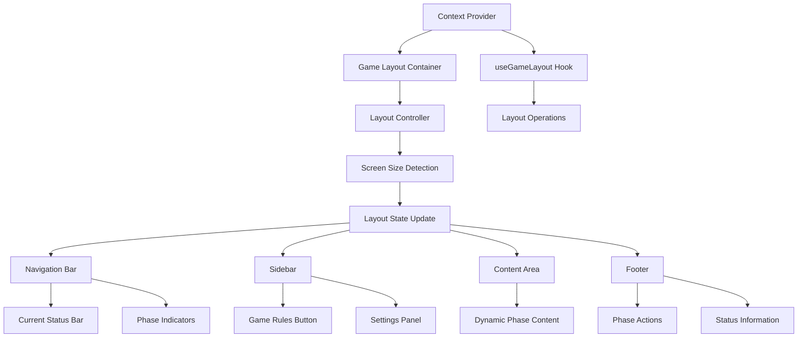

# User Story: 22 - Game Layout System

**As a** player,
**I want** a consistent and intuitive game interface layout,
**so that** I can easily navigate and interact with the game regardless of which phase I'm in.

## Acceptance Criteria

* Full-screen immersive game interface with consistent layout
* Persistent game navigation showing current phase and progress
* Real-time status bar displaying game state and player information
* Phase-specific action areas that adapt to current gameplay needs
* Accessible sidebar with game rules reference and settings
* Responsive design works on desktop, mobile, and tablet (320px to 1440px+)

## Notes

* Integrates CurrentStatusBar (Feature 9) for real-time game status
* Includes GameRulesFloatingButton (Feature 15) for contextual help
* Must maintain dark medieval/fantasy theme consistency
* Layout adapts to different screen sizes and orientations

## Implementation Plan

### 1. Feature Overview

The Game Layout System provides a consistent, immersive interface structure that adapts to all game phases while maintaining visual consistency and optimal user experience across all devices. It serves as the visual framework for all 18 game features.

### 2. Component Analysis & Reuse Strategy

**Existing Components to Reuse:**
- `CurrentStatusBar` (`src/app/room/[roomCode]/game/CurrentStatusBar.tsx`) - Real-time status display
- `GameRulesFloatingButton` (`src/components/features/game-rules/GameRulesFloatingButton.tsx`) - Contextual help access
- `GameRulesModal` (`src/components/features/game-rules/GameRulesModal.tsx`) - Rules reference
- `MobileResponsiveDemo` (`src/components/features/mobile/MobileResponsiveDemo.tsx`) - Mobile layout patterns

**New Components Needed:**
- `GameLayoutContainer` - Main layout wrapper
- `GameNavigationBar` - Persistent navigation
- `GameSidebar` - Collapsible sidebar with rules and settings
- `PhaseContentArea` - Adaptive content area
- `GameFooter` - Action buttons and status
- `LayoutController` - Layout state management

### 3. Affected Files

- `[CREATE] src/components/game-layout/GameLayoutContainer.tsx`
- `[CREATE] src/components/game-layout/GameNavigationBar.tsx`
- `[CREATE] src/components/game-layout/GameSidebar.tsx`
- `[CREATE] src/components/game-layout/PhaseContentArea.tsx`
- `[CREATE] src/components/game-layout/GameFooter.tsx`
- `[CREATE] src/components/game-layout/LayoutController.tsx`
- `[CREATE] src/components/game-layout/index.ts`
- `[CREATE] src/types/game-layout.ts`
- `[CREATE] src/lib/game-layout-utils.ts`
- `[CREATE] src/hooks/useGameLayout.ts`
- `[CREATE] src/context/GameLayoutContext.tsx`
- `[MODIFY] src/app/room/[roomCode]/game/page.tsx`
- `[CREATE] src/components/game-layout/GameLayoutContainer.test.tsx`
- `[CREATE] src/components/game-layout/GameNavigationBar.test.tsx`
- `[CREATE] src/components/game-layout/GameLayoutContainer.visual.spec.ts`

### 4. Component Breakdown

**GameLayoutContainer** (`src/components/game-layout/GameLayoutContainer.tsx`)
- **Type**: Client Component (requires layout state management)
- **Responsibility**: Main container providing the overall layout structure
- **Key Props**:
  ```typescript
  interface GameLayoutContainerProps {
    children: React.ReactNode;
    roomCode: string;
    gamePhase: GamePhase;
    isMobile: boolean;
    sidebarOpen?: boolean;
    onLayoutChange?: (layout: LayoutState) => void;
  }
  ```
- **Child Components**: GameNavigationBar, GameSidebar, PhaseContentArea, GameFooter

**GameNavigationBar** (`src/components/game-layout/GameNavigationBar.tsx`)
- **Type**: Client Component (requires real-time updates)
- **Responsibility**: Persistent navigation showing current phase and progress
- **Key Props**:
  ```typescript
  interface GameNavigationBarProps {
    currentPhase: GamePhase;
    gameProgress: GameProgress;
    roomCode: string;
    playerCount: number;
    onSidebarToggle: () => void;
    onSettingsOpen: () => void;
  }
  ```
- **Child Components**: CurrentStatusBar, phase indicators

**GameSidebar** (`src/components/game-layout/GameSidebar.tsx`)
- **Type**: Client Component (collapsible sidebar)
- **Responsibility**: Sidebar with game rules, settings, and additional information
- **Key Props**:
  ```typescript
  interface GameSidebarProps {
    isOpen: boolean;
    onClose: () => void;
    currentPhase: GamePhase;
    gameRules: GameRules;
    onRulesOpen: () => void;
    onSettingsOpen: () => void;
  }
  ```
- **Child Components**: GameRulesFloatingButton, settings panel

**PhaseContentArea** (`src/components/game-layout/PhaseContentArea.tsx`)
- **Type**: Client Component (adaptive content area)
- **Responsibility**: Main content area that adapts to current phase requirements
- **Key Props**:
  ```typescript
  interface PhaseContentAreaProps {
    children: React.ReactNode;
    currentPhase: GamePhase;
    layoutMode: LayoutMode;
    isMobile: boolean;
    className?: string;
  }
  ```
- **Child Components**: Dynamic phase components

**GameFooter** (`src/components/game-layout/GameFooter.tsx`)
- **Type**: Client Component (action area)
- **Responsibility**: Footer with phase-specific actions and status information
- **Key Props**:
  ```typescript
  interface GameFooterProps {
    currentPhase: GamePhase;
    actions: PhaseAction[];
    onAction: (action: PhaseAction) => void;
    isLoading?: boolean;
    className?: string;
  }
  ```
- **Child Components**: Action buttons, status indicators

**LayoutController** (`src/components/game-layout/LayoutController.tsx`)
- **Type**: Client Component (layout state management)
- **Responsibility**: Manage layout state and respond to screen size changes
- **Key Props**:
  ```typescript
  interface LayoutControllerProps {
    children: React.ReactNode;
    onLayoutChange: (layout: LayoutState) => void;
    initialLayout?: LayoutState;
  }
  ```
- **Child Components**: Layout provider wrapper

### 5. Design Specifications

**Color System:**
| Design Color | Semantic Purpose | Element | Implementation Method |
|--------------|-----------------|---------|------------------------|
| #0a0a0f | Deep background | Main container | Direct hex value (#0a0a0f) |
| #1a1a2e | Primary brand | Navigation bar | Direct hex value (#1a1a2e) |
| #252547 | Elevated surface | Sidebar panels | Direct hex value (#252547) |
| #3d3d7a | Interactive | Navigation items | Direct hex value (#3d3d7a) |
| #22c55e | Success | Positive indicators | Direct hex value (#22c55e) |
| #ef4444 | Error | Error states | Direct hex value (#ef4444) |
| #f59e0b | Warning | Warning indicators | Direct hex value (#f59e0b) |
| #3b82f6 | Information | Info displays | Direct hex value (#3b82f6) |

**Layout Specifications:**
- Navigation bar height: 64px (h-16)
- Sidebar width: 320px (w-80) on desktop, full width on mobile
- Content area: Flex-grow with responsive padding
- Footer height: 72px (h-18)
- Responsive breakpoints: 320px, 768px, 1024px, 1440px

**Typography:**
- Navigation title: 20px, font-bold, line-height: 1.2
- Phase indicators: 16px, font-medium, line-height: 1.3
- Sidebar headers: 18px, font-semibold, line-height: 1.4
- Action buttons: 16px, font-medium, line-height: 1.5

**Spacing:**
- Container padding: 16px (p-4) on mobile, 24px (p-6) on desktop
- Section spacing: 16px (space-y-4)
- Navigation padding: 16px (px-4 py-4)
- Sidebar padding: 24px (p-6)

### 6. Data Flow & State Management

**TypeScript Types:**
```typescript
// src/types/game-layout.ts
export interface LayoutState {
  sidebarOpen: boolean;
  isMobile: boolean;
  screenSize: ScreenSize;
  orientation: 'portrait' | 'landscape';
  layoutMode: LayoutMode;
  currentPhase: GamePhase;
}

export interface GameProgress {
  currentRound: number;
  totalRounds: number;
  currentPhase: GamePhase;
  timeRemaining?: number;
  playerStatus: PlayerStatus[];
}

export interface PhaseAction {
  id: string;
  label: string;
  type: 'primary' | 'secondary' | 'danger';
  disabled?: boolean;
  loading?: boolean;
  onClick: () => void;
}

export type LayoutMode = 'desktop' | 'tablet' | 'mobile';
export type ScreenSize = 'sm' | 'md' | 'lg' | 'xl' | '2xl';
```

**State Management:**
- React Context for layout state
- Custom hook for layout operations
- Local storage for layout preferences
- Responsive breakpoint detection
- Orientation change handling

**Data Flow:**
- Layout state flows down through Context
- Screen size changes trigger layout updates
- Phase changes update content area
- User interactions update layout state

### 7. API Endpoints & Contracts

**No new API endpoints required** - the Game Layout System operates entirely on the client side using existing game state data.

### 8. Integration Diagram



### 9. Styling

**Color Implementation:**
- Main container: #0a0a0f with full-screen gradient
- Navigation bar: #1a1a2e with subtle border
- Sidebar: #252547 with backdrop blur
- Interactive elements: #3d3d7a with hover effects
- Status indicators: #22c55e for success, #ef4444 for errors

**Responsive Design:**
- Mobile-first approach with progressive enhancement
- Flexible grid system for content areas
- Collapsible sidebar for mobile devices
- Touch-friendly button sizes (minimum 44px)
- Adaptive typography scaling

**Animations:**
- Sidebar slide-in/out transitions (250ms)
- Phase transition animations (300ms)
- Hover effects for interactive elements
- Loading states with subtle animations

### 10. Testing Strategy

**Unit Tests:**
- `src/components/game-layout/GameLayoutContainer.test.tsx` - Layout structure
- `src/components/game-layout/GameNavigationBar.test.tsx` - Navigation behavior
- `src/lib/game-layout-utils.test.ts` - Layout utilities
- `src/hooks/useGameLayout.test.ts` - Layout hook functionality

**Component Tests:**
- GameLayoutContainer integration tests
- GameNavigationBar component tests
- GameSidebar component tests
- PhaseContentArea component tests
- Responsive behavior tests

**E2E Tests:**
- Layout consistency across phases
- Responsive design testing
- Sidebar functionality testing
- Navigation behavior testing

### 11. Accessibility (A11y) Considerations

- ARIA landmarks for layout regions
- Keyboard navigation for all interactive elements
- Screen reader compatibility for layout changes
- Focus management during sidebar operations
- High contrast mode support
- Reduced motion preferences for animations

### 12. Security Considerations

- No sensitive data exposed in layout components
- Safe HTML rendering for dynamic content
- Input validation for layout preferences
- Secure storage of layout settings

### 13. Implementation Steps

**Phase 1: UI Implementation with Mock Data**

**1. Setup & Types:**
- [ ] Define `LayoutState`, `GameProgress`, `PhaseAction` in `src/types/game-layout.ts`
- [ ] Create game layout utility functions in `src/lib/game-layout-utils.ts`
- [ ] Set up mock layout data and phase configurations

**2. Context and Hook:**
- [ ] Create `src/context/GameLayoutContext.tsx`
- [ ] Implement React Context for layout state management
- [ ] Create `src/hooks/useGameLayout.ts`
- [ ] Implement custom hook for layout operations and responsive detection

**3. Core Layout Components:**
- [ ] Create `src/components/game-layout/GameLayoutContainer.tsx`
- [ ] Implement main layout structure with mock data
- [ ] Create `src/components/game-layout/LayoutController.tsx`
- [ ] Implement layout state management and screen size detection
- [ ] Create `src/components/game-layout/GameNavigationBar.tsx`
- [ ] Implement navigation bar with mock progress data

**4. Layout Sections:**
- [ ] Create `src/components/game-layout/GameSidebar.tsx`
- [ ] Implement collapsible sidebar with mock content
- [ ] Create `src/components/game-layout/PhaseContentArea.tsx`
- [ ] Implement adaptive content area with mock phase content
- [ ] Create `src/components/game-layout/GameFooter.tsx`
- [ ] Implement footer with mock action buttons

**5. Styling:**
- [ ] Verify main container background (#0a0a0f) matches design system EXACTLY
- [ ] Verify navigation bar colors (#1a1a2e) match design system EXACTLY
- [ ] Verify sidebar colors (#252547) match design system EXACTLY
- [ ] Verify interactive element colors (#3d3d7a) match design system EXACTLY
- [ ] Verify status indicator colors (#22c55e, #ef4444) match design system EXACTLY
- [ ] Apply direct hex values for all colors in className attributes
- [ ] Implement responsive design with all breakpoints (320px, 768px, 1024px, 1440px)
- [ ] Add smooth transitions for layout changes

**6. UI Testing:**
- [ ] Create Playwright visual test in `src/components/game-layout/GameLayoutContainer.visual.spec.ts`
- [ ] Configure tests for all viewport sizes (mobile, tablet, desktop, large)
- [ ] Add visual color verification tests with exact RGB values using CSS property assertions
- [ ] Add responsive layout verification tests
- [ ] Add sidebar animation verification tests
- [ ] Add navigation bar verification tests
- [ ] Add comprehensive data-testid attributes to all layout elements
- [ ] Component tests for GameLayoutContainer with mock data
- [ ] Component tests for GameNavigationBar with mock progress
- [ ] Component tests for GameSidebar with mock content

**Phase 2: API Integration with Real Data**

**7. Game Integration:**
- [ ] Replace mock layout data with real game state
- [ ] Integrate with existing CurrentStatusBar component
- [ ] Integrate with existing GameRulesFloatingButton component
- [ ] Connect with real phase data and progress information

**8. Real-time Updates:**
- [ ] Implement real-time layout updates based on game state changes
- [ ] Add phase-specific layout adaptations
- [ ] Integrate with real player status and game progress
- [ ] Handle layout changes during phase transitions

**9. Page Integration:**
- [ ] Update `src/app/room/[roomCode]/game/page.tsx` to use GameLayoutContainer
- [ ] Replace existing layout structure with new layout system
- [ ] Ensure compatibility with all existing game features
- [ ] Test integration with Game Engine and Phase Router

**10. Integration Testing:**
- [ ] Write unit tests for layout integration logic
- [ ] Update component tests to test with real game data
- [ ] End-to-end testing of layout consistency across phases
- [ ] Responsive design testing on actual devices

**11. Final Documentation & Polishing:**
- [ ] Add JSDoc documentation for all layout components
- [ ] Create layout system documentation
- [ ] Final review of responsive design implementation
- [ ] Performance optimization for layout rendering
