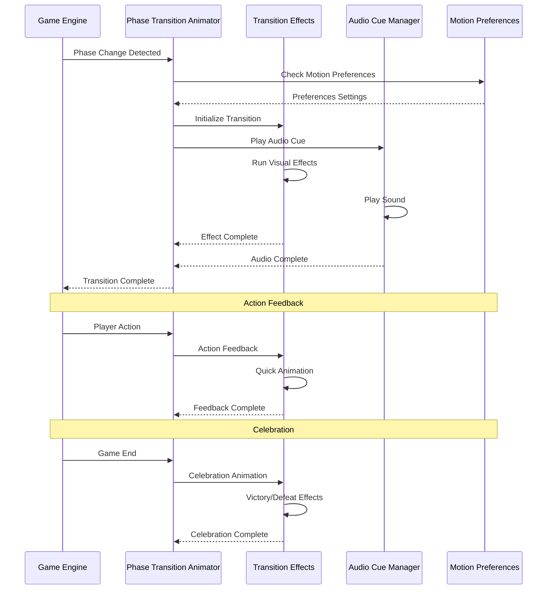

# User Story: 23 - Phase Transition Animations

**As a** player,
**I want** smooth visual transitions between game phases,
**so that** the game feels polished and I understand when phases change.

## Acceptance Criteria

* Phase transitions include smooth CSS animations (300-500ms duration)
* Visual and audio cues indicate phase changes
* Loading animations during phase transitions
* Victory/defeat celebration animations
* Player action feedback animations
* Transition animations respect user's reduced motion preferences

## Notes

* Enhances user experience with polished visual feedback
* Must work across all 18 game features and phase transitions
* Animations should be performant and accessible
* Integrates with existing design system and theme

## Implementation Plan

### 1. Feature Overview

The Phase Transition Animations system provides smooth, polished visual transitions between game phases, enhancing the user experience with appropriate visual and audio feedback while maintaining accessibility and performance standards.

### 2. Component Analysis & Reuse Strategy

**Existing Components to Reuse:**
- `PhaseTransition` component from Dynamic Phase Router (Feature 20)
- Existing CSS animations from `src/styles/globals.css`
- `GameStateMachine` class (`src/lib/game-state-machine.ts`) - Phase transition logic
- All existing phase components from Features 1-18

**New Components Needed:**
- `PhaseTransitionAnimator` - Main animation controller
- `TransitionEffects` - Visual effects library
- `AudioCueManager` - Audio feedback system
- `CelebrationAnimations` - Victory/defeat animations
- `ActionFeedback` - Player action animations
- `MotionPreferences` - Accessibility motion controls

### 3. Affected Files

- `[CREATE] src/components/phase-transition-animations/PhaseTransitionAnimator.tsx`
- `[CREATE] src/components/phase-transition-animations/TransitionEffects.tsx`
- `[CREATE] src/components/phase-transition-animations/AudioCueManager.tsx`
- `[CREATE] src/components/phase-transition-animations/CelebrationAnimations.tsx`
- `[CREATE] src/components/phase-transition-animations/ActionFeedback.tsx`
- `[CREATE] src/components/phase-transition-animations/MotionPreferences.tsx`
- `[CREATE] src/components/phase-transition-animations/index.ts`
- `[CREATE] src/types/phase-transition-animations.ts`
- `[CREATE] src/lib/animation-utils.ts`
- `[CREATE] src/hooks/usePhaseTransitionAnimations.ts`
- `[CREATE] src/hooks/useMotionPreferences.ts`
- `[MODIFY] src/styles/globals.css`
- `[CREATE] src/assets/audio/` (audio files directory)
- `[CREATE] src/components/phase-transition-animations/PhaseTransitionAnimator.test.tsx`
- `[CREATE] src/components/phase-transition-animations/TransitionEffects.test.tsx`
- `[CREATE] src/components/phase-transition-animations/PhaseTransitionAnimator.visual.spec.ts`

### 4. Component Breakdown

**PhaseTransitionAnimator** (`src/components/phase-transition-animations/PhaseTransitionAnimator.tsx`)
- **Type**: Client Component (requires animation state management)
- **Responsibility**: Main controller for all phase transition animations
- **Key Props**:
  ```typescript
  interface PhaseTransitionAnimatorProps {
    currentPhase: GamePhase;
    previousPhase: GamePhase | null;
    isTransitioning: boolean;
    transitionType: TransitionType;
    duration?: number;
    children: React.ReactNode;
    onTransitionComplete?: () => void;
  }
  ```
- **Child Components**: TransitionEffects, AudioCueManager, CelebrationAnimations

**TransitionEffects** (`src/components/phase-transition-animations/TransitionEffects.tsx`)
- **Type**: Client Component (visual effects)
- **Responsibility**: Provide visual effects for phase transitions
- **Key Props**:
  ```typescript
  interface TransitionEffectsProps {
    effectType: EffectType;
    phase: GamePhase;
    isActive: boolean;
    intensity?: 'subtle' | 'moderate' | 'dramatic';
    duration?: number;
    onEffectComplete?: () => void;
  }
  ```
- **Child Components**: Various effect elements (particles, gradients, overlays)

**AudioCueManager** (`src/components/phase-transition-animations/AudioCueManager.tsx`)
- **Type**: Client Component (audio management)
- **Responsibility**: Manage audio cues for phase transitions and actions
- **Key Props**:
  ```typescript
  interface AudioCueManagerProps {
    currentPhase: GamePhase;
    actionType?: ActionType;
    volume?: number;
    enabled?: boolean;
    onAudioPlay?: (audioId: string) => void;
  }
  ```
- **Child Components**: None (audio management)

**CelebrationAnimations** (`src/components/phase-transition-animations/CelebrationAnimations.tsx`)
- **Type**: Client Component (celebration effects)
- **Responsibility**: Handle victory/defeat and achievement animations
- **Key Props**:
  ```typescript
  interface CelebrationAnimationsProps {
    celebrationType: CelebrationType;
    isVisible: boolean;
    winner?: 'good' | 'evil';
    players?: Player[];
    onCelebrationComplete?: () => void;
  }
  ```
- **Child Components**: Fireworks, confetti, particle effects

**ActionFeedback** (`src/components/phase-transition-animations/ActionFeedback.tsx`)
- **Type**: Client Component (action feedback)
- **Responsibility**: Provide immediate feedback for player actions
- **Key Props**:
  ```typescript
  interface ActionFeedbackProps {
    actionType: ActionType;
    success?: boolean;
    position?: { x: number; y: number };
    duration?: number;
    onFeedbackComplete?: () => void;
  }
  ```
- **Child Components**: None (animation effects)

**MotionPreferences** (`src/components/phase-transition-animations/MotionPreferences.tsx`)
- **Type**: Client Component (accessibility controls)
- **Responsibility**: Handle reduced motion preferences and accessibility
- **Key Props**:
  ```typescript
  interface MotionPreferencesProps {
    children: React.ReactNode;
    respectReducedMotion?: boolean;
    fallbackMode?: 'static' | 'minimal' | 'off';
  }
  ```
- **Child Components**: Motion-controlled wrapper

### 5. Design Specifications

**Color System:**
| Design Color | Semantic Purpose | Element | Implementation Method |
|--------------|-----------------|---------|------------------------|
| #0a0a0f | Deep background | Animation base | Direct hex value (#0a0a0f) |
| #1a1a2e | Primary brand | Phase indicators | Direct hex value (#1a1a2e) |
| #252547 | Elevated surface | Transition overlays | Direct hex value (#252547) |
| #3d3d7a | Interactive | Action feedback | Direct hex value (#3d3d7a) |
| #22c55e | Success | Victory animations | Direct hex value (#22c55e) |
| #ef4444 | Error | Defeat animations | Direct hex value (#ef4444) |
| #f59e0b | Warning | Loading states | Direct hex value (#f59e0b) |
| #3b82f6 | Information | Info animations | Direct hex value (#3b82f6) |

**Animation Specifications:**
- Phase transitions: 300-500ms duration
- Action feedback: 150-250ms duration
- Celebration animations: 2-3 seconds
- Loading animations: 1-2 second cycles
- Easing: cubic-bezier(0.25, 0.46, 0.45, 0.94)

**Visual Effects:**
- Particle systems for celebrations
- Gradient overlays for phase transitions
- Pulse effects for loading states
- Shake animations for errors
- Bounce effects for success

**Typography Animation:**
- Text fade-in/out transitions
- Character reveals for dramatic moments
- Typewriter effects for narrative elements
- Scale animations for emphasis

### 6. Data Flow & State Management

**TypeScript Types:**
```typescript
// src/types/phase-transition-animations.ts
export interface AnimationState {
  currentAnimation: AnimationType | null;
  isAnimating: boolean;
  animationQueue: QueuedAnimation[];
  motionPreferences: MotionPreferences;
  audioEnabled: boolean;
}

export interface QueuedAnimation {
  id: string;
  type: AnimationType;
  config: AnimationConfig;
  priority: number;
  delay?: number;
}

export interface AnimationConfig {
  duration: number;
  easing: string;
  intensity: 'subtle' | 'moderate' | 'dramatic';
  effects: EffectType[];
}

export type TransitionType = 'phase' | 'action' | 'celebration' | 'loading';
export type EffectType = 'fade' | 'slide' | 'scale' | 'particles' | 'glow';
export type CelebrationType = 'victory' | 'defeat' | 'achievement' | 'milestone';
```

**State Management:**
- React state for animation control
- Animation queue for managing multiple effects
- Local storage for motion preferences
- Context for global animation settings

**Animation Timing:**
- Staggered animations for multiple elements
- Synchronized transitions across components
- Queued animations for complex sequences
- Interrupt handling for rapid state changes

### 7. API Endpoints & Contracts

**No new API endpoints required** - the Phase Transition Animations system operates entirely on the client side using existing game state and user preferences.

### 8. Integration Diagram



### 9. Styling

**Color Implementation:**
- Animation backgrounds: #0a0a0f with opacity variations
- Phase indicators: #1a1a2e with glow effects
- Success animations: #22c55e with particle effects
- Error animations: #ef4444 with shake effects
- Loading states: #f59e0b with pulse effects

**CSS Custom Properties:**
```css
:root {
  --transition-duration-fast: 150ms;
  --transition-duration-normal: 300ms;
  --transition-duration-slow: 500ms;
  --transition-easing: cubic-bezier(0.25, 0.46, 0.45, 0.94);
  --celebration-duration: 2500ms;
}
```

**Keyframe Animations:**
- Phase fade transitions
- Particle movement systems
- Pulse and glow effects
- Shake and bounce animations
- Scale and rotation effects

### 10. Testing Strategy

**Unit Tests:**
- `src/components/phase-transition-animations/PhaseTransitionAnimator.test.tsx` - Animation control
- `src/components/phase-transition-animations/TransitionEffects.test.tsx` - Visual effects
- `src/lib/animation-utils.test.ts` - Animation utilities
- `src/hooks/usePhaseTransitionAnimations.test.ts` - Animation hook

**Component Tests:**
- PhaseTransitionAnimator integration tests
- TransitionEffects animation tests
- AudioCueManager audio tests
- CelebrationAnimations celebration tests
- Motion preferences tests

**E2E Tests:**
- Phase transition animations across all phases
- Audio cue testing
- Celebration animation testing
- Reduced motion preferences testing

### 11. Accessibility (A11y) Considerations

- Respect `prefers-reduced-motion` media query
- Provide animation controls for users
- Screen reader announcements for phase changes
- Focus management during animations
- High contrast mode support
- Audio cue alternatives for hearing-impaired users

### 12. Security Considerations

- Safe audio file handling
- Secure animation configuration
- Performance limits for complex animations
- Resource cleanup for memory management

### 13. Implementation Steps

**Phase 1: UI Implementation with Mock Data**

**1. Setup & Types:**
- [ ] Define `AnimationState`, `QueuedAnimation`, `AnimationConfig` in `src/types/phase-transition-animations.ts`
- [ ] Create animation utility functions in `src/lib/animation-utils.ts`
- [ ] Set up mock animation configurations and test data

**2. Core Animation Components:**
- [ ] Create `src/components/phase-transition-animations/PhaseTransitionAnimator.tsx`
- [ ] Implement main animation controller with mock transitions
- [ ] Create `src/components/phase-transition-animations/TransitionEffects.tsx`
- [ ] Implement visual effects library with mock effects
- [ ] Create `src/components/phase-transition-animations/MotionPreferences.tsx`
- [ ] Implement motion preference handling with mock settings

**3. Supporting Components:**
- [ ] Create `src/components/phase-transition-animations/AudioCueManager.tsx`
- [ ] Implement audio cue system with mock audio files
- [ ] Create `src/components/phase-transition-animations/CelebrationAnimations.tsx`
- [ ] Implement celebration effects with mock victory/defeat scenarios
- [ ] Create `src/components/phase-transition-animations/ActionFeedback.tsx`
- [ ] Implement action feedback with mock player actions

**4. Animation Hooks:**
- [ ] Create `src/hooks/usePhaseTransitionAnimations.ts`
- [ ] Implement animation state management and control
- [ ] Create `src/hooks/useMotionPreferences.ts`
- [ ] Implement motion preferences detection and handling

**5. CSS Animations:**
- [ ] Extend `src/styles/globals.css` with new animation keyframes
- [ ] Add CSS custom properties for animation timing
- [ ] Implement phase transition animations
- [ ] Add celebration and action feedback animations
- [ ] Include reduced motion fallbacks

**6. Styling:**
- [ ] Verify animation background colors (#0a0a0f) match design system EXACTLY
- [ ] Verify phase indicator colors (#1a1a2e) match design system EXACTLY
- [ ] Verify success animation colors (#22c55e) match design system EXACTLY
- [ ] Verify error animation colors (#ef4444) match design system EXACTLY
- [ ] Verify loading state colors (#f59e0b) match design system EXACTLY
- [ ] Apply direct hex values for all colors in animation CSS
- [ ] Implement smooth transitions with appropriate durations (300-500ms)
- [ ] Add celebration animations with 2-3 second durations

**7. UI Testing:**
- [ ] Create Playwright visual test in `src/components/phase-transition-animations/PhaseTransitionAnimator.visual.spec.ts`
- [ ] Configure tests for animation sequences and transitions
- [ ] Add visual color verification tests for animation states
- [ ] Add animation timing verification tests
- [ ] Add celebration animation verification tests
- [ ] Add motion preference verification tests
- [ ] Add comprehensive data-testid attributes to all animation elements
- [ ] Component tests for PhaseTransitionAnimator with mock data
- [ ] Component tests for TransitionEffects with mock effects
- [ ] Component tests for CelebrationAnimations with mock celebrations

**Phase 2: API Integration with Real Data**

**8. Game Integration:**
- [ ] Replace mock transition data with real phase change events
- [ ] Integrate with existing Game Engine phase transitions
- [ ] Connect with real player actions for feedback animations
- [ ] Implement real victory/defeat detection for celebrations

**9. Audio Integration:**
- [ ] Add real audio files to `src/assets/audio/`
- [ ] Implement audio loading and playback system
- [ ] Add audio cue mapping for different phase transitions
- [ ] Handle audio loading errors and fallbacks

**10. Performance Optimization:**
- [ ] Implement animation performance monitoring
- [ ] Add GPU acceleration for complex animations
- [ ] Optimize particle systems for mobile devices
- [ ] Implement animation cleanup and memory management

**11. Integration Testing:**
- [ ] Write unit tests for animation integration logic
- [ ] Update component tests to test with real game events
- [ ] End-to-end testing of phase transition animations
- [ ] Performance testing with complex animation sequences

**12. Final Documentation & Polishing:**
- [ ] Add JSDoc documentation for all animation components
- [ ] Create animation system documentation
- [ ] Final review of animation timing and effects
- [ ] Browser compatibility testing for CSS animations
