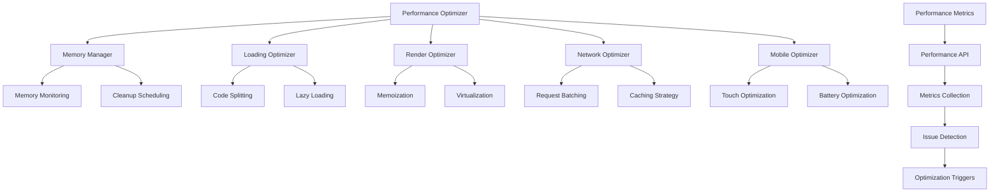

# User Story: 24 - Game Performance Optimization

**As a** player,
**I want** the game to load quickly and run smoothly,
**so that** I can enjoy uninterrupted gameplay without delays or lag.

## Acceptance Criteria

* Initial game page loads in under 2 seconds
* Phase transitions complete in under 500ms
* Real-time state updates arrive in under 200ms
* Game uses less than 50MB of memory
* Supports 5-10 concurrent players without performance degradation
* Maintains 60fps on mobile devices
* Works on Chrome 90+, Firefox 88+, Safari 14+

## Notes

* Performance optimization across all 18 integrated features
* Must handle real-time synchronization efficiently
* Includes memory management and cleanup
* Mobile performance is critical for accessibility

## Implementation Plan

### 1. Feature Overview

The Game Performance Optimization system ensures smooth, efficient gameplay across all devices and browsers by implementing comprehensive performance monitoring, optimization strategies, and resource management for all 18 game features.

### 2. Component Analysis & Reuse Strategy

**Existing Components to Reuse:**
- `PerformanceMonitor` from Game Engine Controller (Feature 19)
- All existing game components (will be optimized)
- `useSSERealtimeRoom` hook (`src/hooks/useSSERealtimeRoom.ts`) - Will be optimized for performance
- Browser performance APIs

**New Components Needed:**
- `PerformanceOptimizer` - Main performance management system
- `MemoryManager` - Memory usage monitoring and cleanup
- `LoadingOptimizer` - Resource loading optimization
- `RenderOptimizer` - React rendering optimizations
- `NetworkOptimizer` - Network request optimization
- `MobileOptimizer` - Mobile-specific optimizations

### 3. Affected Files

- `[CREATE] src/components/performance-optimization/PerformanceOptimizer.tsx`
- `[CREATE] src/components/performance-optimization/MemoryManager.tsx`
- `[CREATE] src/components/performance-optimization/LoadingOptimizer.tsx`
- `[CREATE] src/components/performance-optimization/RenderOptimizer.tsx`
- `[CREATE] src/components/performance-optimization/NetworkOptimizer.tsx`
- `[CREATE] src/components/performance-optimization/MobileOptimizer.tsx`
- `[CREATE] src/components/performance-optimization/index.ts`
- `[CREATE] src/types/performance-optimization.ts`
- `[CREATE] src/lib/performance-utils.ts`
- `[CREATE] src/hooks/usePerformanceOptimization.ts`
- `[CREATE] src/hooks/useMemoryMonitoring.ts`
- `[CREATE] src/hooks/useRenderOptimization.ts`
- `[MODIFY] src/hooks/useSSERealtimeRoom.ts`
- `[MODIFY] src/app/room/[roomCode]/game/page.tsx`
- `[CREATE] next.config.js` (optimization updates)
- `[CREATE] src/components/performance-optimization/PerformanceOptimizer.test.tsx`
- `[CREATE] src/components/performance-optimization/MemoryManager.test.tsx`
- `[CREATE] src/components/performance-optimization/PerformanceOptimizer.visual.spec.ts`

### 4. Component Breakdown

**PerformanceOptimizer** (`src/components/performance-optimization/PerformanceOptimizer.tsx`)
- **Type**: Client Component (requires performance monitoring)
- **Responsibility**: Main performance management and optimization coordination
- **Key Props**:
  ```typescript
  interface PerformanceOptimizerProps {
    children: React.ReactNode;
    enableMonitoring?: boolean;
    optimizationLevel?: 'low' | 'medium' | 'high';
    onPerformanceIssue?: (issue: PerformanceIssue) => void;
    debugMode?: boolean;
  }
  ```
- **Child Components**: MemoryManager, LoadingOptimizer, RenderOptimizer, NetworkOptimizer

**MemoryManager** (`src/components/performance-optimization/MemoryManager.tsx`)
- **Type**: Client Component (memory monitoring)
- **Responsibility**: Monitor and manage memory usage, cleanup unused resources
- **Key Props**:
  ```typescript
  interface MemoryManagerProps {
    memoryLimit?: number;
    cleanupInterval?: number;
    onMemoryWarning?: (usage: MemoryUsage) => void;
    onMemoryCleanup?: (cleaned: CleanupResult) => void;
  }
  ```
- **Child Components**: None (utility component)

**LoadingOptimizer** (`src/components/performance-optimization/LoadingOptimizer.tsx`)
- **Type**: Client Component (loading optimization)
- **Responsibility**: Optimize resource loading and code splitting
- **Key Props**:
  ```typescript
  interface LoadingOptimizerProps {
    preloadStrategy?: PreloadStrategy;
    lazyLoadThreshold?: number;
    onLoadingOptimized?: (metrics: LoadingMetrics) => void;
  }
  ```
- **Child Components**: None (optimization utility)

**RenderOptimizer** (`src/components/performance-optimization/RenderOptimizer.tsx`)
- **Type**: Client Component (render optimization)
- **Responsibility**: Optimize React rendering performance
- **Key Props**:
  ```typescript
  interface RenderOptimizerProps {
    children: React.ReactNode;
    virtualization?: boolean;
    memoization?: boolean;
    onRenderOptimized?: (metrics: RenderMetrics) => void;
  }
  ```
- **Child Components**: Optimized wrapper components

**NetworkOptimizer** (`src/components/performance-optimization/NetworkOptimizer.tsx`)
- **Type**: Client Component (network optimization)
- **Responsibility**: Optimize network requests and real-time updates
- **Key Props**:
  ```typescript
  interface NetworkOptimizerProps {
    cacheStrategy?: CacheStrategy;
    compressionEnabled?: boolean;
    requestBatching?: boolean;
    onNetworkOptimized?: (metrics: NetworkMetrics) => void;
  }
  ```
- **Child Components**: None (network utility)

**MobileOptimizer** (`src/components/performance-optimization/MobileOptimizer.tsx`)
- **Type**: Client Component (mobile optimization)
- **Responsibility**: Mobile-specific performance optimizations
- **Key Props**:
  ```typescript
  interface MobileOptimizerProps {
    children: React.ReactNode;
    touchOptimization?: boolean;
    batteryOptimization?: boolean;
    onMobileOptimized?: (metrics: MobileMetrics) => void;
  }
  ```
- **Child Components**: Mobile-optimized wrapper

### 5. Design Specifications

**Performance Monitoring UI:**
| Design Color | Semantic Purpose | Element | Implementation Method |
|--------------|-----------------|---------|------------------------|
| #0a0a0f | Deep background | Monitor background | Direct hex value (#0a0a0f) |
| #1a1a2e | Primary brand | Monitor panels | Direct hex value (#1a1a2e) |
| #252547 | Elevated surface | Metric displays | Direct hex value (#252547) |
| #22c55e | Success | Good performance | Direct hex value (#22c55e) |
| #ef4444 | Error | Performance issues | Direct hex value (#ef4444) |
| #f59e0b | Warning | Performance warnings | Direct hex value (#f59e0b) |
| #3b82f6 | Information | Performance info | Direct hex value (#3b82f6) |

**Performance Targets:**
- Initial load: <2 seconds
- Phase transitions: <500ms
- State updates: <200ms
- Memory usage: <50MB
- Frame rate: 60fps
- Response time: <100ms

**Typography:**
- Performance headers: 18px, font-bold, line-height: 1.2
- Metric values: 16px, font-mono, line-height: 1.3
- Status messages: 14px, font-medium, line-height: 1.4
- Debug info: 12px, font-mono, line-height: 1.5

### 6. Data Flow & State Management

**TypeScript Types:**
```typescript
// src/types/performance-optimization.ts
export interface PerformanceMetrics {
  loadTime: number;
  memoryUsage: number;
  frameRate: number;
  networkLatency: number;
  renderTime: number;
  interactionDelay: number;
}

export interface PerformanceIssue {
  type: 'memory' | 'render' | 'network' | 'interaction';
  severity: 'low' | 'medium' | 'high' | 'critical';
  message: string;
  metrics: PerformanceMetrics;
  timestamp: number;
}

export interface OptimizationConfig {
  enableLazyLoading: boolean;
  enableMemoryManagement: boolean;
  enableRenderOptimization: boolean;
  enableNetworkOptimization: boolean;
  enableMobileOptimization: boolean;
  performanceThresholds: PerformanceThresholds;
}

export interface PerformanceThresholds {
  maxMemoryUsage: number;
  minFrameRate: number;
  maxLoadTime: number;
  maxRenderTime: number;
  maxNetworkLatency: number;
}
```

**Performance Monitoring:**
- Real-time metrics collection
- Performance budget enforcement
- Automated optimization triggers
- Performance regression detection
- User experience scoring

### 7. API Endpoints & Contracts

**New Route Handler:**
```typescript
// src/app/api/performance/metrics/route.ts
POST /api/performance/metrics
{
  "roomCode": "string",
  "playerId": "string",
  "metrics": "PerformanceMetrics",
  "timestamp": "number"
}
Response: { success: boolean, recommendations: OptimizationRecommendation[] }
```

**Core Logic:**
- Collect client-side performance metrics
- Analyze performance patterns
- Provide optimization recommendations
- Track performance improvements

### 8. Integration Diagram



### 9. Styling

**Performance Monitor Interface:**
- Minimal UI overlay for performance metrics
- Color-coded indicators for performance status
- Collapsible debug panel for development
- Mobile-friendly performance controls

**Optimization Indicators:**
- Green indicators for good performance
- Yellow indicators for performance warnings
- Red indicators for performance issues
- Progress bars for optimization progress

### 10. Testing Strategy

**Unit Tests:**
- `src/components/performance-optimization/PerformanceOptimizer.test.tsx` - Core optimization
- `src/components/performance-optimization/MemoryManager.test.tsx` - Memory management
- `src/lib/performance-utils.test.ts` - Performance utilities
- `src/hooks/usePerformanceOptimization.test.ts` - Performance hook

**Performance Tests:**
- Load time testing
- Memory usage testing
- Frame rate testing
- Network latency testing
- Mobile performance testing

**E2E Tests:**
- End-to-end performance testing
- Multi-player performance testing
- Cross-browser performance testing
- Mobile device performance testing

### 11. Accessibility (A11y) Considerations

- Performance monitoring doesn't interfere with screen readers
- Optimizations maintain accessibility features
- High contrast mode support for performance UI
- Keyboard navigation for performance controls

### 12. Security Considerations

- Secure performance metrics collection
- No sensitive data in performance logs
- Safe resource cleanup procedures
- Performance monitoring privacy protection

### 13. Implementation Steps

**Phase 1: UI Implementation with Mock Data**

**1. Setup & Types:**
- [ ] Define `PerformanceMetrics`, `PerformanceIssue`, `OptimizationConfig` in `src/types/performance-optimization.ts`
- [ ] Create performance utility functions in `src/lib/performance-utils.ts`
- [ ] Set up mock performance data and test scenarios

**2. Core Performance Components:**
- [ ] Create `src/components/performance-optimization/PerformanceOptimizer.tsx`
- [ ] Implement main performance management system with mock metrics
- [ ] Create `src/components/performance-optimization/MemoryManager.tsx`
- [ ] Implement memory monitoring with mock memory usage data
- [ ] Create `src/components/performance-optimization/LoadingOptimizer.tsx`
- [ ] Implement loading optimization with mock loading metrics

**3. Optimization Components:**
- [ ] Create `src/components/performance-optimization/RenderOptimizer.tsx`
- [ ] Implement render optimization with mock render metrics
- [ ] Create `src/components/performance-optimization/NetworkOptimizer.tsx`
- [ ] Implement network optimization with mock network data
- [ ] Create `src/components/performance-optimization/MobileOptimizer.tsx`
- [ ] Implement mobile optimization with mock mobile metrics

**4. Performance Hooks:**
- [ ] Create `src/hooks/usePerformanceOptimization.ts`
- [ ] Implement performance monitoring and optimization control
- [ ] Create `src/hooks/useMemoryMonitoring.ts`
- [ ] Implement memory usage monitoring and cleanup
- [ ] Create `src/hooks/useRenderOptimization.ts`
- [ ] Implement render optimization techniques

**5. Next.js Optimization:**
- [ ] Update `next.config.js` with performance optimizations
- [ ] Enable code splitting and tree shaking
- [ ] Configure bundle analyzer for optimization insights
- [ ] Set up compression and caching strategies

**6. Styling:**
- [ ] Verify performance monitor colors match design system EXACTLY
- [ ] Implement minimal UI for performance metrics display
- [ ] Add color-coded performance indicators
- [ ] Create responsive performance monitoring interface

**7. UI Testing:**
- [ ] Create Playwright visual test in `src/components/performance-optimization/PerformanceOptimizer.visual.spec.ts`
- [ ] Configure tests for performance monitoring interface
- [ ] Add performance metric visualization tests
- [ ] Add optimization indicator tests
- [ ] Component tests for PerformanceOptimizer with mock data
- [ ] Component tests for MemoryManager with mock memory data

**Phase 2: API Integration with Real Data**

**8. Real Performance Integration:**
- [ ] Replace mock performance data with real browser Performance API
- [ ] Implement real memory usage monitoring
- [ ] Add real network latency measurements
- [ ] Integrate with real frame rate monitoring

**9. Backend Integration:**
- [ ] Create `src/app/api/performance/metrics/route.ts`
- [ ] Implement performance metrics collection endpoint
- [ ] Add performance analytics and reporting
- [ ] Create performance optimization recommendations

**10. Game Integration:**
- [ ] Update `src/app/room/[roomCode]/game/page.tsx` with performance optimization
- [ ] Optimize `src/hooks/useSSERealtimeRoom.ts` for performance
- [ ] Add performance monitoring to all game components
- [ ] Implement performance-based feature degradation

**11. Mobile Optimization:**
- [ ] Implement touch optimization for mobile devices
- [ ] Add battery usage optimization
- [ ] Optimize rendering for mobile GPUs
- [ ] Implement adaptive quality based on device capabilities

**12. Integration Testing:**
- [ ] Write unit tests for performance optimization logic
- [ ] Performance testing across different devices and browsers
- [ ] Load testing with multiple concurrent players
- [ ] Memory leak testing with extended gameplay

**13. Final Documentation & Polishing:**
- [ ] Add JSDoc documentation for all performance components
- [ ] Create performance optimization guide
- [ ] Final review of optimization strategies
- [ ] Performance monitoring dashboard for production
