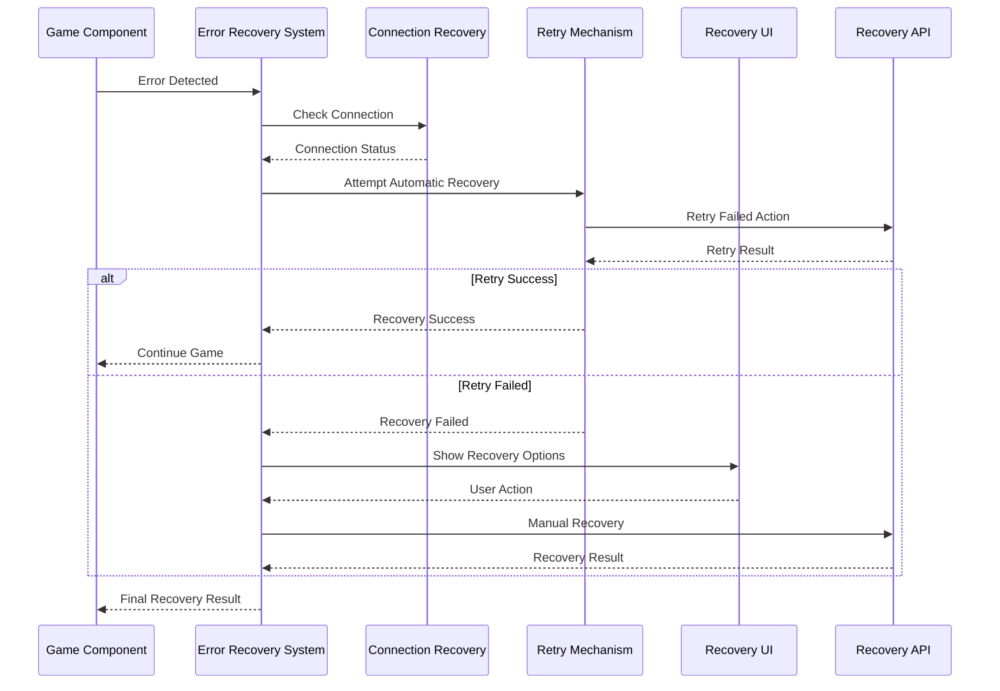

# User Story: 25 - Game Error Recovery System

**As a** player,
**I want** the game to recover gracefully from errors and connection issues,
**so that** I can continue playing without losing progress or having to restart.

## Acceptance Criteria

* Connection issues are handled gracefully with retry mechanisms
* Game state is automatically recovered after disconnections
* User-friendly error messages explain what happened and next steps
* Automatic retry for failed actions with exponential backoff
* Fallback mechanisms when real-time features fail
* Players can rejoin games after connection drops
* Error boundaries prevent crashes from propagating

## Notes

* Integrates with existing Game State Recovery (Feature 16)
* Must handle errors across all 18 game features
* Provides excellent user experience even when things go wrong
* Critical for multiplayer game reliability

## Implementation Plan

### 1. Feature Overview

The Game Error Recovery System provides comprehensive error handling and recovery mechanisms across all game features, ensuring players can continue playing even when technical issues occur, with automatic recovery and user-friendly error communication.

### 2. Component Analysis & Reuse Strategy

**Existing Components to Reuse:**
- `GameStateRecovery` components (`src/components/features/game-state-recovery/`) - State recovery mechanisms
- `ErrorBoundary` from Game Engine (Feature 19) - Error boundary handling
- `useSSERealtimeRoom` hook (`src/hooks/useSSERealtimeRoom.ts`) - Connection management
- All existing error handling patterns across features

**New Components Needed:**
- `GameErrorRecoverySystem` - Main error recovery coordinator
- `ConnectionRecoveryManager` - Connection issue handling
- `ErrorMessageCenter` - User-friendly error communication
- `RetryMechanism` - Automated retry with exponential backoff
- `FallbackHandler` - Fallback mechanisms for failed features
- `RecoveryUI` - User interface for recovery operations

### 3. Affected Files

- `[CREATE] src/components/game-error-recovery/GameErrorRecoverySystem.tsx`
- `[CREATE] src/components/game-error-recovery/ConnectionRecoveryManager.tsx`
- `[CREATE] src/components/game-error-recovery/ErrorMessageCenter.tsx`
- `[CREATE] src/components/game-error-recovery/RetryMechanism.tsx`
- `[CREATE] src/components/game-error-recovery/FallbackHandler.tsx`
- `[CREATE] src/components/game-error-recovery/RecoveryUI.tsx`
- `[CREATE] src/components/game-error-recovery/index.ts`
- `[CREATE] src/types/game-error-recovery.ts`
- `[CREATE] src/lib/error-recovery-utils.ts`
- `[CREATE] src/hooks/useGameErrorRecovery.ts`
- `[CREATE] src/hooks/useConnectionRecovery.ts`
- `[CREATE] src/context/GameErrorRecoveryContext.tsx`
- `[MODIFY] src/hooks/useSSERealtimeRoom.ts`
- `[MODIFY] src/components/game-engine/ErrorBoundary.tsx`
- `[CREATE] src/components/game-error-recovery/GameErrorRecoverySystem.test.tsx`
- `[CREATE] src/components/game-error-recovery/ConnectionRecoveryManager.test.tsx`
- `[CREATE] src/components/game-error-recovery/GameErrorRecoverySystem.visual.spec.ts`

### 4. Component Breakdown

**GameErrorRecoverySystem** (`src/components/game-error-recovery/GameErrorRecoverySystem.tsx`)
- **Type**: Client Component (requires error state management)
- **Responsibility**: Main coordinator for all error recovery operations
- **Key Props**:
  ```typescript
  interface GameErrorRecoverySystemProps {
    children: React.ReactNode;
    roomCode: string;
    playerId: string;
    onRecoveryStart?: (error: GameError) => void;
    onRecoveryComplete?: (result: RecoveryResult) => void;
    onRecoveryFailed?: (error: GameError) => void;
  }
  ```
- **Child Components**: ConnectionRecoveryManager, ErrorMessageCenter, RetryMechanism, FallbackHandler

**ConnectionRecoveryManager** (`src/components/game-error-recovery/ConnectionRecoveryManager.tsx`)
- **Type**: Client Component (connection management)
- **Responsibility**: Handle connection issues and automatic reconnection
- **Key Props**:
  ```typescript
  interface ConnectionRecoveryManagerProps {
    connectionState: ConnectionState;
    onConnectionRecovered?: () => void;
    onConnectionFailed?: (error: ConnectionError) => void;
    retryConfig?: RetryConfig;
  }
  ```
- **Child Components**: None (utility component)

**ErrorMessageCenter** (`src/components/game-error-recovery/ErrorMessageCenter.tsx`)
- **Type**: Client Component (error communication)
- **Responsibility**: Display user-friendly error messages and recovery options
- **Key Props**:
  ```typescript
  interface ErrorMessageCenterProps {
    errors: GameError[];
    onErrorDismiss?: (errorId: string) => void;
    onRetryAction?: (action: RecoveryAction) => void;
    showRecoveryOptions?: boolean;
  }
  ```
- **Child Components**: Error message components, action buttons

**RetryMechanism** (`src/components/game-error-recovery/RetryMechanism.tsx`)
- **Type**: Client Component (retry logic)
- **Responsibility**: Implement automatic retry with exponential backoff
- **Key Props**:
  ```typescript
  interface RetryMechanismProps {
    failedActions: FailedAction[];
    retryConfig: RetryConfig;
    onRetrySuccess?: (action: FailedAction) => void;
    onRetryFailed?: (action: FailedAction) => void;
  }
  ```
- **Child Components**: None (utility component)

**FallbackHandler** (`src/components/game-error-recovery/FallbackHandler.tsx`)
- **Type**: Client Component (fallback mechanisms)
- **Responsibility**: Provide fallback mechanisms when features fail
- **Key Props**:
  ```typescript
  interface FallbackHandlerProps {
    children: React.ReactNode;
    fallbackConfig: FallbackConfig;
    onFallbackActivated?: (feature: string) => void;
  }
  ```
- **Child Components**: Fallback components

**RecoveryUI** (`src/components/game-error-recovery/RecoveryUI.tsx`)
- **Type**: Client Component (recovery interface)
- **Responsibility**: Provide user interface for recovery operations
- **Key Props**:
  ```typescript
  interface RecoveryUIProps {
    recoveryState: RecoveryState;
    onRecoveryAction?: (action: RecoveryAction) => void;
    onManualRecovery?: () => void;
    showProgress?: boolean;
  }
  ```
- **Child Components**: Progress indicators, action buttons

### 5. Design Specifications

**Color System:**
| Design Color | Semantic Purpose | Element | Implementation Method |
|--------------|-----------------|---------|------------------------|
| #0a0a0f | Deep background | Recovery background | Direct hex value (#0a0a0f) |
| #1a1a2e | Primary brand | Recovery panels | Direct hex value (#1a1a2e) |
| #252547 | Elevated surface | Error message containers | Direct hex value (#252547) |
| #3d3d7a | Interactive | Recovery actions | Direct hex value (#3d3d7a) |
| #22c55e | Success | Recovery success | Direct hex value (#22c55e) |
| #ef4444 | Error | Error states | Direct hex value (#ef4444) |
| #f59e0b | Warning | Recovery warnings | Direct hex value (#f59e0b) |
| #3b82f6 | Information | Recovery info | Direct hex value (#3b82f6) |

**Error Message Design:**
- Clear, non-technical language
- Actionable recovery steps
- Progress indicators for recovery operations
- Dismissible notifications for minor issues
- Persistent overlays for critical errors

**Typography:**
- Error headers: 20px, font-bold, line-height: 1.2
- Error messages: 16px, font-medium, line-height: 1.4
- Recovery instructions: 14px, font-normal, line-height: 1.5
- Action buttons: 16px, font-medium, line-height: 1.3

**Spacing:**
- Error panel padding: 24px (p-6)
- Message spacing: 16px (space-y-4)
- Button spacing: 12px (space-x-3)
- Progress indicator height: 4px (h-1)

### 6. Data Flow & State Management

**TypeScript Types:**
```typescript
// src/types/game-error-recovery.ts
export interface GameError {
  id: string;
  type: ErrorType;
  severity: 'low' | 'medium' | 'high' | 'critical';
  message: string;
  technicalDetails?: string;
  recoverable: boolean;
  timestamp: number;
  context: ErrorContext;
}

export interface RecoveryState {
  isRecovering: boolean;
  activeErrors: GameError[];
  recoveryProgress: number;
  lastRecoveryAttempt: number | null;
  recoveryAttempts: number;
  maxRecoveryAttempts: number;
}

export interface RetryConfig {
  maxRetries: number;
  initialDelay: number;
  maxDelay: number;
  backoffMultiplier: number;
  jitter: boolean;
}

export interface FallbackConfig {
  enableOfflineMode: boolean;
  enableReducedFunctionality: boolean;
  fallbackComponents: Record<string, React.ComponentType>;
}

export type ErrorType = 'connection' | 'state' | 'validation' | 'timeout' | 'unknown';
export type RecoveryAction = 'retry' | 'refresh' | 'reconnect' | 'fallback' | 'ignore';
```

**State Management:**
- React Context for global error state
- Custom hooks for error recovery operations
- Local storage for error recovery preferences
- Integration with existing game state recovery

### 7. API Endpoints & Contracts

**New Route Handler:**
```typescript
// src/app/api/error-recovery/report/route.ts
POST /api/error-recovery/report
{
  "roomCode": "string",
  "playerId": "string",
  "error": "GameError",
  "recoveryAttempted": "boolean"
}
Response: { success: boolean, recoveryOptions: RecoveryOption[] }
```

**Core Logic:**
- Log errors for analysis
- Provide recovery recommendations
- Track recovery success rates
- Identify common error patterns

### 8. Integration Diagram



### 9. Styling

**Color Implementation:**
- Recovery backgrounds: #0a0a0f with subtle overlay
- Error panels: #1a1a2e with red accent borders
- Success messages: #22c55e with checkmark icons
- Warning messages: #f59e0b with warning icons
- Action buttons: #3d3d7a with hover effects

**Visual Feedback:**
- Progress bars for recovery operations
- Loading spinners for retry attempts
- Success/failure animations
- Smooth transitions for error state changes

### 10. Testing Strategy

**Unit Tests:**
- `src/components/game-error-recovery/GameErrorRecoverySystem.test.tsx` - Core recovery logic
- `src/components/game-error-recovery/ConnectionRecoveryManager.test.tsx` - Connection recovery
- `src/lib/error-recovery-utils.test.ts` - Recovery utilities
- `src/hooks/useGameErrorRecovery.test.ts` - Recovery hook

**Component Tests:**
- GameErrorRecoverySystem integration tests
- ConnectionRecoveryManager tests
- ErrorMessageCenter tests
- RetryMechanism tests
- FallbackHandler tests

**E2E Tests:**
- End-to-end error recovery scenarios
- Network failure recovery testing
- Connection drop recovery testing
- Multi-player error recovery testing

### 11. Accessibility (A11y) Considerations

- Screen reader announcements for error states
- Keyboard navigation for recovery options
- High contrast mode for error messages
- Clear focus indicators for recovery actions
- ARIA labels for error severity levels

### 12. Security Considerations

- Secure error logging without exposing sensitive data
- Safe error message display
- Validate recovery actions before execution
- Prevent error state manipulation
- Secure error reporting to backend

### 13. Implementation Steps

**Phase 1: UI Implementation with Mock Data**

**1. Setup & Types:**
- [ ] Define `GameError`, `RecoveryState`, `RetryConfig`, `FallbackConfig` in `src/types/game-error-recovery.ts`
- [ ] Create error recovery utility functions in `src/lib/error-recovery-utils.ts`
- [ ] Set up mock error scenarios and recovery test data

**2. Context and Hook:**
- [ ] Create `src/context/GameErrorRecoveryContext.tsx`
- [ ] Implement React Context for error recovery state
- [ ] Create `src/hooks/useGameErrorRecovery.ts`
- [ ] Implement custom hook for error recovery operations
- [ ] Create `src/hooks/useConnectionRecovery.ts`
- [ ] Implement connection recovery hook

**3. Core Recovery Components:**
- [ ] Create `src/components/game-error-recovery/GameErrorRecoverySystem.tsx`
- [ ] Implement main error recovery coordinator with mock errors
- [ ] Create `src/components/game-error-recovery/ConnectionRecoveryManager.tsx`
- [ ] Implement connection recovery with mock connection issues
- [ ] Create `src/components/game-error-recovery/ErrorMessageCenter.tsx`
- [ ] Implement error message display with mock error messages

**4. Recovery Mechanisms:**
- [ ] Create `src/components/game-error-recovery/RetryMechanism.tsx`
- [ ] Implement retry logic with exponential backoff
- [ ] Create `src/components/game-error-recovery/FallbackHandler.tsx`
- [ ] Implement fallback mechanisms with mock fallback scenarios
- [ ] Create `src/components/game-error-recovery/RecoveryUI.tsx`
- [ ] Implement recovery user interface with mock recovery options

**5. Styling:**
- [ ] Verify recovery background colors (#0a0a0f) match design system EXACTLY
- [ ] Verify error panel colors (#1a1a2e) match design system EXACTLY
- [ ] Verify success message colors (#22c55e) match design system EXACTLY
- [ ] Verify error message colors (#ef4444) match design system EXACTLY
- [ ] Verify warning message colors (#f59e0b) match design system EXACTLY
- [ ] Apply direct hex values for all colors in className attributes
- [ ] Implement smooth transitions for error state changes
- [ ] Add progress indicators for recovery operations

**6. UI Testing:**
- [ ] Create Playwright visual test in `src/components/game-error-recovery/GameErrorRecoverySystem.visual.spec.ts`
- [ ] Configure tests for error recovery scenarios
- [ ] Add visual color verification tests for error states
- [ ] Add recovery UI verification tests
- [ ] Add progress indicator verification tests
- [ ] Add comprehensive data-testid attributes to all recovery elements
- [ ] Component tests for GameErrorRecoverySystem with mock data
- [ ] Component tests for ConnectionRecoveryManager with mock connection issues
- [ ] Component tests for ErrorMessageCenter with mock error messages

**Phase 2: API Integration with Real Data**

**7. Backend Integration:**
- [ ] Create `src/app/api/error-recovery/report/route.ts`
- [ ] Implement error reporting endpoint
- [ ] Add recovery recommendations logic
- [ ] Create error analytics and tracking

**8. Real Error Integration:**
- [ ] Replace mock error data with real error detection
- [ ] Integrate with existing error boundary systems
- [ ] Connect with real connection monitoring
- [ ] Implement real retry mechanisms for failed API calls

**9. Game Integration:**
- [ ] Update `src/hooks/useSSERealtimeRoom.ts` with error recovery integration
- [ ] Modify `src/components/game-engine/ErrorBoundary.tsx` to use recovery system
- [ ] Integrate with existing game state recovery system
- [ ] Add error recovery to all game components

**10. Integration Testing:**
- [ ] Write unit tests for error recovery integration logic
- [ ] Update component tests to test with real error scenarios
- [ ] End-to-end testing of error recovery across all game features
- [ ] Network failure simulation and recovery testing

**11. Final Documentation & Polishing:**
- [ ] Add JSDoc documentation for all error recovery components
- [ ] Create error recovery system documentation
- [ ] Final review of error recovery strategies
- [ ] Error recovery monitoring and analytics setup
