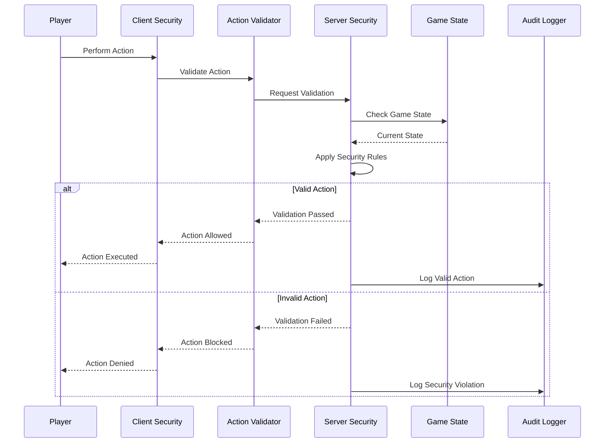

# User Story: 26 - Integrated Security Validation

**As a** player,
**I want** the game to be secure and prevent cheating,
**so that** I can trust that the game is fair and my data is protected.

## Acceptance Criteria

* Game state validation prevents invalid actions
* Player actions are monitored for suspicious behavior
* Role information is encrypted during transmission
* Session validation ensures only authorized players can act
* Phase-specific action permissions are enforced
* Anti-cheat system (Feature 17) is integrated throughout gameplay
* Secure state synchronization across all players

## Notes

* Integrates existing Anti-cheat Security Measures (Feature 17)
* Must validate actions across all 18 game features
* Balances security with user experience
* Critical for maintaining game integrity in multiplayer environment

## Implementation Plan

### 1. Feature Overview

The Integrated Security Validation system provides comprehensive security measures across all game features, ensuring game integrity through server-side validation, cheat detection, input sanitization, and secure communication channels.

### 2. Component Analysis & Reuse Strategy

**Existing Components to Reuse:**
- Security validation components (`src/components/features/security/`) - Basic security measures
- Game state validation (`src/types/game-state.ts`) - State validation schemas
- Player authentication from Game Engine (Feature 19) - Identity verification
- All existing validation patterns across features

**New Components Needed:**
- `SecurityValidationSystem` - Main security coordinator
- `ActionValidator` - Server-side action validation
- `CheatDetector` - Cheat detection and prevention
- `InputSanitizer` - Input validation and sanitization
- `SecureChannel` - Secure communication wrapper
- `AuditLogger` - Security event logging

### 3. Affected Files

- `[CREATE] src/components/security-validation/SecurityValidationSystem.tsx`
- `[CREATE] src/components/security-validation/ActionValidator.tsx`
- `[CREATE] src/components/security-validation/CheatDetector.tsx`
- `[CREATE] src/components/security-validation/InputSanitizer.tsx`
- `[CREATE] src/components/security-validation/SecureChannel.tsx`
- `[CREATE] src/components/security-validation/AuditLogger.tsx`
- `[CREATE] src/components/security-validation/index.ts`
- `[CREATE] src/types/security-validation.ts`
- `[CREATE] src/lib/security-validation-utils.ts`
- `[CREATE] src/hooks/useSecurityValidation.ts`
- `[CREATE] src/context/SecurityValidationContext.tsx`
- `[CREATE] src/server/security-validation/validation-rules.ts`
- `[CREATE] src/server/security-validation/cheat-detection.ts`
- `[MODIFY] src/server/api/routers/game.ts`
- `[MODIFY] src/server/api/routers/room.ts`
- `[CREATE] src/components/security-validation/SecurityValidationSystem.test.tsx`
- `[CREATE] src/components/security-validation/ActionValidator.test.tsx`
- `[CREATE] src/components/security-validation/SecurityValidationSystem.visual.spec.ts`

### 4. Component Breakdown

**SecurityValidationSystem** (`src/components/security-validation/SecurityValidationSystem.tsx`)
- **Type**: Client Component (security monitoring)
- **Responsibility**: Main coordinator for all security validation operations
- **Key Props**:
  ```typescript
  interface SecurityValidationSystemProps {
    children: React.ReactNode;
    roomCode: string;
    playerId: string;
    onSecurityViolation?: (violation: SecurityViolation) => void;
    onValidationPassed?: (action: ValidatedAction) => void;
  }
  ```
- **Child Components**: ActionValidator, CheatDetector, InputSanitizer, SecureChannel

**ActionValidator** (`src/components/security-validation/ActionValidator.tsx`)
- **Type**: Client Component (action validation)
- **Responsibility**: Validate all player actions before processing
- **Key Props**:
  ```typescript
  interface ActionValidatorProps {
    action: GameAction;
    gameState: GameState;
    playerId: string;
    onValidationResult?: (result: ValidationResult) => void;
  }
  ```
- **Child Components**: None (validation component)

**CheatDetector** (`src/components/security-validation/CheatDetector.tsx`)
- **Type**: Client Component (cheat detection)
- **Responsibility**: Detect and prevent cheating attempts
- **Key Props**:
  ```typescript
  interface CheatDetectorProps {
    playerActions: PlayerAction[];
    gameState: GameState;
    onCheatDetected?: (cheat: CheatAttempt) => void;
    detectionRules?: CheatDetectionRule[];
  }
  ```
- **Child Components**: None (detection component)

**InputSanitizer** (`src/components/security-validation/InputSanitizer.tsx`)
- **Type**: Client Component (input sanitization)
- **Responsibility**: Sanitize and validate all user inputs
- **Key Props**:
  ```typescript
  interface InputSanitizerProps {
    children: React.ReactNode;
    onSanitizationComplete?: (sanitized: SanitizedData) => void;
    sanitizationRules?: SanitizationRule[];
  }
  ```
- **Child Components**: Child components with sanitized inputs

**SecureChannel** (`src/components/security-validation/SecureChannel.tsx`)
- **Type**: Client Component (secure communication)
- **Responsibility**: Provide secure communication channels
- **Key Props**:
  ```typescript
  interface SecureChannelProps {
    children: React.ReactNode;
    encryptionLevel: 'basic' | 'standard' | 'high';
    onSecurityBreach?: (breach: SecurityBreach) => void;
  }
  ```
- **Child Components**: Wrapped components with secure communication

**AuditLogger** (`src/components/security-validation/AuditLogger.tsx`)
- **Type**: Client Component (audit logging)
- **Responsibility**: Log security events and violations
- **Key Props**:
  ```typescript
  interface AuditLoggerProps {
    events: SecurityEvent[];
    logLevel: 'info' | 'warning' | 'error';
    onLogComplete?: (log: AuditLog) => void;
  }
  ```
- **Child Components**: None (logging component)

### 5. Design Specifications

**Color System:**
| Design Color | Semantic Purpose | Element | Implementation Method |
|--------------|-----------------|---------|------------------------|
| #0a0a0f | Deep background | Security dashboard | Direct hex value (#0a0a0f) |
| #1a1a2e | Primary brand | Security panels | Direct hex value (#1a1a2e) |
| #252547 | Elevated surface | Validation containers | Direct hex value (#252547) |
| #3d3d7a | Interactive | Security actions | Direct hex value (#3d3d7a) |
| #22c55e | Success | Valid actions | Direct hex value (#22c55e) |
| #ef4444 | Error | Security violations | Direct hex value (#ef4444) |
| #f59e0b | Warning | Security warnings | Direct hex value (#f59e0b) |
| #8b5cf6 | Special | Security features | Direct hex value (#8b5cf6) |

**Security Indicator Design:**
- Subtle security status indicators
- Non-intrusive validation feedback
- Clear violation notifications
- Secure action confirmations

**Typography:**
- Security headers: 18px, font-bold, line-height: 1.2
- Validation messages: 14px, font-medium, line-height: 1.4
- Security notices: 12px, font-normal, line-height: 1.5
- Action confirmations: 16px, font-medium, line-height: 1.3

**Spacing:**
- Security panel padding: 20px (p-5)
- Message spacing: 12px (space-y-3)
- Button spacing: 8px (space-x-2)
- Indicator spacing: 8px (space-x-2)

### 6. Data Flow & State Management

**TypeScript Types:**
```typescript
// src/types/security-validation.ts
export interface SecurityViolation {
  id: string;
  type: ViolationType;
  severity: 'low' | 'medium' | 'high' | 'critical';
  playerId: string;
  action: GameAction;
  timestamp: number;
  details: string;
  prevented: boolean;
}

export interface ValidationResult {
  isValid: boolean;
  violations: SecurityViolation[];
  sanitizedData?: any;
  actionAllowed: boolean;
}

export interface CheatAttempt {
  id: string;
  playerId: string;
  type: CheatType;
  evidence: CheatEvidence;
  timestamp: number;
  prevented: boolean;
}

export interface SecurityEvent {
  id: string;
  type: SecurityEventType;
  playerId: string;
  timestamp: number;
  details: Record<string, any>;
}

export type ViolationType = 'invalid_action' | 'state_manipulation' | 'timing_violation' | 'input_injection';
export type CheatType = 'state_hack' | 'action_replay' | 'timing_abuse' | 'information_leak';
export type SecurityEventType = 'login' | 'action' | 'violation' | 'breach' | 'recovery';
```

**State Management:**
- React Context for security state
- Server-side validation state
- Client-side security monitoring
- Audit trail persistence

### 7. API Endpoints & Contracts

**New Route Handlers:**
```typescript
// src/app/api/security/validate-action/route.ts
POST /api/security/validate-action
{
  "roomCode": "string",
  "playerId": "string",
  "action": "GameAction",
  "timestamp": "number"
}
Response: { valid: boolean, violations: SecurityViolation[] }

// src/app/api/security/report-violation/route.ts
POST /api/security/report-violation
{
  "roomCode": "string",
  "playerId": "string",
  "violation": "SecurityViolation"
}
Response: { success: boolean, action: SecurityAction }
```

**Core Logic:**
- Server-side action validation
- Cheat detection algorithms
- Security event logging
- Violation response handling

### 8. Integration Diagram



### 9. Styling

**Color Implementation:**
- Security backgrounds: #0a0a0f with subtle security overlay
- Validation panels: #1a1a2e with security accent borders
- Success validation: #22c55e with checkmark icons
- Security violations: #ef4444 with warning icons
- Security warnings: #f59e0b with caution icons
- Interactive elements: #3d3d7a with secure styling

**Visual Feedback:**
- Subtle security status indicators
- Non-intrusive validation feedback
- Clear violation notifications
- Secure action confirmations

### 10. Testing Strategy

**Unit Tests:**
- `src/components/security-validation/SecurityValidationSystem.test.tsx` - Core security logic
- `src/components/security-validation/ActionValidator.test.tsx` - Action validation
- `src/lib/security-validation-utils.test.ts` - Security utilities
- `src/hooks/useSecurityValidation.test.ts` - Security hook
- `src/server/security-validation/validation-rules.test.ts` - Server validation rules

**Component Tests:**
- SecurityValidationSystem integration tests
- ActionValidator component tests
- CheatDetector component tests
- InputSanitizer component tests
- SecureChannel component tests

**E2E Tests:**
- End-to-end security validation scenarios
- Cheat detection and prevention testing
- Action validation across all game features
- Security violation response testing

### 11. Accessibility (A11y) Considerations

- Screen reader announcements for security events
- Keyboard navigation for security actions
- Clear focus indicators for security elements
- ARIA labels for security status indicators
- High contrast mode for security notifications

### 12. Security Considerations

- Server-side validation for all actions
- Input sanitization and validation
- Secure communication channels
- Audit trail for security events
- Cheat detection and prevention
- Rate limiting for security actions

### 13. Implementation Steps

**Phase 1: UI Implementation with Mock Data**

**1. Setup & Types:**
- [ ] Define `SecurityViolation`, `ValidationResult`, `CheatAttempt`, `SecurityEvent` in `src/types/security-validation.ts`
- [ ] Create security validation utility functions in `src/lib/security-validation-utils.ts`
- [ ] Set up mock security scenarios and validation test data

**2. Context and Hook:**
- [ ] Create `src/context/SecurityValidationContext.tsx`
- [ ] Implement React Context for security validation state
- [ ] Create `src/hooks/useSecurityValidation.ts`
- [ ] Implement custom hook for security validation operations

**3. Core Security Components:**
- [ ] Create `src/components/security-validation/SecurityValidationSystem.tsx`
- [ ] Implement main security coordinator with mock violations
- [ ] Create `src/components/security-validation/ActionValidator.tsx`
- [ ] Implement action validation with mock validation results
- [ ] Create `src/components/security-validation/CheatDetector.tsx`
- [ ] Implement cheat detection with mock cheat attempts

**4. Security Mechanisms:**
- [ ] Create `src/components/security-validation/InputSanitizer.tsx`
- [ ] Implement input sanitization with mock sanitization rules
- [ ] Create `src/components/security-validation/SecureChannel.tsx`
- [ ] Implement secure communication with mock security levels
- [ ] Create `src/components/security-validation/AuditLogger.tsx`
- [ ] Implement audit logging with mock security events

**5. Styling:**
- [ ] Verify security background colors (#0a0a0f) match design system EXACTLY
- [ ] Verify validation panel colors (#1a1a2e) match design system EXACTLY
- [ ] Verify success validation colors (#22c55e) match design system EXACTLY
- [ ] Verify security violation colors (#ef4444) match design system EXACTLY
- [ ] Verify security warning colors (#f59e0b) match design system EXACTLY
- [ ] Apply direct hex values for all colors in className attributes
- [ ] Implement subtle security status indicators
- [ ] Add non-intrusive validation feedback

**6. UI Testing:**
- [ ] Create Playwright visual test in `src/components/security-validation/SecurityValidationSystem.visual.spec.ts`
- [ ] Configure tests for security validation scenarios
- [ ] Add visual color verification tests for security states
- [ ] Add validation UI verification tests
- [ ] Add security indicator verification tests
- [ ] Add comprehensive data-testid attributes to all security elements
- [ ] Component tests for SecurityValidationSystem with mock data
- [ ] Component tests for ActionValidator with mock validation results
- [ ] Component tests for CheatDetector with mock cheat attempts

**Phase 2: API Integration with Real Data**

**7. Backend Integration:**
- [ ] Create `src/app/api/security/validate-action/route.ts`
- [ ] Implement action validation endpoint
- [ ] Create `src/app/api/security/report-violation/route.ts`
- [ ] Implement violation reporting endpoint
- [ ] Create `src/server/security-validation/validation-rules.ts`
- [ ] Implement server-side validation rules
- [ ] Create `src/server/security-validation/cheat-detection.ts`
- [ ] Implement cheat detection algorithms

**8. Real Security Integration:**
- [ ] Replace mock security data with real security validation
- [ ] Integrate with existing authentication systems
- [ ] Connect with real action validation
- [ ] Implement real cheat detection mechanisms

**9. Game Integration:**
- [ ] Modify `src/server/api/routers/game.ts` with security validation
- [ ] Modify `src/server/api/routers/room.ts` with security validation
- [ ] Integrate security validation with all game actions
- [ ] Add security monitoring to all game components

**10. Integration Testing:**
- [ ] Write unit tests for security validation integration logic
- [ ] Update component tests to test with real security scenarios
- [ ] End-to-end testing of security validation across all game features
- [ ] Security penetration testing and vulnerability assessment

**11. Final Documentation & Polishing:**
- [ ] Add JSDoc documentation for all security validation components
- [ ] Create security validation system documentation
- [ ] Final review of security validation strategies
- [ ] Security validation monitoring and analytics setup
