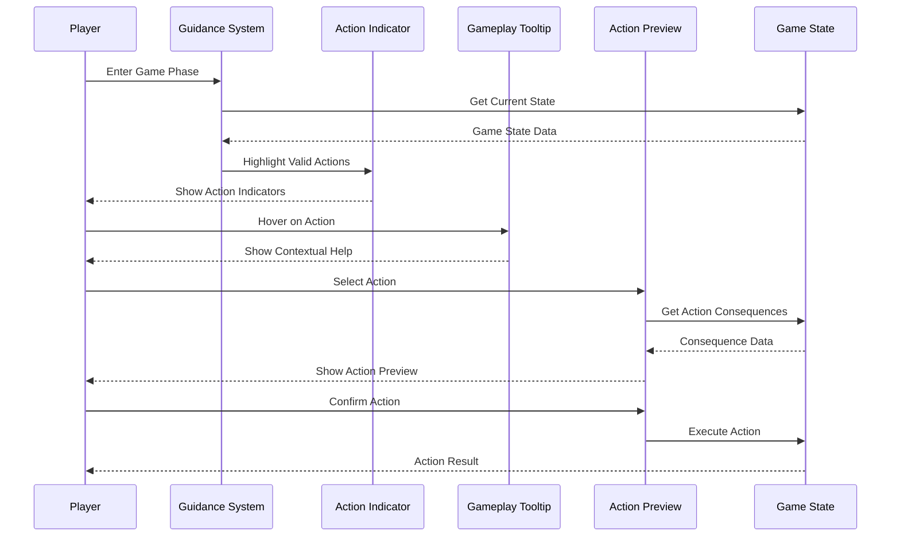

# User Story: 27 - Player Guidance System

**As a** player,
**I want** clear guidance on what actions I can take during each game phase,
**so that** I can play effectively without confusion or mistakes.

## Acceptance Criteria

* Visual indicators highlight valid actions for current phase
* Tooltips explain game mechanics and available actions
* In-game hints provide strategic guidance without giving away secrets
* Action preview shows potential consequences before committing
* Step-by-step guidance for complex actions
* Context-sensitive help adapts to current game state
* Beginner-friendly mode with additional explanations

## Notes

* Enhances existing Interactive Tutorial System (Feature 18)
* Provides ongoing guidance throughout gameplay
* Balances helpful guidance with strategic depth
* Critical for new player onboarding and retention

## Implementation Plan

### 1. Feature Overview

The Player Guidance System provides contextual, real-time guidance to players during gameplay, helping them understand available actions, game mechanics, and strategic options through visual indicators, tooltips, and interactive hints.

### 2. Component Analysis & Reuse Strategy

**Existing Components to Reuse:**
- Tutorial system components (`src/components/features/tutorial/`) - Tutorial framework
- Game state components (`src/components/features/game-state/`) - Current game state
- UI components from existing features - Button, modal, and notification components
- Player interface components - Action buttons and status displays

**New Components Needed:**
- `PlayerGuidanceSystem` - Main guidance coordinator
- `ActionIndicator` - Visual indicators for valid actions
- `GameplayTooltip` - Contextual tooltip system
- `StrategyHint` - Strategic guidance without spoilers
- `ActionPreview` - Preview action consequences
- `GuidanceOverlay` - Overlay guidance system

### 3. Affected Files

- `[CREATE] src/components/player-guidance/PlayerGuidanceSystem.tsx`
- `[CREATE] src/components/player-guidance/ActionIndicator.tsx`
- `[CREATE] src/components/player-guidance/GameplayTooltip.tsx`
- `[CREATE] src/components/player-guidance/StrategyHint.tsx`
- `[CREATE] src/components/player-guidance/ActionPreview.tsx`
- `[CREATE] src/components/player-guidance/GuidanceOverlay.tsx`
- `[CREATE] src/components/player-guidance/index.ts`
- `[CREATE] src/types/player-guidance.ts`
- `[CREATE] src/lib/player-guidance-utils.ts`
- `[CREATE] src/hooks/usePlayerGuidance.ts`
- `[CREATE] src/context/PlayerGuidanceContext.tsx`
- `[CREATE] src/data/guidance-content.ts`
- `[MODIFY] src/components/game-layout/GameLayout.tsx`
- `[CREATE] src/components/player-guidance/PlayerGuidanceSystem.test.tsx`
- `[CREATE] src/components/player-guidance/ActionIndicator.test.tsx`
- `[CREATE] src/components/player-guidance/PlayerGuidanceSystem.visual.spec.ts`

### 4. Component Breakdown

**PlayerGuidanceSystem** (`src/components/player-guidance/PlayerGuidanceSystem.tsx`)
- **Type**: Client Component (guidance coordination)
- **Responsibility**: Main coordinator for all player guidance features
- **Key Props**:
  ```typescript
  interface PlayerGuidanceSystemProps {
    children: React.ReactNode;
    gameState: GameState;
    playerId: string;
    guidanceLevel: 'beginner' | 'intermediate' | 'advanced';
    onGuidanceInteraction?: (interaction: GuidanceInteraction) => void;
  }
  ```
- **Child Components**: ActionIndicator, GameplayTooltip, StrategyHint, ActionPreview, GuidanceOverlay

**ActionIndicator** (`src/components/player-guidance/ActionIndicator.tsx`)
- **Type**: Client Component (visual indicators)
- **Responsibility**: Highlight valid actions for current phase
- **Key Props**:
  ```typescript
  interface ActionIndicatorProps {
    availableActions: GameAction[];
    currentPhase: GamePhase;
    playerRole: PlayerRole;
    onActionHighlight?: (action: GameAction) => void;
  }
  ```
- **Child Components**: Indicator overlays, action highlights

**GameplayTooltip** (`src/components/player-guidance/GameplayTooltip.tsx`)
- **Type**: Client Component (contextual tooltips)
- **Responsibility**: Provide contextual explanations and help
- **Key Props**:
  ```typescript
  interface GameplayTooltipProps {
    trigger: React.ReactNode;
    content: TooltipContent;
    placement?: 'top' | 'bottom' | 'left' | 'right';
    delay?: number;
  }
  ```
- **Child Components**: Tooltip content, positioning wrapper

**StrategyHint** (`src/components/player-guidance/StrategyHint.tsx`)
- **Type**: Client Component (strategic guidance)
- **Responsibility**: Provide strategic guidance without spoilers
- **Key Props**:
  ```typescript
  interface StrategyHintProps {
    gameState: GameState;
    playerRole: PlayerRole;
    hintType: 'action' | 'strategy' | 'reminder';
    onHintDismiss?: () => void;
  }
  ```
- **Child Components**: Hint content, dismiss controls

**ActionPreview** (`src/components/player-guidance/ActionPreview.tsx`)
- **Type**: Client Component (action preview)
- **Responsibility**: Show potential consequences before committing
- **Key Props**:
  ```typescript
  interface ActionPreviewProps {
    action: GameAction;
    gameState: GameState;
    onPreviewConfirm?: (action: GameAction) => void;
    onPreviewCancel?: () => void;
  }
  ```
- **Child Components**: Preview content, confirmation controls

**GuidanceOverlay** (`src/components/player-guidance/GuidanceOverlay.tsx`)
- **Type**: Client Component (overlay guidance)
- **Responsibility**: Provide step-by-step guidance overlay
- **Key Props**:
  ```typescript
  interface GuidanceOverlayProps {
    steps: GuidanceStep[];
    currentStep: number;
    onStepComplete?: (step: number) => void;
    onGuidanceComplete?: () => void;
  }
  ```
- **Child Components**: Step indicators, navigation controls

### 5. Design Specifications

**Color System:**
| Design Color | Semantic Purpose | Element | Implementation Method |
|--------------|-----------------|---------|------------------------|
| #0a0a0f | Deep background | Guidance backgrounds | Direct hex value (#0a0a0f) |
| #1a1a2e | Primary brand | Guidance panels | Direct hex value (#1a1a2e) |
| #252547 | Elevated surface | Tooltip containers | Direct hex value (#252547) |
| #3d3d7a | Interactive | Action indicators | Direct hex value (#3d3d7a) |
| #22c55e | Success | Valid actions | Direct hex value (#22c55e) |
| #3b82f6 | Information | Guidance hints | Direct hex value (#3b82f6) |
| #f59e0b | Warning | Important reminders | Direct hex value (#f59e0b) |
| #8b5cf6 | Special | Strategic hints | Direct hex value (#8b5cf6) |

**Guidance Visual Design:**
- Subtle highlight overlays for valid actions
- Contextual tooltips with arrow indicators
- Non-intrusive hint notifications
- Clear action preview modals

**Typography:**
- Guidance headers: 18px, font-bold, line-height: 1.2
- Tooltip content: 14px, font-medium, line-height: 1.4
- Hint text: 12px, font-normal, line-height: 1.5
- Action descriptions: 16px, font-medium, line-height: 1.3

**Spacing:**
- Guidance panel padding: 20px (p-5)
- Tooltip padding: 12px (p-3)
- Hint spacing: 8px (space-y-2)
- Action preview spacing: 16px (space-y-4)

### 6. Data Flow & State Management

**TypeScript Types:**
```typescript
// src/types/player-guidance.ts
export interface GuidanceInteraction {
  type: 'tooltip_viewed' | 'hint_dismissed' | 'action_previewed' | 'guidance_completed';
  playerId: string;
  content: string;
  timestamp: number;
}

export interface TooltipContent {
  title: string;
  description: string;
  actionRequired?: string;
  relatedActions?: GameAction[];
}

export interface StrategyHint {
  id: string;
  type: 'action' | 'strategy' | 'reminder';
  title: string;
  content: string;
  priority: 'low' | 'medium' | 'high';
  conditions: HintCondition[];
}

export interface GuidanceStep {
  id: string;
  title: string;
  description: string;
  target: string;
  action: 'highlight' | 'click' | 'wait';
  optional: boolean;
}

export interface ActionPreview {
  action: GameAction;
  description: string;
  consequences: string[];
  risks: string[];
  requirements: string[];
}
```

**State Management:**
- React Context for guidance state
- Local storage for guidance preferences
- Session storage for current guidance progress
- Integration with game state

### 7. API Endpoints & Contracts

**New Route Handler:**
```typescript
// src/app/api/guidance/track-interaction/route.ts
POST /api/guidance/track-interaction
{
  "roomCode": "string",
  "playerId": "string",
  "interaction": "GuidanceInteraction"
}
Response: { success: boolean, recommendations: GuidanceRecommendation[] }
```

**Core Logic:**
- Track guidance interactions
- Provide personalized recommendations
- Adapt guidance based on player behavior
- Analytics for guidance effectiveness

### 8. Integration Diagram



### 9. Styling

**Color Implementation:**
- Guidance backgrounds: #0a0a0f with subtle overlay
- Action indicators: #22c55e with pulsing animation
- Tooltips: #252547 with arrow indicators
- Strategic hints: #8b5cf6 with special styling
- Information hints: #3b82f6 with info icons
- Warning reminders: #f59e0b with caution styling

**Visual Feedback:**
- Subtle highlight overlays for valid actions
- Smooth tooltip animations
- Non-intrusive hint notifications
- Clear action preview modals

### 10. Testing Strategy

**Unit Tests:**
- `src/components/player-guidance/PlayerGuidanceSystem.test.tsx` - Core guidance logic
- `src/components/player-guidance/ActionIndicator.test.tsx` - Action indicators
- `src/lib/player-guidance-utils.test.ts` - Guidance utilities
- `src/hooks/usePlayerGuidance.test.ts` - Guidance hook

**Component Tests:**
- PlayerGuidanceSystem integration tests
- ActionIndicator component tests
- GameplayTooltip component tests
- StrategyHint component tests
- ActionPreview component tests

**E2E Tests:**
- End-to-end guidance flow testing
- Multi-phase guidance scenarios
- Player interaction tracking
- Guidance effectiveness metrics

### 11. Accessibility (A11y) Considerations

- Screen reader announcements for guidance updates
- Keyboard navigation for guidance elements
- High contrast mode for guidance indicators
- ARIA labels for guidance components
- Focus management for guidance overlays

### 12. Security Considerations

- Safe guidance content rendering
- Validate guidance interactions
- Prevent guidance state manipulation
- Secure tracking of player interactions
- Privacy-conscious guidance analytics

### 13. Implementation Steps

**Phase 1: UI Implementation with Mock Data**

**1. Setup & Types:**
- [ ] Define `GuidanceInteraction`, `TooltipContent`, `StrategyHint`, `GuidanceStep` in `src/types/player-guidance.ts`
- [ ] Create player guidance utility functions in `src/lib/player-guidance-utils.ts`
- [ ] Set up mock guidance content in `src/data/guidance-content.ts`

**2. Context and Hook:**
- [ ] Create `src/context/PlayerGuidanceContext.tsx`
- [ ] Implement React Context for guidance state
- [ ] Create `src/hooks/usePlayerGuidance.ts`
- [ ] Implement custom hook for guidance operations

**3. Core Guidance Components:**
- [ ] Create `src/components/player-guidance/PlayerGuidanceSystem.tsx`
- [ ] Implement main guidance coordinator with mock data
- [ ] Create `src/components/player-guidance/ActionIndicator.tsx`
- [ ] Implement action indicators with mock valid actions
- [ ] Create `src/components/player-guidance/GameplayTooltip.tsx`
- [ ] Implement contextual tooltips with mock content

**4. Advanced Guidance Features:**
- [ ] Create `src/components/player-guidance/StrategyHint.tsx`
- [ ] Implement strategic hints with mock scenarios
- [ ] Create `src/components/player-guidance/ActionPreview.tsx`
- [ ] Implement action preview with mock consequences
- [ ] Create `src/components/player-guidance/GuidanceOverlay.tsx`
- [ ] Implement step-by-step guidance with mock steps

**5. Styling:**
- [ ] Verify guidance background colors (#0a0a0f) match design system EXACTLY
- [ ] Verify action indicator colors (#22c55e) match design system EXACTLY
- [ ] Verify tooltip colors (#252547) match design system EXACTLY
- [ ] Verify strategic hint colors (#8b5cf6) match design system EXACTLY
- [ ] Verify information hint colors (#3b82f6) match design system EXACTLY
- [ ] Apply direct hex values for all colors in className attributes
- [ ] Implement subtle highlight overlays for valid actions
- [ ] Add smooth tooltip animations

**6. UI Testing:**
- [ ] Create Playwright visual test in `src/components/player-guidance/PlayerGuidanceSystem.visual.spec.ts`
- [ ] Configure tests for guidance scenarios
- [ ] Add visual color verification tests for guidance states
- [ ] Add action indicator verification tests
- [ ] Add tooltip verification tests
- [ ] Add comprehensive data-testid attributes to all guidance elements
- [ ] Component tests for PlayerGuidanceSystem with mock data
- [ ] Component tests for ActionIndicator with mock actions
- [ ] Component tests for GameplayTooltip with mock content

**Phase 2: API Integration with Real Data**

**7. Backend Integration:**
- [ ] Create `src/app/api/guidance/track-interaction/route.ts`
- [ ] Implement guidance interaction tracking endpoint
- [ ] Add guidance analytics and metrics collection

**8. Real Data Integration:**
- [ ] Replace mock guidance data with real game state integration
- [ ] Connect action indicators with real available actions
- [ ] Integrate tooltips with real game mechanics
- [ ] Implement real action preview with consequence calculation

**9. Game Integration:**
- [ ] Modify `src/components/game-layout/GameLayout.tsx` to include guidance system
- [ ] Integrate guidance with all game phases
- [ ] Add guidance to all interactive game elements
- [ ] Connect guidance with player progression

**10. Integration Testing:**
- [ ] Write unit tests for guidance integration logic
- [ ] Update component tests to test with real game scenarios
- [ ] End-to-end testing of guidance across all game features
- [ ] Player behavior tracking and guidance effectiveness testing

**11. Final Documentation & Polishing:**
- [ ] Add JSDoc documentation for all guidance components
- [ ] Create player guidance system documentation
- [ ] Final review of guidance content and effectiveness
- [ ] Guidance analytics and improvement recommendations
