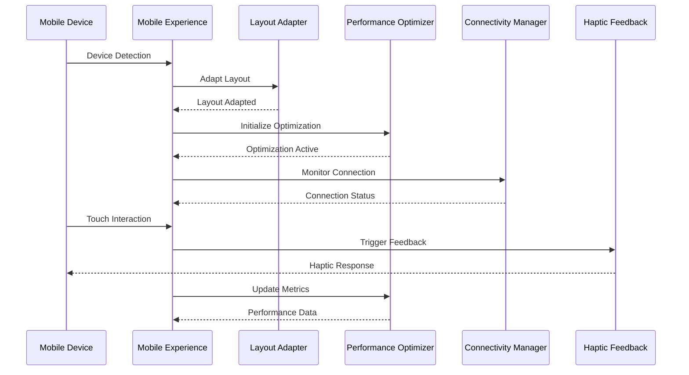

# User Story: 28 - Mobile Game Experience

**As a** mobile player,
**I want** a touch-optimized game interface that works perfectly on my phone,
**so that** I can play Avalon comfortably on any device.

## Acceptance Criteria

* Touch-optimized interface with proper touch targets (44px minimum)
* Responsive design adapts to screen sizes from 320px to 1440px+
* Touch gestures are supported for game interactions
* Mobile-specific components (Feature 13) are integrated
* Safe area handling for devices with notches
* Haptic feedback for touch interactions where appropriate
* Performance optimized for mobile devices (60fps)

## Notes

* Integrates Mobile Responsive Gameplay (Feature 13)
* Must work across all 18 game features on mobile
* Touch-first design with desktop enhancements
* Critical for accessibility and user adoption

## Implementation Plan

### 1. Feature Overview

The Mobile Game Experience provides comprehensive mobile optimization, ensuring excellent gameplay on mobile devices through touch-friendly interfaces, optimized layouts, efficient rendering, and native-like interactions.

### 2. Component Analysis & Reuse Strategy

**Existing Components to Reuse:**
- Mobile responsive components (`src/components/features/mobile/`) - Basic mobile adaptations
- Layout system (Feature 22) - Responsive layout foundation
- All existing responsive design patterns across features
- Touch interaction components from existing features

**New Components Needed:**
- `MobileGameExperience` - Mobile experience coordinator
- `TouchOptimizedInterface` - Touch-friendly UI components
- `MobileLayoutAdapter` - Mobile-specific layout adaptations
- `MobilePerformanceOptimizer` - Performance optimization for mobile
- `MobileConnectivityManager` - Mobile connection handling
- `HapticFeedbackSystem` - Native-like haptic feedback

### 3. Affected Files

- `[CREATE] src/components/mobile-experience/MobileGameExperience.tsx`
- `[CREATE] src/components/mobile-experience/TouchOptimizedInterface.tsx`
- `[CREATE] src/components/mobile-experience/MobileLayoutAdapter.tsx`
- `[CREATE] src/components/mobile-experience/MobilePerformanceOptimizer.tsx`
- `[CREATE] src/components/mobile-experience/MobileConnectivityManager.tsx`
- `[CREATE] src/components/mobile-experience/HapticFeedbackSystem.tsx`
- `[CREATE] src/components/mobile-experience/index.ts`
- `[CREATE] src/types/mobile-experience.ts`
- `[CREATE] src/lib/mobile-experience-utils.ts`
- `[CREATE] src/hooks/useMobileExperience.ts`
- `[CREATE] src/hooks/useTouchOptimization.ts`
- `[CREATE] src/context/MobileExperienceContext.tsx`
- `[MODIFY] src/components/game-layout/GameLayout.tsx`
- `[MODIFY] src/styles/globals.css`
- `[CREATE] src/components/mobile-experience/MobileGameExperience.test.tsx`
- `[CREATE] src/components/mobile-experience/TouchOptimizedInterface.test.tsx`
- `[CREATE] src/components/mobile-experience/MobileGameExperience.visual.spec.ts`

### 4. Component Breakdown

**MobileGameExperience** (`src/components/mobile-experience/MobileGameExperience.tsx`)
- **Type**: Client Component (mobile coordination)
- **Responsibility**: Main coordinator for mobile experience optimizations
- **Key Props**:
  ```typescript
  interface MobileGameExperienceProps {
    children: React.ReactNode;
    deviceType: 'mobile' | 'tablet' | 'desktop';
    orientation: 'portrait' | 'landscape';
    onDeviceChange?: (device: DeviceInfo) => void;
  }
  ```
- **Child Components**: TouchOptimizedInterface, MobileLayoutAdapter, MobilePerformanceOptimizer

**TouchOptimizedInterface** (`src/components/mobile-experience/TouchOptimizedInterface.tsx`)
- **Type**: Client Component (touch optimization)
- **Responsibility**: Provide touch-friendly UI components
- **Key Props**:
  ```typescript
  interface TouchOptimizedInterfaceProps {
    children: React.ReactNode;
    touchTargetSize: 'small' | 'medium' | 'large';
    enableHapticFeedback: boolean;
    onTouchInteraction?: (interaction: TouchInteraction) => void;
  }
  ```
- **Child Components**: Touch-optimized buttons, gestures, interactions

**MobileLayoutAdapter** (`src/components/mobile-experience/MobileLayoutAdapter.tsx`)
- **Type**: Client Component (layout adaptation)
- **Responsibility**: Adapt layouts for mobile devices
- **Key Props**:
  ```typescript
  interface MobileLayoutAdapterProps {
    children: React.ReactNode;
    viewport: ViewportInfo;
    adaptationLevel: 'basic' | 'enhanced' | 'native';
    onLayoutChange?: (layout: LayoutInfo) => void;
  }
  ```
- **Child Components**: Adaptive layout containers

**MobilePerformanceOptimizer** (`src/components/mobile-experience/MobilePerformanceOptimizer.tsx`)
- **Type**: Client Component (performance optimization)
- **Responsibility**: Optimize performance for mobile devices
- **Key Props**:
  ```typescript
  interface MobilePerformanceOptimizerProps {
    children: React.ReactNode;
    optimizationLevel: 'low' | 'medium' | 'high';
    batteryOptimization: boolean;
    onPerformanceUpdate?: (metrics: PerformanceMetrics) => void;
  }
  ```
- **Child Components**: Performance monitoring components

**MobileConnectivityManager** (`src/components/mobile-experience/MobileConnectivityManager.tsx`)
- **Type**: Client Component (connectivity management)
- **Responsibility**: Handle mobile connectivity and data optimization
- **Key Props**:
  ```typescript
  interface MobileConnectivityManagerProps {
    children: React.ReactNode;
    dataOptimization: boolean;
    offlineMode: boolean;
    onConnectivityChange?: (status: ConnectivityStatus) => void;
  }
  ```
- **Child Components**: Connectivity indicators, offline handling

**HapticFeedbackSystem** (`src/components/mobile-experience/HapticFeedbackSystem.tsx`)
- **Type**: Client Component (haptic feedback)
- **Responsibility**: Provide native-like haptic feedback
- **Key Props**:
  ```typescript
  interface HapticFeedbackSystemProps {
    children: React.ReactNode;
    feedbackLevel: 'light' | 'medium' | 'strong';
    feedbackTypes: HapticFeedbackType[];
    onFeedbackTriggered?: (type: HapticFeedbackType) => void;
  }
  ```
- **Child Components**: Haptic feedback triggers

### 5. Design Specifications

**Color System:**
| Design Color | Semantic Purpose | Element | Implementation Method |
|--------------|-----------------|---------|------------------------|
| #0a0a0f | Deep background | Mobile backgrounds | Direct hex value (#0a0a0f) |
| #1a1a2e | Primary brand | Mobile panels | Direct hex value (#1a1a2e) |
| #252547 | Elevated surface | Mobile containers | Direct hex value (#252547) |
| #3d3d7a | Interactive | Touch targets | Direct hex value (#3d3d7a) |
| #22c55e | Success | Mobile success states | Direct hex value (#22c55e) |
| #ef4444 | Error | Mobile error states | Direct hex value (#ef4444) |
| #f59e0b | Warning | Mobile warnings | Direct hex value (#f59e0b) |
| #3b82f6 | Information | Mobile info | Direct hex value (#3b82f6) |

**Mobile-Specific Design:**
- Minimum touch target size: 44px (iOS) / 48px (Android)
- Increased spacing for touch interactions
- Larger text for mobile readability
- Simplified navigation patterns
- Gesture-friendly interface elements

**Typography:**
- Mobile headers: 20px, font-bold, line-height: 1.2
- Mobile body text: 16px, font-normal, line-height: 1.5
- Mobile button text: 18px, font-medium, line-height: 1.3
- Mobile captions: 14px, font-normal, line-height: 1.4

**Spacing:**
- Mobile padding: 16px (p-4)
- Touch target spacing: 8px (space-x-2, space-y-2)
- Mobile content spacing: 20px (space-y-5)
- Mobile button spacing: 12px (space-x-3)

### 6. Data Flow & State Management

**TypeScript Types:**
```typescript
// src/types/mobile-experience.ts
export interface DeviceInfo {
  type: 'mobile' | 'tablet' | 'desktop';
  orientation: 'portrait' | 'landscape';
  screenSize: { width: number; height: number };
  touchSupport: boolean;
  batteryLevel?: number;
  connectionType?: 'wifi' | 'cellular' | 'offline';
}

export interface TouchInteraction {
  type: 'tap' | 'swipe' | 'pinch' | 'long-press';
  coordinates: { x: number; y: number };
  element: string;
  timestamp: number;
}

export interface PerformanceMetrics {
  frameRate: number;
  memoryUsage: number;
  batteryImpact: 'low' | 'medium' | 'high';
  dataUsage: number;
  renderTime: number;
}

export interface ConnectivityStatus {
  isOnline: boolean;
  connectionType: 'wifi' | 'cellular' | 'offline';
  bandwidth?: number;
  latency?: number;
}

export type HapticFeedbackType = 'light' | 'medium' | 'heavy' | 'selection' | 'impact' | 'notification';
```

**State Management:**
- React Context for mobile experience state
- Device detection and monitoring
- Performance metrics tracking
- Connectivity status management

### 7. API Endpoints & Contracts

**New Route Handler:**
```typescript
// src/app/api/mobile/track-performance/route.ts
POST /api/mobile/track-performance
{
  "deviceInfo": "DeviceInfo",
  "performanceMetrics": "PerformanceMetrics",
  "sessionId": "string"
}
Response: { success: boolean, recommendations: OptimizationRecommendation[] }
```

**Core Logic:**
- Track mobile performance metrics
- Provide optimization recommendations
- Monitor mobile-specific issues
- Analytics for mobile experience

### 8. Integration Diagram



### 9. Styling

**Color Implementation:**
- Mobile backgrounds: #0a0a0f with mobile-optimized contrast
- Touch targets: #3d3d7a with enlarged touch areas
- Mobile panels: #1a1a2e with mobile-friendly spacing
- Success states: #22c55e with mobile-appropriate feedback
- Error states: #ef4444 with mobile-appropriate feedback
- Interactive elements: Enhanced for touch interaction

**Mobile-Specific Styling:**
- Minimum touch target size: 44px
- Increased spacing for touch interactions
- Larger text for mobile readability
- Simplified navigation patterns
- Gesture-friendly interface elements

### 10. Testing Strategy

**Unit Tests:**
- `src/components/mobile-experience/MobileGameExperience.test.tsx` - Core mobile logic
- `src/components/mobile-experience/TouchOptimizedInterface.test.tsx` - Touch optimization
- `src/lib/mobile-experience-utils.test.ts` - Mobile utilities
- `src/hooks/useMobileExperience.test.ts` - Mobile hooks
- `src/hooks/useTouchOptimization.test.ts` - Touch optimization hooks

**Component Tests:**
- MobileGameExperience integration tests
- TouchOptimizedInterface component tests
- MobileLayoutAdapter component tests
- MobilePerformanceOptimizer component tests
- HapticFeedbackSystem component tests

**E2E Tests:**
- Mobile device testing across different screen sizes
- Touch interaction testing
- Performance testing on mobile devices
- Connectivity testing for mobile scenarios

### 11. Accessibility (A11y) Considerations

- Touch accessibility for users with motor impairments
- Voice control integration for mobile devices
- Screen reader optimization for mobile
- High contrast mode for mobile viewing
- Gesture alternatives for accessibility

### 12. Security Considerations

- Secure mobile data transmission
- Privacy protection for mobile analytics
- Secure haptic feedback implementation
- Safe mobile performance monitoring
- Protect sensitive data on mobile devices

### 13. Implementation Steps

**Phase 1: UI Implementation with Mock Data**

**1. Setup & Types:**
- [ ] Define `DeviceInfo`, `TouchInteraction`, `PerformanceMetrics`, `ConnectivityStatus` in `src/types/mobile-experience.ts`
- [ ] Create mobile experience utility functions in `src/lib/mobile-experience-utils.ts`
- [ ] Set up mock mobile device data and scenarios

**2. Context and Hooks:**
- [ ] Create `src/context/MobileExperienceContext.tsx`
- [ ] Implement React Context for mobile experience state
- [ ] Create `src/hooks/useMobileExperience.ts`
- [ ] Implement device detection and mobile experience hook
- [ ] Create `src/hooks/useTouchOptimization.ts`
- [ ] Implement touch optimization hook

**3. Core Mobile Components:**
- [ ] Create `src/components/mobile-experience/MobileGameExperience.tsx`
- [ ] Implement main mobile experience coordinator with mock data
- [ ] Create `src/components/mobile-experience/TouchOptimizedInterface.tsx`
- [ ] Implement touch-optimized interface with mock interactions
- [ ] Create `src/components/mobile-experience/MobileLayoutAdapter.tsx`
- [ ] Implement mobile layout adaptation with mock viewports

**4. Mobile Optimization Features:**
- [ ] Create `src/components/mobile-experience/MobilePerformanceOptimizer.tsx`
- [ ] Implement performance optimization with mock metrics
- [ ] Create `src/components/mobile-experience/MobileConnectivityManager.tsx`
- [ ] Implement connectivity management with mock connectivity states
- [ ] Create `src/components/mobile-experience/HapticFeedbackSystem.tsx`
- [ ] Implement haptic feedback with mock feedback types

**5. Styling:**
- [ ] Verify mobile background colors (#0a0a0f) match design system EXACTLY
- [ ] Verify touch target colors (#3d3d7a) match design system EXACTLY
- [ ] Verify mobile panel colors (#1a1a2e) match design system EXACTLY
- [ ] Verify mobile success colors (#22c55e) match design system EXACTLY
- [ ] Verify mobile error colors (#ef4444) match design system EXACTLY
- [ ] Apply direct hex values for all colors in className attributes
- [ ] Implement minimum touch target size (44px)
- [ ] Add mobile-optimized spacing and typography
- [ ] Update `src/styles/globals.css` with mobile-specific styles

**6. UI Testing:**
- [ ] Create Playwright visual test in `src/components/mobile-experience/MobileGameExperience.visual.spec.ts`
- [ ] Configure tests for mobile device scenarios
- [ ] Add visual color verification tests for mobile states
- [ ] Add touch interaction verification tests
- [ ] Add mobile layout verification tests
- [ ] Add comprehensive data-testid attributes to all mobile elements
- [ ] Component tests for MobileGameExperience with mock data
- [ ] Component tests for TouchOptimizedInterface with mock interactions
- [ ] Component tests for MobileLayoutAdapter with mock viewports

**Phase 2: API Integration with Real Data**

**7. Backend Integration:**
- [ ] Create `src/app/api/mobile/track-performance/route.ts`
- [ ] Implement mobile performance tracking endpoint
- [ ] Add mobile analytics and optimization recommendations

**8. Real Device Integration:**
- [ ] Replace mock device data with real device detection
- [ ] Connect performance optimization with real metrics
- [ ] Integrate connectivity management with real network status
- [ ] Implement real haptic feedback using device APIs

**9. Game Integration:**
- [ ] Modify `src/components/game-layout/GameLayout.tsx` to include mobile experience
- [ ] Integrate mobile optimization with all game components
- [ ] Add mobile-specific optimizations to all interactive elements
- [ ] Connect mobile experience with game performance

**10. Integration Testing:**
- [ ] Write unit tests for mobile experience integration logic
- [ ] Update component tests to test with real mobile scenarios
- [ ] End-to-end testing across different mobile devices
- [ ] Performance testing on various mobile devices and networks

**11. Final Documentation & Polishing:**
- [ ] Add JSDoc documentation for all mobile experience components
- [ ] Create mobile experience optimization documentation
- [ ] Final review of mobile experience across all features
- [ ] Mobile analytics and performance monitoring setup
