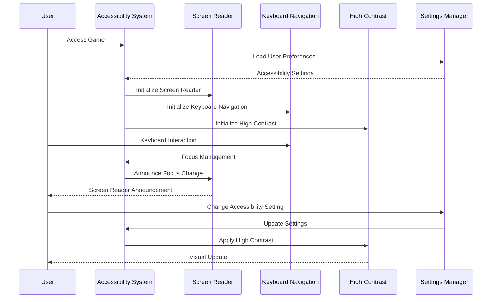

# User Story: 29 - Accessibility Compliance

**As a** player with accessibility needs,
**I want** the game to be fully accessible and compliant with WCAG 2.1 AA standards,
**so that** I can enjoy the game regardless of my abilities.

## Acceptance Criteria

* Full WCAG 2.1 AA compliance across all game features
* Screen reader compatibility with proper ARIA labels
* Keyboard navigation support for all interactive elements
* High contrast mode support with proper color ratios
* Scalable text up to 200% without horizontal scrolling
* Audio descriptions for visual elements where needed
* Alternative input methods for users with motor impairments

## Notes

* Must be compliant across all 18 game features
* Follows modern accessibility best practices
* Ensures legal compliance and inclusivity
* Critical for user adoption and legal requirements

## Implementation Plan

### 1. Feature Overview

The Accessibility Compliance system ensures the game meets WCAG 2.1 AA standards, providing full accessibility support through screen reader compatibility, keyboard navigation, high contrast modes, and alternative input methods.

### 2. Component Analysis & Reuse Strategy

**Existing Components to Reuse:**
- All existing UI components - Must be made accessible
- Design system components - Add accessibility features
- Layout components (Feature 22) - Add accessibility enhancements
- Mobile components (Feature 28) - Add accessibility optimizations

**New Components Needed:**
- `AccessibilitySystem` - Main accessibility coordinator
- `ScreenReaderSupport` - Screen reader optimization
- `KeyboardNavigation` - Keyboard navigation system
- `HighContrastMode` - High contrast display mode
- `AlternativeInputs` - Alternative input methods
- `AccessibilitySettings` - User accessibility preferences

### 3. Affected Files

- `[CREATE] src/components/accessibility/AccessibilitySystem.tsx`
- `[CREATE] src/components/accessibility/ScreenReaderSupport.tsx`
- `[CREATE] src/components/accessibility/KeyboardNavigation.tsx`
- `[CREATE] src/components/accessibility/HighContrastMode.tsx`
- `[CREATE] src/components/accessibility/AlternativeInputs.tsx`
- `[CREATE] src/components/accessibility/AccessibilitySettings.tsx`
- `[CREATE] src/components/accessibility/index.ts`
- `[CREATE] src/types/accessibility.ts`
- `[CREATE] src/lib/accessibility-utils.ts`
- `[CREATE] src/hooks/useAccessibility.ts`
- `[CREATE] src/context/AccessibilityContext.tsx`
- `[MODIFY] src/styles/globals.css`
- `[MODIFY] src/components/ui/Button.tsx`
- `[MODIFY] src/components/ui/Modal.tsx`
- `[MODIFY] src/components/game-layout/GameLayout.tsx`
- `[CREATE] src/components/accessibility/AccessibilitySystem.test.tsx`
- `[CREATE] src/components/accessibility/ScreenReaderSupport.test.tsx`
- `[CREATE] src/components/accessibility/AccessibilitySystem.visual.spec.ts`

### 4. Component Breakdown

**AccessibilitySystem** (`src/components/accessibility/AccessibilitySystem.tsx`)
- **Type**: Client Component (accessibility coordination)
- **Responsibility**: Main coordinator for all accessibility features
- **Key Props**:
  ```typescript
  interface AccessibilitySystemProps {
    children: React.ReactNode;
    settings: AccessibilitySettings;
    onSettingsChange?: (settings: AccessibilitySettings) => void;
  }
  ```
- **Child Components**: ScreenReaderSupport, KeyboardNavigation, HighContrastMode, AlternativeInputs

**ScreenReaderSupport** (`src/components/accessibility/ScreenReaderSupport.tsx`)
- **Type**: Client Component (screen reader optimization)
- **Responsibility**: Provide screen reader compatibility and ARIA support
- **Key Props**:
  ```typescript
  interface ScreenReaderSupportProps {
    children: React.ReactNode;
    announcements: string[];
    liveRegion: boolean;
    onAnnouncement?: (message: string) => void;
  }
  ```
- **Child Components**: ARIA live regions, screen reader announcements

**KeyboardNavigation** (`src/components/accessibility/KeyboardNavigation.tsx`)
- **Type**: Client Component (keyboard navigation)
- **Responsibility**: Provide comprehensive keyboard navigation support
- **Key Props**:
  ```typescript
  interface KeyboardNavigationProps {
    children: React.ReactNode;
    focusManagement: 'automatic' | 'manual';
    skipLinks: boolean;
    onFocusChange?: (element: HTMLElement) => void;
  }
  ```
- **Child Components**: Focus management, skip links, keyboard shortcuts

**HighContrastMode** (`src/components/accessibility/HighContrastMode.tsx`)
- **Type**: Client Component (high contrast)
- **Responsibility**: Provide high contrast mode support
- **Key Props**:
  ```typescript
  interface HighContrastModeProps {
    children: React.ReactNode;
    enabled: boolean;
    contrastLevel: 'AA' | 'AAA';
    onToggle?: (enabled: boolean) => void;
  }
  ```
- **Child Components**: High contrast styling, contrast controls

**AlternativeInputs** (`src/components/accessibility/AlternativeInputs.tsx`)
- **Type**: Client Component (alternative inputs)
- **Responsibility**: Support alternative input methods
- **Key Props**:
  ```typescript
  interface AlternativeInputsProps {
    children: React.ReactNode;
    enabledInputs: InputMethod[];
    onInputMethodChange?: (method: InputMethod) => void;
  }
  ```
- **Child Components**: Voice control, switch control, eye tracking

**AccessibilitySettings** (`src/components/accessibility/AccessibilitySettings.tsx`)
- **Type**: Client Component (accessibility settings)
- **Responsibility**: Manage user accessibility preferences
- **Key Props**:
  ```typescript
  interface AccessibilitySettingsProps {
    settings: AccessibilitySettings;
    onSettingsChange: (settings: AccessibilitySettings) => void;
    presets: AccessibilityPreset[];
  }
  ```
- **Child Components**: Settings controls, presets, customization

### 5. Design Specifications

**Color System (High Contrast):**
| Design Color | Semantic Purpose | Element | Implementation Method |
|--------------|-----------------|---------|------------------------|
| #000000 | Deep background | High contrast backgrounds | Direct hex value (#000000) |
| #ffffff | Primary text | High contrast text | Direct hex value (#ffffff) |
| #ffff00 | Focus indicator | Focus outlines | Direct hex value (#ffff00) |
| #00ff00 | Success | High contrast success | Direct hex value (#00ff00) |
| #ff0000 | Error | High contrast error | Direct hex value (#ff0000) |
| #0000ff | Links | High contrast links | Direct hex value (#0000ff) |
| #800080 | Visited links | High contrast visited | Direct hex value (#800080) |

**Accessibility Design Principles:**
- Minimum contrast ratio: 4.5:1 (AA) / 7:1 (AAA)
- Focus indicators: 2px solid outline
- Touch targets: Minimum 44px × 44px
- Text scaling: Support up to 200%
- Motion: Respect prefers-reduced-motion

**Typography:**
- Scalable text: 100% to 200% without horizontal scrolling
- Clear font hierarchy with proper heading structure
- Sufficient line height: 1.5 minimum
- Proper font weight contrast

**Spacing:**
- Focus outline offset: 2px
- Interactive element spacing: 8px minimum
- Touch target spacing: 8px minimum
- Content spacing: Maintains structure at 200% zoom

### 6. Data Flow & State Management

**TypeScript Types:**
```typescript
// src/types/accessibility.ts
export interface AccessibilitySettings {
  screenReaderEnabled: boolean;
  highContrastMode: boolean;
  keyboardNavigation: boolean;
  reducedMotion: boolean;
  textScale: 100 | 125 | 150 | 200;
  focusIndicatorStyle: 'default' | 'high-contrast' | 'large';
  alternativeInputs: InputMethod[];
}

export interface AccessibilityPreset {
  id: string;
  name: string;
  description: string;
  settings: AccessibilitySettings;
}

export interface AccessibilityAnnouncement {
  id: string;
  message: string;
  priority: 'polite' | 'assertive';
  timestamp: number;
}

export type InputMethod = 'keyboard' | 'voice' | 'switch' | 'eye-tracking' | 'head-tracking';
```

**State Management:**
- React Context for accessibility settings
- Local storage for user preferences
- System preference detection
- Real-time accessibility monitoring

### 7. API Endpoints & Contracts

**New Route Handler:**
```typescript
// src/app/api/accessibility/track-usage/route.ts
POST /api/accessibility/track-usage
{
  "settings": "AccessibilitySettings",
  "interactions": "AccessibilityInteraction[]",
  "sessionId": "string"
}
Response: { success: boolean, recommendations: AccessibilityRecommendation[] }
```

**Core Logic:**
- Track accessibility feature usage
- Provide accessibility recommendations
- Monitor compliance metrics
- Analytics for accessibility improvements

### 8. Integration Diagram



### 9. Styling

**Color Implementation:**
- High contrast backgrounds: #000000 for high contrast mode
- High contrast text: #ffffff for high contrast mode
- Focus indicators: #ffff00 with 2px solid outline
- Success indicators: #00ff00 for high contrast mode
- Error indicators: #ff0000 for high contrast mode
- Interactive elements: Enhanced contrast ratios

**Accessibility Styling:**
- Focus outlines: 2px solid with high contrast
- Touch targets: Minimum 44px × 44px
- Text scaling: Support up to 200%
- Motion: Respect prefers-reduced-motion
- Contrast: Meet WCAG 2.1 AA/AAA standards

### 10. Testing Strategy

**Unit Tests:**
- `src/components/accessibility/AccessibilitySystem.test.tsx` - Core accessibility logic
- `src/components/accessibility/ScreenReaderSupport.test.tsx` - Screen reader support
- `src/lib/accessibility-utils.test.ts` - Accessibility utilities
- `src/hooks/useAccessibility.test.ts` - Accessibility hooks

**Accessibility Tests:**
- Automated accessibility testing with axe-core
- Screen reader testing with NVDA, JAWS, VoiceOver
- Keyboard navigation testing
- High contrast mode testing
- Color contrast ratio testing

**E2E Tests:**
- End-to-end accessibility scenarios
- Cross-browser accessibility testing
- Mobile accessibility testing
- Assistive technology compatibility testing

### 11. Accessibility (A11y) Considerations

- WCAG 2.1 AA compliance across all features
- Screen reader compatibility with proper ARIA labels
- Keyboard navigation support for all interactive elements
- High contrast mode support with proper color ratios
- Scalable text up to 200% without horizontal scrolling
- Audio descriptions for visual elements where needed
- Alternative input methods for users with motor impairments

### 12. Security Considerations

- Secure accessibility data collection
- Privacy protection for accessibility preferences
- Safe accessibility feature implementation
- Prevent accessibility setting manipulation
- Secure assistive technology integration

### 13. Implementation Steps

**Phase 1: UI Implementation with Mock Data**

**1. Setup & Types:**
- [ ] Define `AccessibilitySettings`, `AccessibilityPreset`, `AccessibilityAnnouncement` in `src/types/accessibility.ts`
- [ ] Create accessibility utility functions in `src/lib/accessibility-utils.ts`
- [ ] Set up accessibility testing tools and mock data

**2. Context and Hook:**
- [ ] Create `src/context/AccessibilityContext.tsx`
- [ ] Implement React Context for accessibility state
- [ ] Create `src/hooks/useAccessibility.ts`
- [ ] Implement custom hook for accessibility features

**3. Core Accessibility Components:**
- [ ] Create `src/components/accessibility/AccessibilitySystem.tsx`
- [ ] Implement main accessibility coordinator with mock settings
- [ ] Create `src/components/accessibility/ScreenReaderSupport.tsx`
- [ ] Implement screen reader support with ARIA regions
- [ ] Create `src/components/accessibility/KeyboardNavigation.tsx`
- [ ] Implement keyboard navigation with focus management

**4. Advanced Accessibility Features:**
- [ ] Create `src/components/accessibility/HighContrastMode.tsx`
- [ ] Implement high contrast mode with color overrides
- [ ] Create `src/components/accessibility/AlternativeInputs.tsx`
- [ ] Implement alternative input methods with mock support
- [ ] Create `src/components/accessibility/AccessibilitySettings.tsx`
- [ ] Implement accessibility settings management

**5. Styling:**
- [ ] Update `src/styles/globals.css` with accessibility-specific styles
- [ ] Implement high contrast mode color overrides
- [ ] Add focus indicator styles (#ffff00, 2px solid)
- [ ] Implement text scaling support (100%-200%)
- [ ] Add reduced motion preferences support
- [ ] Ensure minimum contrast ratios (4.5:1 AA, 7:1 AAA)
- [ ] Add skip link styles and positioning

**6. UI Component Updates:**
- [ ] Modify `src/components/ui/Button.tsx` for accessibility
- [ ] Add ARIA labels, roles, and keyboard support
- [ ] Modify `src/components/ui/Modal.tsx` for accessibility
- [ ] Add focus trapping and ARIA modal support
- [ ] Modify `src/components/game-layout/GameLayout.tsx` for accessibility
- [ ] Add landmark roles and skip links

**7. UI Testing:**
- [ ] Create Playwright visual test in `src/components/accessibility/AccessibilitySystem.visual.spec.ts`
- [ ] Configure automated accessibility testing with axe-core
- [ ] Add accessibility verification tests for all components
- [ ] Test keyboard navigation flows
- [ ] Test screen reader announcements
- [ ] Test high contrast mode rendering
- [ ] Add comprehensive data-testid attributes with accessibility considerations

**Phase 2: Comprehensive Accessibility Integration**

**8. Backend Integration:**
- [ ] Create `src/app/api/accessibility/track-usage/route.ts`
- [ ] Implement accessibility usage tracking endpoint
- [ ] Add accessibility analytics and compliance monitoring

**9. Full Accessibility Integration:**
- [ ] Audit all existing components for accessibility compliance
- [ ] Add ARIA labels, roles, and properties to all interactive elements
- [ ] Implement keyboard navigation for all game features
- [ ] Add screen reader announcements for all game state changes
- [ ] Implement high contrast mode for all visual elements

**10. Game Feature Integration:**
- [ ] Integrate accessibility with all 18 game features
- [ ] Add accessibility support to game engine (Feature 19)
- [ ] Integrate with mobile experience (Feature 28)
- [ ] Add accessibility to player guidance (Feature 27)
- [ ] Ensure accessibility in all layout components (Feature 22)

**11. Testing & Validation:**
- [ ] Write comprehensive accessibility tests for all components
- [ ] Perform manual screen reader testing (NVDA, JAWS, VoiceOver)
- [ ] Conduct keyboard navigation testing across all features
- [ ] Validate color contrast ratios meet WCAG standards
- [ ] Test text scaling up to 200% without horizontal scrolling
- [ ] Verify alternative input method support

**12. Final Documentation & Compliance:**
- [ ] Add JSDoc documentation for all accessibility components
- [ ] Create accessibility compliance documentation
- [ ] Generate WCAG 2.1 AA compliance report
- [ ] Final review of accessibility across all features
- [ ] Accessibility monitoring and continuous improvement setup
