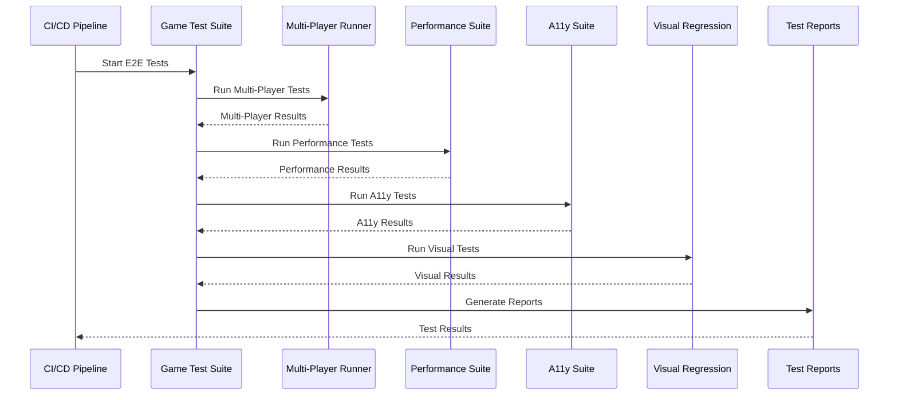

# User Story: 30 - End-to-End Game Testing

**As a** developer,
**I want** comprehensive testing coverage for the complete game flow,
**so that** I can ensure the game works reliably for all players.

## Acceptance Criteria

* Complete game flow testing from start to finish
* Multi-player synchronization testing with 5-10 concurrent players
* Error scenario testing (connection drops, browser refresh, etc.)
* Performance testing under load
* Cross-browser compatibility testing
* Mobile device testing across different screen sizes
* Accessibility testing with screen readers and keyboard navigation

## Notes

* Testing must cover integration of all 18 features
* Critical for production readiness and reliability
* Includes unit tests, integration tests, and end-to-end tests
* Performance and security testing are essential

## Implementation Plan

### 1. Feature Overview

The End-to-End Game Testing system provides comprehensive testing coverage for all game scenarios, ensuring reliability, performance, and accessibility across all features through automated test suites and continuous integration.

### 2. Component Analysis & Reuse Strategy

**Existing Components to Reuse:**
- All game components (Features 1-29) - Complete testing coverage
- Existing test utilities and frameworks
- Playwright test configuration - Foundation for E2E testing
- Visual testing setup - Extend for comprehensive coverage

**New Components Needed:**
- `GameTestSuite` - Comprehensive game testing framework
- `MultiPlayerTestRunner` - Multi-player scenario testing
- `PerformanceTestSuite` - Performance and load testing
- `AccessibilityTestSuite` - Accessibility compliance testing
- `VisualRegressionSuite` - Visual consistency testing
- `TestDataGenerator` - Test data and scenario generation

### 3. Affected Files

- `[CREATE] tests/e2e/GameTestSuite.ts`
- `[CREATE] tests/e2e/MultiPlayerTestRunner.ts`
- `[CREATE] tests/e2e/PerformanceTestSuite.ts`
- `[CREATE] tests/e2e/AccessibilityTestSuite.ts`
- `[CREATE] tests/e2e/VisualRegressionSuite.ts`
- `[CREATE] tests/e2e/TestDataGenerator.ts`
- `[CREATE] tests/e2e/scenarios/`
- `[CREATE] tests/e2e/scenarios/complete-game-flow.spec.ts`
- `[CREATE] tests/e2e/scenarios/multi-player-interactions.spec.ts`
- `[CREATE] tests/e2e/scenarios/edge-cases.spec.ts`
- `[CREATE] tests/e2e/scenarios/performance-testing.spec.ts`
- `[CREATE] tests/e2e/scenarios/accessibility-compliance.spec.ts`
- `[CREATE] tests/e2e/scenarios/visual-regression.spec.ts`
- `[CREATE] tests/e2e/utils/test-helpers.ts`
- `[CREATE] tests/e2e/utils/mock-data.ts`
- `[CREATE] tests/e2e/utils/assertions.ts`
- `[MODIFY] playwright.config.ts`
- `[MODIFY] package.json`
- `[CREATE] tests/e2e/reports/`

### 4. Test Suite Breakdown

**GameTestSuite** (`tests/e2e/GameTestSuite.ts`)
- **Type**: Test Framework (main coordinator)
- **Responsibility**: Orchestrate all E2E testing scenarios
- **Key Features**:
  ```typescript
  interface GameTestSuiteConfig {
    testEnvironment: 'local' | 'staging' | 'production';
    browserConfigs: BrowserConfig[];
    testScenarios: TestScenario[];
    reportingConfig: ReportingConfig;
  }
  ```
- **Test Categories**: Complete game flows, feature integration, error handling

**MultiPlayerTestRunner** (`tests/e2e/MultiPlayerTestRunner.ts`)
- **Type**: Test Framework (multi-player testing)
- **Responsibility**: Test multi-player interactions and synchronization
- **Key Features**:
  ```typescript
  interface MultiPlayerTestConfig {
    playerCount: number;
    roleDistribution: RoleDistribution;
    testActions: PlayerAction[];
    syncValidation: boolean;
  }
  ```
- **Test Categories**: Real-time sync, role interactions, state consistency

**PerformanceTestSuite** (`tests/e2e/PerformanceTestSuite.ts`)
- **Type**: Test Framework (performance testing)
- **Responsibility**: Test performance under various conditions
- **Key Features**:
  ```typescript
  interface PerformanceTestConfig {
    loadLevels: LoadLevel[];
    performanceMetrics: PerformanceMetric[];
    thresholds: PerformanceThreshold[];
    duration: number;
  }
  ```
- **Test Categories**: Load testing, memory usage, response times

**AccessibilityTestSuite** (`tests/e2e/AccessibilityTestSuite.ts`)
- **Type**: Test Framework (accessibility testing)
- **Responsibility**: Test accessibility compliance across all features
- **Key Features**:
  ```typescript
  interface AccessibilityTestConfig {
    complianceLevel: 'A' | 'AA' | 'AAA';
    assistiveTechnologies: AssistiveTechnology[];
    testScenarios: AccessibilityScenario[];
    auditTools: AuditTool[];
  }
  ```
- **Test Categories**: Screen reader compatibility, keyboard navigation, color contrast

**VisualRegressionSuite** (`tests/e2e/VisualRegressionSuite.ts`)
- **Type**: Test Framework (visual testing)
- **Responsibility**: Test visual consistency and prevent UI regressions
- **Key Features**:
  ```typescript
  interface VisualTestConfig {
    viewports: Viewport[];
    browsers: Browser[];
    testPages: TestPage[];
    diffThreshold: number;
  }
  ```
- **Test Categories**: UI consistency, responsive design, component rendering

**TestDataGenerator** (`tests/e2e/TestDataGenerator.ts`)
- **Type**: Test Utility (data generation)
- **Responsibility**: Generate test data and scenarios
- **Key Features**:
  ```typescript
  interface TestDataConfig {
    gameStates: GameState[];
    playerProfiles: PlayerProfile[];
    scenarios: TestScenario[];
    mockData: MockData;
  }
  ```
- **Test Categories**: Data generation, scenario creation, mock services

### 5. Test Specifications

**Test Coverage Areas:**
| Feature Category | Test Scenarios | Priority | Browser Support |
|------------------|----------------|----------|-----------------|
| Core Game Flow | Complete game scenarios | High | All browsers |
| Multi-Player | Real-time synchronization | High | Chrome, Firefox, Safari |
| Performance | Load and stress testing | Medium | Chrome, Firefox |
| Accessibility | WCAG compliance | High | Chrome with assistive tech |
| Visual Regression | UI consistency | Medium | Chrome, Firefox, Safari |
| Mobile | Touch interactions | High | Mobile Chrome, Safari |
| Error Handling | Edge cases | Medium | All browsers |

**Test Environment Setup:**
- Local development testing
- Staging environment validation
- Production-like testing
- Cross-browser compatibility
- Mobile device testing

### 6. Test Scenarios & Data

**Complete Game Flow Test Scenarios:**
```typescript
// tests/e2e/scenarios/complete-game-flow.spec.ts
export const gameFlowScenarios = [
  {
    name: 'Standard 5-player game',
    players: 5,
    roles: ['Merlin', 'Percival', 'Loyal Servant', 'Loyal Servant', 'Assassin'],
    missions: [2, 3, 2, 3, 3],
    expectedDuration: '15-20 minutes'
  },
  {
    name: 'Large 10-player game',
    players: 10,
    roles: ['Merlin', 'Percival', 'Loyal Servant', 'Loyal Servant', 'Loyal Servant', 'Loyal Servant', 'Mordred', 'Assassin', 'Morgana', 'Oberon'],
    missions: [3, 4, 4, 5, 5],
    expectedDuration: '25-30 minutes'
  }
];
```

**Multi-Player Test Scenarios:**
```typescript
// tests/e2e/scenarios/multi-player-interactions.spec.ts
export const multiPlayerScenarios = [
  {
    name: 'Simultaneous actions',
    description: 'Multiple players perform actions at the same time',
    players: 5,
    actions: ['vote', 'select_team', 'mission_action'],
    validation: 'state_consistency'
  },
  {
    name: 'Player disconnection',
    description: 'Handle player disconnection during game',
    players: 6,
    disconnectPlayer: 2,
    reconnectAfter: 30000,
    validation: 'game_continues'
  }
];
```

### 7. Test Configuration

**Playwright Configuration:**
```typescript
// playwright.config.ts updates
export default defineConfig({
  testDir: './tests/e2e',
  fullyParallel: false, // Sequential for multi-player tests
  forbidOnly: !!process.env.CI,
  retries: process.env.CI ? 2 : 0,
  workers: process.env.CI ? 1 : undefined,
  reporter: [
    ['html'],
    ['junit', { outputFile: 'test-results/junit.xml' }],
    ['json', { outputFile: 'test-results/results.json' }]
  ],
  use: {
    baseURL: process.env.BASE_URL || 'http://localhost:3000',
    trace: 'on-first-retry',
    video: 'retain-on-failure',
    screenshot: 'only-on-failure'
  },
  projects: [
    {
      name: 'chromium',
      use: { ...devices['Desktop Chrome'] }
    },
    {
      name: 'firefox',
      use: { ...devices['Desktop Firefox'] }
    },
    {
      name: 'webkit',
      use: { ...devices['Desktop Safari'] }
    },
    {
      name: 'Mobile Chrome',
      use: { ...devices['Pixel 5'] }
    },
    {
      name: 'Mobile Safari',
      use: { ...devices['iPhone 12'] }
    }
  ]
});
```

### 8. Integration Diagram



### 9. Test Implementation

**Core Test Structure:**
```typescript
// tests/e2e/scenarios/complete-game-flow.spec.ts
import { test, expect } from '@playwright/test';
import { GameTestSuite } from '../GameTestSuite';

test.describe('Complete Game Flow', () => {
  let gameTestSuite: GameTestSuite;

  test.beforeEach(async ({ page }) => {
    gameTestSuite = new GameTestSuite(page);
    await gameTestSuite.initialize();
  });

  test('5-player standard game flow', async ({ page }) => {
    // Create room
    await gameTestSuite.createRoom('5-player-game');
    
    // Add players
    const players = await gameTestSuite.addPlayers(5);
    
    // Start game
    await gameTestSuite.startGame();
    
    // Verify role distribution
    await gameTestSuite.verifyRoleDistribution();
    
    // Play through missions
    for (let mission = 1; mission <= 5; mission++) {
      await gameTestSuite.playMission(mission);
    }
    
    // Verify game completion
    await gameTestSuite.verifyGameCompletion();
  });
});
```

### 10. Testing Strategy

**Test Categories:**
- **Unit Tests**: Individual component testing
- **Integration Tests**: Feature interaction testing
- **E2E Tests**: Complete user flow testing
- **Performance Tests**: Load and stress testing
- **Accessibility Tests**: WCAG compliance testing
- **Visual Tests**: UI consistency testing

**Test Execution:**
- Local development testing
- PR validation testing
- Staging environment testing
- Production monitoring
- Scheduled regression testing

### 11. Reporting & Analytics

**Test Reports:**
- HTML reports with screenshots and videos
- JUnit XML for CI integration
- JSON reports for custom analysis
- Performance metrics and trends
- Accessibility compliance reports
- Visual regression reports

**Test Analytics:**
- Test execution trends
- Failure analysis and patterns
- Performance benchmarks
- Browser compatibility metrics
- Accessibility compliance scores

### 12. Continuous Integration

**CI/CD Pipeline Integration:**
- Automated test execution on PR
- Parallel test execution for efficiency
- Test result reporting and notifications
- Automatic retry for flaky tests
- Performance regression detection

### 13. Implementation Steps

**Phase 1: Core E2E Testing Framework**

**1. Setup & Configuration:**
- [ ] Update `playwright.config.ts` with comprehensive E2E configuration
- [ ] Create test directory structure under `tests/e2e/`
- [ ] Set up test reporting and analytics configuration
- [ ] Configure CI/CD pipeline for E2E testing

**2. Test Framework:**
- [ ] Create `tests/e2e/GameTestSuite.ts` - Main test coordinator
- [ ] Create `tests/e2e/utils/test-helpers.ts` - Test utility functions
- [ ] Create `tests/e2e/utils/mock-data.ts` - Test data generation
- [ ] Create `tests/e2e/utils/assertions.ts` - Custom assertions

**3. Core Game Flow Tests:**
- [ ] Create `tests/e2e/scenarios/complete-game-flow.spec.ts`
- [ ] Implement 5-player standard game flow test
- [ ] Implement 10-player large game flow test
- [ ] Implement edge case game scenarios
- [ ] Add game flow validation and assertions

**4. Multi-Player Testing:**
- [ ] Create `tests/e2e/MultiPlayerTestRunner.ts`
- [ ] Create `tests/e2e/scenarios/multi-player-interactions.spec.ts`
- [ ] Implement simultaneous player action testing
- [ ] Implement player disconnection/reconnection testing
- [ ] Add real-time synchronization validation

**5. Performance Testing:**
- [ ] Create `tests/e2e/PerformanceTestSuite.ts`
- [ ] Create `tests/e2e/scenarios/performance-testing.spec.ts`
- [ ] Implement load testing scenarios
- [ ] Implement memory usage monitoring
- [ ] Add performance threshold validation

**Phase 2: Advanced Testing Features**

**6. Accessibility Testing:**
- [ ] Create `tests/e2e/AccessibilityTestSuite.ts`
- [ ] Create `tests/e2e/scenarios/accessibility-compliance.spec.ts`
- [ ] Implement automated accessibility testing with axe-core
- [ ] Implement screen reader compatibility testing
- [ ] Implement keyboard navigation testing
- [ ] Add WCAG 2.1 AA compliance validation

**7. Visual Regression Testing:**
- [ ] Create `tests/e2e/VisualRegressionSuite.ts`
- [ ] Create `tests/e2e/scenarios/visual-regression.spec.ts`
- [ ] Implement cross-browser visual testing
- [ ] Implement responsive design testing
- [ ] Implement component rendering testing
- [ ] Add visual diff analysis and reporting

**8. Edge Case Testing:**
- [ ] Create `tests/e2e/scenarios/edge-cases.spec.ts`
- [ ] Implement network failure scenarios
- [ ] Implement browser crash recovery testing
- [ ] Implement data corruption scenarios
- [ ] Implement security vulnerability testing

**9. Test Data Management:**
- [ ] Create `tests/e2e/TestDataGenerator.ts`
- [ ] Implement dynamic test data generation
- [ ] Implement test scenario creation
- [ ] Implement mock service integration
- [ ] Add test data cleanup and management

**Phase 3: Integration & Reporting**

**10. CI/CD Integration:**
- [ ] Configure GitHub Actions for E2E testing
- [ ] Set up parallel test execution
- [ ] Configure test result reporting
- [ ] Set up performance regression detection
- [ ] Configure test failure notifications

**11. Advanced Reporting:**
- [ ] Create comprehensive test reporting dashboard
- [ ] Implement test analytics and trends
- [ ] Add performance benchmarking
- [ ] Implement accessibility compliance tracking
- [ ] Create visual regression reporting

**12. Monitoring & Maintenance:**
- [ ] Set up production monitoring with synthetic tests
- [ ] Implement test suite maintenance automation
- [ ] Create test debugging and troubleshooting tools
- [ ] Add test suite performance optimization
- [ ] Implement continuous test improvement

**13. Documentation & Training:**
- [ ] Create comprehensive E2E testing documentation
- [ ] Document test writing guidelines and best practices
- [ ] Create troubleshooting guides for common test issues
- [ ] Document test maintenance procedures
- [ ] Final review and optimization of complete test suite
